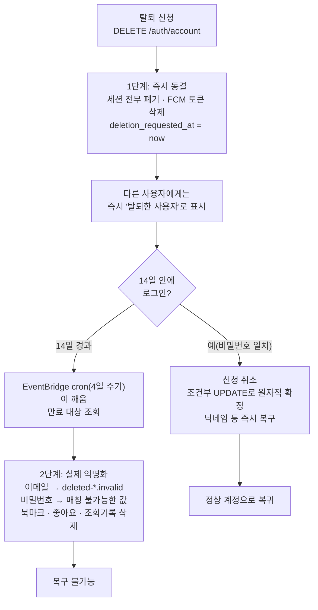

# Link-Sphere BE — 회원탈퇴 14일 유예기간 (2026-09-29)

> **문서 성격**: 서사형(설명) — "왜 만들었고 어떻게 동작하는지"를 처음부터 끝까지 기록한다.
> 절차서(런북)가 아니다 — EventBridge 룰 조작 등 실제 배포 절차 자체는
> [`docs/DEPLOY.md`](./DEPLOY.md) 10장 참고.
>
> **대상 독자**: 이 레포 BE를 처음 보거나, 회원탈퇴·유예기간 관련 코드를 오랜만에
> 다시 만지는 개발자.
>
> **읽고 나면**: 이 문서만 보고 유예기간 값을 조정하거나, 로그인 복구 로직을
> 수정하거나, 유예 만료 정리 배치의 실행 주기를 바꾸거나, 버그를 재현·수정할 수
> 있다(§8 참고).
>
> **마지막 검토**: 2026-09-29 (최초 작성)

## 1. 쉬운 설명

컴퓨터 휴지통을 떠올리면 된다. 파일을 지워도 휴지통으로 이동할 뿐 바로
사라지지 않고, 그 사이 "복구" 버튼을 누르면 원래 자리로 돌아온다. 휴지통을
비우거나 일정 기간이 지나야 완전히 사라진다.

회원탈퇴도 같은 구조다. 예전에는(2026-09-28 이전) 탈퇴 신청 즉시 계정이
익명화돼 완전히 되돌릴 수 없었다. 지금은 신청하면 바로 로그아웃되고 다른
사람에게는 탈퇴한 것처럼 보이지만(휴지통으로 이동한 상태), 실제 계정 정보는
14일 동안 그대로 보존된다. 이 기간에 로그인하면 탈퇴가 취소되고 원래 상태로
돌아온다(휴지통에서 복구). 14일이 지나면 예약 작업이 계정을 실제로
익명화한다(휴지통 비우기) — 이때부터는 되돌릴 수 없다.

## 2. 전제 지식

이 문서는 Spring Boot·JPA 기본기, 그리고 이 레포가 세션을 JWT가 아니라
서버 관리 불투명 토큰으로 처리한다는 사실(`docs/plans/2026-09-28-auth-hardening.md`
Phase 3)은 이미 안다고 가정한다. AWS Lambda SnapStart·EventBridge cron의
전반적인 동작 방식은 가정하지 않는다 — `docs/DEPLOY.md`의 "핵심 동작 원리",
특히 8장(RSS 피드 수집)을 먼저 읽으면 이 기능이 재사용한 인프라 패턴을 이해하기
쉽다. 이 기능이 나오게 된 배경(업계 선례 조사, 법적 고려, 대안 비교)은
`docs/plans/2026-09-29-account-deletion-grace-period.md`에 있다 — 이 문서는
"왜 14일인가" 같은 판단 근거를 다시 옮겨적지 않고 그 파일을 가리킨다.

## 3. 사용한 도구·기술

**기능 자체**

- Spring Data JPA의 조건부 `@Modifying @Query` UPDATE (WHERE 재검증으로 낙관적
  락 없이 경합을 가르는 패턴 — 이 레포에 이미 있던 `MemberSessionRepository.
  consumeRefreshIfActive`와 같은 형태)
- AWS EventBridge 스케줄 룰(신규 룰 없이 기존 `link-sphere-feed-crawl` 룰에
  타겟만 추가, §7 참고)

**구현·검증 과정에서 쓴 도구**

- Node.js `pg` 클라이언트로 운영 Supabase Postgres에 직접 접속해 마이그레이션
  적용 여부 검증(1회성 스크립트, 레포에 남기지 않음)
- AWS CLI(`aws lambda invoke`, `aws events put-targets`)로 배포된 Lambda를
  직접 호출해 배치 동작·멱등성 확인
- `gh` CLI로 PR·CI 상태 확인

## 4. 왜 만들었나

기존 `AccountDeletionService`(PR #44, Phase 5)는 탈퇴 신청 즉시 계정 행을
익명화했다 — 이메일을 `.invalid` 도메인으로, 비밀번호를 매칭 불가능한 값으로
바꿔버려 복구 경로 자체가 구조적으로 없었다. "탈퇴를 번복할 수 있는가"라는
질문에서 시작해 실제로 코드를 추적해보니 복구 로직이 전혀 없다는 게
확인됐고, Discord(14일)·Instagram·X(둘 다 30일) 등 대형 서비스를 조사한 결과
대부분 유예기간을 두고 재로그인으로 복구하는 구조였다("2단계 삭제"라는 이름이
붙은 업계 표준 패턴, 근거는 `docs/plans/2026-09-29-account-deletion-grace-period.md`
Context 절 참고). 한국 개인정보보호법의 "지체 없이 파기" 원칙과의 충돌을
최소화하기 위해 선례 중 가장 짧은 14일을 택했다.

## 5. 구조

### 5-1. 상태를 나타내는 방식

`deleted_at`(기존, Phase 5)과 `deletion_requested_at`(신규) 두 컬럼의 조합으로
세 가지 상태를 나타낸다 — 별도 status 컬럼을 두지 않았다. status enum을
도입하면 이미 `deleted_at`을 참조하는 기존 코드 전부를 같이 고쳐야 했고, 두
타임스탬프의 존재 여부만으로 상태 전이가 자연스럽게 표현됐다.

| 상태 | `deletion_requested_at` | `deleted_at` | 로그인 | 다른 사람에게 보이는 모습 |
| --- | --- | --- | --- | --- |
| 정상 | NULL | NULL | 가능 | 실제 닉네임·이미지 |
| 유예 중 | 있음 | NULL | 가능(복구됨) | "탈퇴한 사용자" |
| 퍼지 완료 | 있음(남겨둠, §11 참고) | 있음 | 불가능 | "탈퇴한 사용자" |

`TableMember.isWithdrawn`(`domain/member/TableMember.kt:47`)이 이 표의 "유예
중"·"퍼지 완료" 두 행을 하나의 불리언으로 합친다 — 남에게 보이는 정보
(`publicNickname`·`publicImage`, 같은 파일:50-54)를 결정하는 유일한 기준점이다.
작성자를 노출하는 모든 경로(댓글·게시글·알림·닉네임 검색, §8 코드 지도 참고)가
이 프로퍼티 하나만 참조하도록 통일해서, "어디는 유예 중을 반영하고 어디는
안 하는" 불일치가 생기지 않게 했다.

### 5-2. 경합 처리

로그인에 의한 복구(`AuthService.login`)와 예약 작업에 의한 퍼지
(`AccountPurgeService.purgeExpired`)가 같은 회원을 동시에 건드릴 수 있다.
둘 다 조건부 UPDATE로 "내가 먼저 처리할 권리를 얻었는가"를 원자적으로
확정한다 — 앞서 있던 `MemberSessionRepository.consumeRefreshIfActive`의 세션
재사용 탐지와 완전히 같은 발상이다.

| 시나리오 | 처리 |
| --- | --- |
| 퍼지가 먼저 확정한 뒤 로그인 시도 | `cancelDeletionRequest`가 0행 → 로그인 실패(`InvalidCredentialsException`, 실패 기록은 안 남김) |
| 로그인이 먼저 취소한 뒤 퍼지 실행 | `claimForPurge`가 0행 → 그 회원은 건너뜀(skipped로 집계) |
| 대상 조회 뒤, claim 전에 로그인으로 복구됨 | `claimForPurge`의 WHERE가 재검증되므로 자동으로 걸러짐 |
| 14일 지났지만 배치가 아직 안 돎(최대 4일, §7) | 로그인 복구는 여전히 허용 — "14일 안에 로그인하면 취소"라는 약속을 깨는 방향으로는 절대 안 틀리게 설계 |

## 6. 데이터 모델

`members` 테이블에 `deletion_requested_at TIMESTAMPTZ NULL` 컬럼 하나가
추가됐다. DDL 원문은 [`sql/add_member_deletion_requested_at.sql`](../src/main/resources/sql/add_member_deletion_requested_at.sql)을
참고한다 — 만료 대상 조회용 부분 인덱스(`deletion_requested_at IS NOT NULL
AND deleted_at IS NULL` 조건)도 같은 파일에 있다.

## 7. 운영 파라미터

| 값 | 실제 위치 |
| --- | --- |
| 유예기간(14일) | `AccountDeletionService.kt:52` (`GRACE_PERIOD`) — FE `texts.ts`의 안내 문구에도 같은 값이 중복돼 있다(자동 동기화 없음, §11 참고) |
| 정리 배치 실행 주기 | AWS 콘솔/CLI — 전용 EventBridge 룰이 아니라 기존 `link-sphere-feed-crawl` 룰(4일마다, `docs/DEPLOY.md` 8장)에 타겟만 추가했다(§10-2 시행착오 참고). 최악의 경우 유예 만료 후 최대 4일 더 지나야 실제 퍼지된다(14~18일) |
| 퍼지 배치 한 번에 처리하는 최대 건수 | `AccountPurgeService.kt`의 `BATCH_SIZE`(200) |
| 퍼지 배치 데드라인 | `AccountPurgeService.kt`의 `DEADLINE_MILLIS`(90초) — 넘기면 남은 건은 다음 실행으로 미룸 |

## 8. 코드 지도와 자주 하는 수정

| 순서도 단계 | 파일 | 재배포 필요 |
| --- | --- | --- |
| 탈퇴 신청(1단계) | `domain/auth/AccountDeletionService.kt`의 `requestDeletion` | 예 |
| 탈퇴 신청 API | `domain/auth/AuthController.kt`의 `deleteAccount` | 예 |
| 로그인 시 자동 복구 | `domain/auth/AuthService.kt:135-168`의 `login`(비밀번호 일치 후 `memberService.cancelPendingDeletion` 호출) | 예 |
| 복구 여부를 FE에 전달 | `domain/auth/AuthDTO.kt`의 `TokenResponse.deletionCancelled` | 예 |
| 경합 처리용 조건부 UPDATE 3개 | `domain/member/MemberRepository.kt:25-45`(`findIdsPendingPurge`·`cancelDeletionRequest`·`claimForPurge`) | 예 |
| 유예 만료 확정 + 실제 익명화(2단계) | `domain/auth/AccountDeletionService.kt`의 `purge` | 예 |
| 배치 진입점(회원별 트랜잭션 분리) | `domain/auth/AccountPurgeService.kt` | 예 |
| EventBridge → Lambda 진입점 | `LambdaHandler.kt:145-147, 316`(`"account-purge"` case) | 예 |
| 남에게 보이는 표시(공개 기준) | `domain/member/TableMember.kt:47-54`(`isWithdrawn`·`publicNickname`·`publicImage`) | 예 |
| 댓글 작성자 표시 | `domain/comment/CommentService.kt`(`toCommentResponse`, `getComments`) | 예 |
| 게시글 작성자 표시 | `domain/post/PostResponseAssembler.kt`(`convertToResponse`·`buildResponsesFromPosts`) | 예 |
| 댓글 알림 문구 | `domain/comment/CommentPostProcessService.kt`의 `sendNotification` | 예 |
| 닉네임 검색에서 제외 | `domain/post/PostRepositoryImpl.kt`의 닉네임 서브쿼리 | 예 |
| 퍼지된 계정의 비밀번호 재설정 차단 | `domain/auth/PasswordResetService.kt`의 `confirmReset` | 예 |
| FE 문구·복구 토스트 | `link-sphere_FE_NEW`의 `texts.ts`, `entities/auth/api/auth.queries.ts`(`useLoginMutation`) | FE 별도 배포 |

**이렇게 고치려면**

- **유예기간을 바꾸려면**: `AccountDeletionService.GRACE_PERIOD` 하나만 고치면
  퍼지 대상 조회·claim 조건에 전부 반영된다. FE `texts.ts`의 안내 문구는 수동으로
  같이 고쳐야 한다(자동 동기화 없음).
- **작성자 노출 범위를 바꾸려면**(예: 유예 중엔 닉네임을 그대로 보여주고 싶다면):
  `TableMember.isWithdrawn`의 조건만 `deletedAt != null`로 좁히면 된다 —
  `publicNickname`·`publicImage`를 참조하는 곳 전부에 자동으로 반영된다.
- **정리 배치 실행 주기를 바꾸려면**: 코드 변경 없이 AWS 인프라만 바꾸면 된다
  (`docs/DEPLOY.md` 10장) — 더 자주 돌리고 싶으면 전용 EventBridge 룰을 새로
  만들거나(§10-2 참고, 왜 처음엔 안 그랬는지), 더 촘촘한 기존 룰(예: 6장 워밍
  핑, 5분마다)에 타겟을 옮기면 된다.

## 9. 검증 결과

- BE 단위 테스트 전체 404개 통과(0 실패), ktlint 클린(PR #48 병합 시점).
- 운영 Supabase Postgres에 직접 접속해 마이그레이션을 확인 — `deletion_requested_at`
  컬럼(`timestamp with time zone`, nullable)과 `idx_members_deletion_pending`
  인덱스가 실제로 존재함을 SQL로 확인.
- 배포 검증: `prod` alias가 버전 116으로 승격됨(연속 invoke 게이트 통과).
- `account-purge` 수동 invoke 2회 — 둘 다 `purged=0, skipped=0, failed=0`(유예
  만료 대상이 아직 없는 정상 상태), 두 번째 실행이 첫 번째보다 훨씬 빠름
  (110ms → 14ms, DB에 아무것도 안 씀을 방증) — 멱등성 확인.
- FE 단위 테스트 전체 536개 통과(86개 파일), `type-check`·`lint`·`check:docs`·
  `format:check` 전부 통과. PR CI(`check`·`e2e`·`lighthouse`) 전부 green.

## 10. 시행착오

### 10-1. Mockito + Kotlin `any()`가 이전 테스트의 매처 스택을 오염시킴

`AccountPurgeServiceTest`에서 `accountDeletionService.purge(eq(id), any())`처럼
`any()`로 스텁하자 `AccountDeletionService.purge(id: UUID, cutoff: Instant)`의
**non-null** Kotlin 파라미터 검사에 걸려 `NullPointerException`이 났다. 문제는
그 예외가 Mockito의 내부 매처 스택을 미소비 상태로 남긴다는 점이었다 — 같은
JVM에서 이어 도는 **다음 테스트**가 `InvalidUseOfMatchersException`으로
연쇄 실패했다(정작 그 테스트는 `any()`를 전혀 안 썼는데도). 이 함정은 이미
`MemberSessionRepository.kt` 상단 주석에 리포지토리 메서드 기준으로
문서화돼 있었지만, 이번엔 리포지토리가 아니라 **일반 서비스 클래스**를
모킹하는 경우라 놓쳤다. 해결은 같은 패턴 — `any()` 대신 `now`를 고정값으로
둬서 실제 `cutoff` 값을 계산할 수 있게 하고, 모든 스텁·검증을 리터럴 값으로
바꿨다(`AccountPurgeServiceTest.kt`).

### 10-2. EventBridge 정리 배치 스케줄 — 처음 설계가 "배보다 배꼽" 지적을 받음

최초 설계(PR #48에 포함)는 `account-purge` 전용 EventBridge 룰을 새로
만드는 것이었다 — `put-rule` + `add-permission` + `put-targets` 3단계, 매일
실행. PR이 이미 병합·배포된 **뒤**, 실제 AWS 인프라를 적용하기 전에 사용자
리뷰에서 지적이 나왔다: 탈퇴 자체가 드문 액션인데(게다가 14일 유예 중 로그인
복구까지 거치고 남는 경우만 대상) 전용 스케줄 인프라를 새로 만드는 건 발생
빈도 대비 과하다는 것이었다.

다시 따져보니 AWS Lambda의 EventBridge 호출 허용 권한(`add-permission`)은
**타겟이 아니라 룰(rule ARN) 단위**로 부여된다는 걸 확인했다 — "이 규칙에서
오는 호출은 허용"이라는 조건이지 "이 타겟에서 오는 호출"이 아니다. 이미
8장의 `link-sphere-feed-crawl` 룰에 `EventBridgeFeedCrawl`이라는 권한 문이
있었으므로, 그 룰에 타겟을 하나 더 추가하기만 하면(`put-targets` 한 번) 새
룰도 새 권한도 필요 없었다. `LambdaHandler`는 어느 룰이 호출했는지가 아니라
페이로드의 `linksphereJob` 값으로만 분기하므로 코드 영향도 전혀 없었다.

이미 병합·배포된 PR의 문서(`docs/DEPLOY.md` 10장)를 고치는 작은 후속
PR(#49)로 반영했다 — 코드는 그대로 두고 인프라 적용 절차 문서만 고쳤다.
실행 주기가 매일에서 4일마다(feed-crawl과 동일)로 늘어나 최악의 경우
유예기간이 14~15일에서 14~18일이 됐지만(§7 운영 파라미터 참고), 애초에 발생
빈도가 낮다는 전제라 문제 삼지 않기로 했다.

### 10-3. 운영 DB·AWS 인프라 변경은 에이전트가 직접 실행할 수 없었다

이 작업 과정에서 운영 Postgres에 직접 쓰는 명령과 `aws events put-rule`
(공유 인프라 수정)이 자동화 도구의 안전장치에 의해 차단됐다 — 사용자가 SQL과
AWS CLI 명령을 직접 실행해야 했다. 읽기 전용 조회(컬럼·인덱스 존재 확인)는
허용됐다. 이건 버그가 아니라 의도된 안전장치이므로, 향후 비슷한 작업에서도
운영 DB 스키마 변경·공유 AWS 리소스 생성은 사람이 직접 실행하는 단계로
남겨둬야 한다.

## 11. 남은 것

- **개인정보처리방침 미비**: 유예기간 동안 개인정보를 보관한다는 사실을
  알리는 곳이 탈퇴 화면 문구와 확인 창뿐이다 — 이 앱에 개인정보처리방침
  페이지 자체가 없다. 이 고지로 충분한지는 법무 판단이 필요하다.
- **유예 중 좋아요 카운트**: 유예 회원의 좋아요가 퍼지 전까지 다른 글의
  좋아요 수에 그대로 남는다(개인 전용 데이터가 아니라 집계에 영향을 주는
  데이터라 1단계에서 지우지 않기로 했다). 필요하면 후속 작업으로 뺀다.
- **14일 값의 중복**: FE `texts.ts`의 안내 문구와 BE `GRACE_PERIOD`
  양쪽에 따로 있다. 주석으로 짝을 표시해뒀을 뿐 자동으로 동기화하는
  장치는 없다.
- **경합 시나리오 R4 수용**: 기기 A의 탈퇴 신청과 기기 B의 로그인이
  밀리초 단위로 겹치면 B에 세션이 남을 수 있다 — 확률이 극히 낮고 퍼지 시
  세션을 다시 전부 폐기하므로 의도적으로 손대지 않았다(`docs/plans/2026-09-29-account-deletion-grace-period.md`
  "영향 범위" 절 참고).
- **퍼지 완료 후에도 `deletion_requested_at`을 남겨둠**: 감사(audit) 목적으로
  지우지 않기로 했다 — 개인정보가 아니라 "언제 신청했는지"라는 메타데이터라
  GDPR류 삭제 의무와 충돌하지 않는다고 판단했다. 문제가 되면 `deleted_at`이
  세팅될 때 같이 NULL로 지우는 방향으로 바꿀 수 있다.

## 12. 용어 사전

- **유예기간(grace period)**: 탈퇴 신청 후 실제 삭제까지 기다리는 기간(14일).
  이 기간 중 상태를 이 문서에서는 "유예 중"이라 부른다.
- **퍼지(purge)**: 유예가 끝난 계정을 실제로 익명화하고 개인 데이터를
  삭제하는 2단계 처리(`AccountDeletionService.purge`).
- **톰스톤(tombstone)**: 행을 삭제하지 않고 표시만 해서 다른 데이터의
  참조 무결성을 지키는 패턴. 이 기능에서는 `members` 행 자체가 톰스톤 역할을
  한다(글·댓글이 이 행을 계속 참조).
- **isWithdrawn**: `TableMember`의 파생 프로퍼티. "이 회원을 남에게 탈퇴한
  것처럼 보여줘야 하는가"를 유예 중·퍼지 완료 두 상태 모두에 대해 true로
  묶어 반환한다(§5-1 참고).
- **EventBridge**: AWS의 스케줄러 서비스 — "몇 시에 이 Lambda를 실행해줘"를
  cron 표현식으로 등록해두는 것. 자세한 동작은 `docs/DEPLOY.md` 8장 참고.

## 13. 관련 문서

- [`docs/plans/2026-09-29-account-deletion-grace-period.md`](./plans/2026-09-29-account-deletion-grace-period.md) — 이 기능의 계획 원본(업계 선례 조사, 대안 비교, 세부 계획)
- [`docs/plans/2026-09-28-auth-hardening.md`](./plans/2026-09-28-auth-hardening.md) — 기존(즉시 익명화) 탈퇴 구현의 배경(Phase 5)
- [`docs/DEPLOY.md`](./DEPLOY.md) 8장·10장 — RSS 피드 수집 EventBridge 룰, 그 룰을 재사용하는 정리 배치 적용 절차
- `link-sphere_FE_NEW`의 `docs/AUTH.md` §8-E — 로그인 성공 시 복구 토스트를 띄우는 FE 쪽 처리
