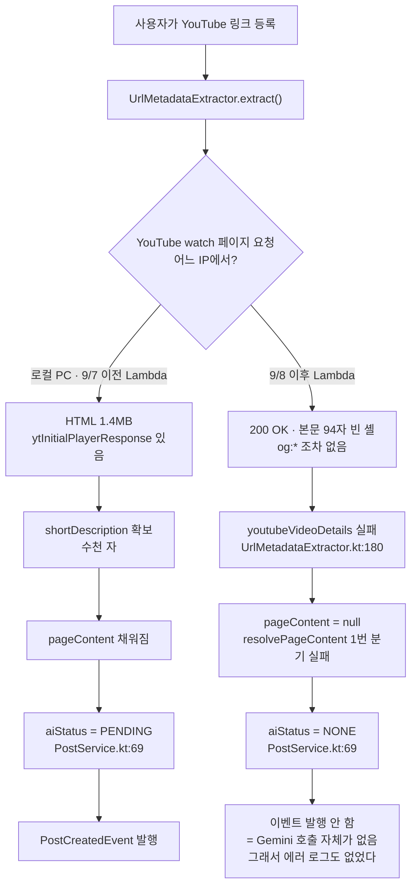

# Link-Sphere BE — 게시글 AI 분석 비동기화 (2026-08-01)

> 마지막 검토: 2026-09-09

## 1. 문제

`POST /post`는 크롤링 이후 Gemini 요약·카테고리 분류가 끝날 때까지 응답을 미룬 채
동기로 기다리는 구조였다(`PostAIService.handlePostCreatedEvent`,
`@TransactionalEventListener(AFTER_COMMIT)` + 동기 호출). 크롤링과 AI 처리 합산
시간이 CloudFront origin timeout(30초)을 넘기면 클라이언트는 504를 받지만, Lambda
자체는 계속 실행되어 게시글은 이미 DB에 커밋된 채 **응답만 유실**되는 문제가 있었다.

실제 사고 사례(2026-07-31 02:20~02:21 UTC, `postId b61c9b90...`):

| 시각 | 내용 |
| ---- | ---- |
| 02:20:36 | 크롤링·커밋 완료 |
| 02:20:36~02:20:46 | Gemini 요약 호출 (9.6초) |
| 02:20:46~02:21:11 | Gemini 카테고리 분류 호출 (**25.2초**, 비정상적으로 느림) |
| 02:21:12 | `ObjectOptimisticLockingFailureException` — 이 사이 사용자가 같은 post를 삭제함 |
| — | 전체 요청 소요 시간 **35.9초** — CloudFront 30초 한도를 넘겨 클라이언트는 504 수신 |

### 왜 처음부터 비동기로 만들지 않았는가

과거(`80d8861` → `55b2bcc` → `c9de0f5`)에 `@Async` + SSE로 비동기 처리를 구현한
적이 있다. `e23fa0e fix: Lambda 환경 안정성 개선` 커밋에서 의도적으로 되돌렸는데,
이유는 커밋 메시지에 명시돼 있다:

> Lambda는 `handleRequest()` 반환 후 컨테이너를 동결하므로 비동기 스레드가
> 완료되기 전에 AI 처리가 중단될 수 있음. 동기 처리로 변경해 POST /post 응답 전에
> AI 분석 완료 보장

`@Async`는 Spring `TaskExecutor`로 작업을 던지는데, 이 스레드는 **같은 Lambda
실행 환경(같은 컨테이너) 안의 또 다른 스레드**일 뿐이다. Lambda는 `handleRequest()`가
리턴하는 순간 그 컨테이너 전체(모든 스레드 포함)를 얼려버리므로, 백그라운드 스레드가
Gemini 응답을 기다리는 도중 그대로 멈춰버릴 수 있었다. SSE(`GET /post/ai-events`)도
같은 이유로 죽었다 — 커넥션을 열어두고 나중에 push하려면 컨테이너가 계속 살아있어야
하는데, 그 전제 자체가 깨진다.

## 2. 해결 방향 — Lambda self-invoke

"같은 실행 환경 안에서 스레드만 백그라운드로 돌리기"가 아니라 **완전히 별도의
Lambda 호출로 위임**하면 이 제약을 피할 수 있다.

- `PostService.createPost()` 커밋 후, `PostAIService.handlePostCreatedEvent`가
  `AiJobDispatcher`를 통해 이 Lambda 함수 자기 자신을 `InvocationType.EVENT`
  (비동기)로 호출한다.
- 이 호출은 AWS Lambda 컨트롤 플레인에 작업을 "접수"시키고 202 Accepted를
  받는 것으로 끝난다 — Gemini를 호출하는 것과 성격이 같은 평범한 동기 외부 HTTP
  호출이며, 202를 받는 순간 원래 요청의 컨테이너가 얼든 말든 상관없다.
- AWS는 이 작업을 위해 완전히 별도의 실행 환경을 새로 띄운다. 원래 요청을
  처리하던 컨테이너와 메모리·스레드·생명주기를 전혀 공유하지 않는다.
- `LambdaHandler.handleRequest`는 페이로드의 `linksphereJob` 필드로 일반 HTTP
  이벤트와 이 내부 작업 이벤트를 구분해서, 후자면 MockMvc를 거치지 않고
  `PostAIService.processAiJob`을 직접 호출한다.

```
POST /post
  → 크롤링 → DB 커밋 → AiJobDispatcher.dispatch() [202 Accepted, ~1~2초]
  → 응답 반환 (크롤링만 끝나면 바로 나감)

(완전히 별도의 Lambda 실행 환경)
  → LambdaHandler.handleAiJob()
    → PostAIService.processAiJob()
      → Gemini 요약(+제목·설명 폴백) + 카테고리 분류 (병렬)
      → DB 저장 (aiStatus: PENDING → COMPLETED(요약 없이 부분 저장 가능)/FAILED)
```

요약과 카테고리 분류도 순차 대신 병렬로 실행한다(`GeminiService.analyzeContentAsync`,
`PostCategoryClassifier.classifyAsync`, 기존 `AsyncConfig`의 `ai-async-` 스레드풀
재사용). 카테고리 분류 입력은 요약이 만들어낼 AI 태그 대신 크롤링 시점의 기존 태그만
사용하도록 바꿨다 — 순차 의존을 끊어야 병렬화가 가능하기 때문이며, 태그 매칭 1차
필터는 기존 태그만으로도 대체로 충분하다는 판단.

`analyzeContentAsync` 호출 하나가 요약·태그뿐 아니라 제목·설명 폴백까지 함께
만들어낸다(`GeminiService`의 프롬프트에 `TITLE`/`DESCRIPTION` 섹션을 추가한
것뿐, Gemini 호출 횟수는 늘지 않았다). `PostAIService.processAiJob`은
`WeakTitleDetector`로 크롤링된 제목이 URL·사이트명 수준으로 빈약한지 판단해
그럴 때만 AI 제목으로 교체하고, `description`은 크롤링 결과가 `null`/빈
문자열일 때만 AI 설명으로 채운다 — 크롤링이 건진 값은 절대 덮지 않는 순수
폴백이다. 크롤링 자체가 실패해 `pageContent`가 없는 경우는 애초에 이 AI
잡이 발행되지 않으므로(`PostService.createPost`, 그리고 URL 변경·제목 비움으로
재크롤링하는 `PostService.updatePost`) 이 폴백의 대상이 아니다.

### 2.1 결과 확인 방식 — 실시간 알림 없음

self-invoke 구조로 바꾼 뒤에도 **비동기라는 사실 자체는 그대로다.** 위에서
SSE(`GET /post/ai-events`)를 걷어낸 이유는 "AI 처리가 동기화돼서"가 아니라,
SSE가 전제하는 "커넥션을 열어둔 채 컨테이너가 계속 살아있어야 한다"는 조건이
Lambda 환경에서 애초에 성립하지 않았기 때문이다(1절). self-invoke로 옮긴
뒤에는 원래 요청의 커넥션이 이미 끊어진 뒤에 별도 실행 환경에서 처리가
끝나므로, 그 커넥션으로 결과를 push할 방법 자체가 없다.

즉 SSE를 대체하는 폴링이나 웹소켓도 도입하지 않았다 — **완료 시점을 클라이언트에
능동적으로 알려주는 경로가 없다.** 클라이언트는 `post.aiStatus`
(`NONE`/`PENDING`/`COMPLETED`/`FAILED`)를 보고 처리 여부를 판단해야 하는데,
값이 갱신되는 시점은 오직 클라이언트가 `GET /post` 또는 `GET /post/{id}`를
**다시 호출했을 때**뿐이다. 방금 만든 게시글을 응답으로 받은 직후에는 항상
`PENDING`이고, AI 처리가 끝났는지는 그 이후의 재조회로만 확인 가능하다. 크롤링
제목·설명이 빈약해 AI 폴백이 적용된 경우도 마찬가지라, 등록 응답에는 여전히
크롤링 시점 값(URL 문자열 등)이 실리고 재조회해야 AI가 채운 값을 본다.

**`COMPLETED`가 항상 `aiSummary`가 채워져 있음을 보장하지는 않는다** (2026-09-06,
5절 참고) — YouTube 등 크롤링 본문이 사실상 비는 페이지는 Gemini가 정상 응답하되
요약만 비워 보내는데, 이 경우도 태그·제목·카테고리는 정상 저장되므로
`aiStatus=COMPLETED`다. `aiSummary`가 필요한 화면은 상태값과 별개로 그 필드
자체의 null 여부를 확인해야 한다.

현재 FE는 이 필드를 읽어 UI를 분기하지 않는다(`aiSummary`가 채워져 있으면
그냥 보여줄 뿐) — PENDING 상태를 사용자에게 "AI 분석 중" 등으로 노출하려면
FE에서 이 필드를 소비하는 로직이 별도로 필요하다.

관련 파일: `AiJobDispatcher`, `LambdaHandler.handleAiJob`,
`PostAIService.processAiJob`, `GeminiService.analyzeContentAsync`,
`PostCategoryClassifier.classifyAsync`

### 2.2 로컬 환경에서는 AI 처리가 아예 스킵됨 (버그 아님)

self-invoke는 "이 Lambda 함수 자기 자신"을 호출하는 구조라, 호출할 함수 이름을
알아야 한다. `LambdaSelfInvoker`는 이를 `AWS_LAMBDA_FUNCTION_NAME` 환경변수로
판단하는데, 이 값은 실제 Lambda 실행 환경에서만 존재한다.

```kotlin
// LambdaSelfInvoker.kt
private val functionName: String? = System.getenv("AWS_LAMBDA_FUNCTION_NAME")

fun invoke(payload: Any, logContext: String): Boolean {
    val fnName = functionName
    if (fnName.isNullOrBlank()) {
        logger.warn("[LambdaSelfInvoker] AWS_LAMBDA_FUNCTION_NAME 없음 - 위임 생략(로컬 환경으로 추정) - $logContext")
        return false
    }
    ...
```

`./gradlew bootRun`으로 로컬 실행하면 이 환경변수가 없으므로 `invoke()`가 즉시
`false`를 반환하고 끝난다. `AiJobDispatcher.dispatch()`도 그 결과를 그대로
받아 경고 로그만 남기고 리턴한다:

```
[LambdaSelfInvoker] AWS_LAMBDA_FUNCTION_NAME 없음 - 위임 생략(로컬 환경으로 추정) - postId: ...
[AiJobDispatcher] AI 작업 발행 생략(로컬 환경으로 추정) - postId: ...
```

즉 **로컬에서 게시글을 등록하면 크롤링·저장까지는 정상 동작하지만, Gemini
요약·태그·카테고리 분류는 절대 실행되지 않는다** — `aiSummary`는 계속
`null`, `aiStatus`는 계속 `PENDING`으로 남는다. `gemini.api.key`가 로컬에
올바르게 설정돼 있어도 마찬가지다(호출 자체가 발행되지 않으므로 키 유효성과
무관).

2026-08-06 로컬 게시글 등록 후 "AI 응답이 안 오는 것 같다"는 문의로 재확인한
사례: 프로덕션(배포된 Lambda)에 동일하게 게시글을 등록하자 `Requesting
analysis` → `Response received` → `[AI] 분석 완료`까지 9초 내 정상 완료됐고,
CloudWatch 로그 전 구간에 401/403 등 인증 오류는 없었다. 즉 API 키 문제가
아니라 이 절에서 설명하는 로컬 환경의 구조적 스킵이었다.

**로컬에서 AI 파이프라인 자체를 검증하려면** 배포된 환경(prod alias)에 직접
게시글을 등록하고 CloudWatch(`/aws/lambda/link-sphere-api`)에서
`[Gemini API]`, `[AI] 분석 완료` 로그를 확인하는 방법뿐이다. 로컬에서 이
경로까지 동작하게 하려면 `AiJobDispatcher.dispatch()`가 `invoke()`
실패(`false`) 시 `PostAIService.processAiJob(event)`를 직접 동기 호출하는
fallback을 추가해야 하는데, 아직 구현하지 않았다 — 필요성이 제기됐을 때
평가만 하고 보류한 상태(과한 작업은 아니라고 판단됨, 트레이드오프는 로컬
게시글 등록 응답이 Gemini 호출 시간만큼 느려진다는 점).

## 3. 시행착오 1 — self-invoke가 `$LATEST`를 타던 문제

`AiJobDispatcher`가 `InvokeRequest`에 qualifier를 지정하지 않고 배포했더니, AWS가
기본값인 `$LATEST`로 호출했다. `application.yml`의 SnapStart는
`ApplyOn=PublishedVersions`로 설정돼 있어 **`$LATEST`엔 스냅샷 최적화가 적용되지
않는다** — EventBridge 워밍 핑에서 이미 겪었던 것과 같은 함정이다([DEPLOY.md](./DEPLOY.md)
6장 참고).

실측(1차 배포, `$LATEST`로 실행됨):

```
START RequestId: 83232e69... Version: $LATEST
REPORT ... Duration: 25373.84 ms
```

`InvokeRequest`에 `.qualifier("prod")`를 명시해 발행된 버전(SnapStart 적용
대상)으로 호출하도록 수정 후 재검증:

```
START RequestId: 021ab36d... Version: 56
REPORT ... Duration: 10293.71 ms   (Restore Duration 없음 — 웜 컨테이너 재사용)
```

IAM 정책도 qualifier 포함 여부에 따라 리소스 ARN 매칭이 달라진다는 점에 주의.
`arn:...:function:link-sphere-api`(qualifier 없음)와 `arn:...:function:link-sphere-api:prod`는
IAM 입장에서 다른 문자열이라, 정책의 `Resource`가 정확히 전자로만 돼 있으면 후자
호출은 매치되지 않아 `AccessDenied`가 난다. 이 저장소의 GitHub Actions 배포용
IAM 정책([DEPLOY.md](./DEPLOY.md) 1절)도 정확히 이 이유로 끝에 와일드카드를 붙여둔다:

```json
"Resource": "arn:aws:lambda:ap-northeast-1:*:function:link-sphere-api*"
```

`AiJobDispatcher`가 self-invoke할 때 필요한 `lambda:InvokeFunction` 권한도 같은
패턴(`arn:aws:lambda:ap-northeast-1:<account>:function:link-sphere-api*`)으로
Lambda 실행 역할에 부여해야 한다.

## 4. 시행착오 2 — AI 처리 중 삭제 시 예외 처리 (핵심)

### 4.1 증상

AI 분석(최대 45초 소요 가능)이 끝나기 전에 사용자가 같은 게시글을 삭제하면 어떻게
되는지가 문제였다. `postRepository.save()`는 UPDATE SQL을 즉시 실행하지 않고
**트랜잭션 커밋 시점까지 지연**시킨다. 그 사이 다른 요청이 같은 row를 삭제하면,
커밋 시점에 Hibernate가 "UPDATE가 0 rows에 적용됨"을 감지해
`ObjectOptimisticLockingFailureException`(원인: `StaleObjectStateException`)을
던진다.

문제는 이 예외가 발생하는 시점이다 — Kotlin 코드 상의 `try/catch` 블록은 메서드
본문만 감싸고 있는데, 실제 flush/commit은 `@Transactional` 프록시가 메서드 본문이
끝난 **뒤**에 수행한다. 즉 `save()`만 쓰면 이 예외는 우리 코드의 `try/catch` **바깥**에서
터진다.

- 과거 동기 구조에서는 이 예외가 Spring의 `TransactionSynchronizationUtils`
  내부에서 로그만 남기고 조용히 삼켜졌다(사용자·운영자 모두 눈치채기 어려운
  "조용한 실패").
- 오늘 만든 비동기 self-invoke 구조에서는 같은 예외가 `processAiJob`의
  `@Transactional` 커밋 실패로 이어져 `handleAiJob`까지 전파되고, Lambda가 이
  호출을 실패로 판단해 **불필요하게 재시도**(최대 2회)했다.

### 4.2 1차 수정 — `saveAndFlush` (불완전)

"UPDATE를 즉시 실행시키면 예외도 그 자리에서 터질 테니 잡을 수 있다"는 생각으로
`save()` → `saveAndFlush()`로 바꾸고, `catch (e: ObjectOptimisticLockingFailureException)`
블록에서 로그만 남기고 조용히 넘어가도록 했다.

실제 배포 후 재현하자 새로운 예외가 로그에 나타났다:

```
ERROR o.s.t.s.TransactionSynchronizationUtils : TransactionSynchronization.afterCompletion threw exception
org.springframework.transaction.UnexpectedRollbackException:
Transaction silently rolled back because it has been marked as rollback-only
```

### 4.3 원인 — 트랜잭션은 예외를 "잡았다고" 해서 되돌릴 수 없다

`saveAndFlush()`가 던지는 예외는 Hibernate의 `EntityManager`/세션이 이미
**사용 불가능한 상태로 오염**됐다는 신호다. 이 시점에 Spring의 트랜잭션 인프라는
현재 트랜잭션을 `rollback-only`로 표시한다. 애플리케이션 코드에서 이 예외를
`catch`해서 삼키고 메서드가 정상적으로 `return`하더라도, 그 표시는 지워지지
않는다.

메서드가 예외 없이 정상 종료되면 `@Transactional` 프록시(`TransactionInterceptor`)는
당연히 **커밋을 시도**한다. 하지만 트랜잭션 매니저가 커밋 직전에 `rollback-only`
표시를 발견하면, "커밋하라고 했는데 이미 롤백 예정으로 표시돼 있다"는 모순된
상태를 `UnexpectedRollbackException`으로 알린다.

**결론: 같은 트랜잭션 경계 안에서 flush 예외를 catch하고 정상적으로 계속
진행하는 것은 불가능하다.** 예외가 발생한 이상 그 트랜잭션은 반드시 롤백으로
끝나야 하며, "괜찮으니 계속 진행"이라는 선택지는 없다.

### 4.4 최종 수정 — 트랜잭션 경계 밖에서 흡수

접근을 바꿨다: 트랜잭션 안에서 억지로 수습하려 하지 않고, 예외를 그대로
인정해 정상적으로 롤백시킨 뒤, "이건 에러가 아니라 정상적인 레이스였다"는
판단은 트랜잭션이 완전히 끝난 **호출자 쪽**에서 내린다.

```kotlin
// PostAIService.kt — @Transactional 경계 "안"
} catch (e: ObjectOptimisticLockingFailureException) {
    logger.info("[AI] 분석 중 post가 삭제됨 - postId: $postId")
    throw e   // 삼키지 않고 다시 던진다 → 트랜잭션 매니저가 정상 롤백 경로를 탐
} catch (e: Exception) {
    logger.error("[AI] 분석 실패 - postId: $postId", e)
    post.aiStatus = AiStatus.FAILED
    postRepository.saveAndFlush(post)   // 이것도 같은 이유로 실패하면 자연스럽게 전파됨
}
```

```kotlin
// LambdaHandler.kt — 트랜잭션이 이미 정리된 "바깥"
private fun handleAiJob(event: JsonNode, output: OutputStream) {
    val payload = mapper.treeToValue(event.get("event"), PostCreatedEvent::class.java)
    val postAIService = applicationContext.getBean(PostAIService::class.java)
    try {
        postAIService.processAiJob(payload)
    } catch (e: ObjectOptimisticLockingFailureException) {
        // 여기는 트랜잭션 밖이므로 안전하게 흡수해도 된다.
        logger.info("[AI Job] 처리 중 post가 삭제됨 - postId: ${payload.postId}")
    }
    mapper.writeValue(output, mapOf("statusCode" to 200, "body" to "ok"))
}
```

`throw e`로 다시 던지면 `TransactionInterceptor`가 "예외가 났으니 롤백해야
한다"는 정상 경로를 타서, `UnexpectedRollbackException` 없이 깔끔하게
롤백된다. 트랜잭션이 완전히 정리된 뒤인 `LambdaHandler` 레벨에서 그 예외를
받아 로그만 남기고 200으로 응답하면, Lambda는 이 호출을 성공으로 처리하고
재시도하지 않는다.

`findById`로 post를 아예 못 찾는 최초 케이스(AI 작업이 위임된 뒤 처리되기 전에
이미 삭제된 경우)도 같은 근본 원인의 다른 타이밍일 뿐이므로 로그 레벨을
`error` → `info`로 하향했다.

### 4.5 검증 (실제 프로덕션 로그)

등록 직후 AI 처리가 끝나기 전에 게시글을 삭제해 재현:

```
04:08:53 - PostCreatedEvent 발행, AI 작업 발행 (statusCode: 202)
04:09:11 - [AI] 분석 중 post가 삭제됨          ← PostAIService, 로그 남기고 재던짐
04:09:11 - [AI Job] 처리 중 post가 삭제됨      ← LambdaHandler, 최종 흡수
```

`ERROR`, `UnexpectedRollbackException`, 재시도 없이 INFO 로그 두 줄로 종료됨을
확인했다.

## 5. 시행착오 3 — 프로덕션 AI 요약 미생성 3종 원인 (2026-09-06)

"AI 요약이 왜 안 되냐"는 문의로 CloudWatch 로그와 프로덕션 API를 직접 조회해
확인한 결과, 원인은 하나가 아니라 서로 다른 세 갈래였다(최근 100건 기준:
COMPLETED 61, FAILED 8, PENDING 14, NONE 17).

### 5.1 원인 ① — 빈 요약이 태그·제목·카테고리까지 통째로 버림

YouTube·d2.naver.com처럼 JS로 렌더돼 크롤링 본문이 사실상 비는 페이지는
Gemini가 정상 응답(200)하면서도 `SUMMARY`만 비워 보낸다. 실제 프로덕션 응답
원문(2026-09-06 04:30):

```
TITLE:
DESCRIPTION:
SUMMARY:
TAGS: AI, 학습, 미래 교육, 자기계발
```

`PostAiService.kt`가 `analysisResult.summary.isNullOrBlank()`이면 곧바로
`throw`했는데, 태그·제목·설명·카테고리 저장 로직이 전부 그 아래에 있어 같은
응답에서 얻은 값까지 통째로 버리고 `aiStatus=FAILED`로 남았다.

판정 기준을 "요약이 있는가"에서 "뭐라도 건졌는가"로 바꿨다 — 요약 외 항목
(태그·제목·설명) 중 하나라도 새로 얻었으면 `aiStatus=COMPLETED` +
`aiSummary=null`로 부분 저장하고, 넷 다 비어 응답 자체가 실패한 경우(API 키
만료 등)만 `FAILED`로 남긴다. `FAILED` 비율이 운영상 Gemini 쿼터 초과 신호로
쓰이므로(§8 참고, [RSS-FEED-BOT.md](./RSS-FEED-BOT.md)) 이 구분을 지켜야
지표가 오염되지 않는다. 빈 요약은 순수 폴백이라 기존 `aiSummary`를 덮지
않는다. Gemini 프롬프트에도 "요약 규칙"을 추가해 본문이 부족하면 `SUMMARY`를
비우고 제목만 보고 지어내지 말라는 지침을 명문화했다 — "반드시 채워라"는
넣지 않았다, 본문 없는 링크에 요약을 지어내는 게 빈 요약보다 나쁘다고
판단했기 때문이다.

### 5.2 원인 ② — self-invoke가 발사되지 않아 PENDING 고착

프로덕션 PENDING 14건 중 10건은 2026-09-03 16:31에 로컬 `FeedCrawlRunner
--commit`으로 등록된 것이었다 — §2.2에서 설명한 로컬 스킵과 같은 원인이다.
나머지 4건(2026-07~08 등록)은 해당 시각 로그 자체가 남아있지 않아 원인
확정은 못 했지만, self-invoke 전환(2026-07-31~08-01, 1절)을 전후한
컨테이너 freeze 결함의 잔존물로 추정된다 — 9월 이후 등록건에서는 이 패턴이
재발하지 않았다.

### 5.3 원인 ③ — 크롤링 403 차단으로 AI 이벤트 자체가 미발행

`PostService.createPost`는 `metadata.pageContent == null`이면 `aiStatus=NONE`
으로 두고 이벤트를 발행하지 않는다(§2.2 코드와 같은 게이트). RSS 봇이 수집한
`news.hada.io`(GeekNews)·`medium.com`이 봇 UA를 403으로 차단해 이 경로를
탔다. RSS 피드 자체에는 본문이 들어 있었으므로, `FeedParser`가 `content:encoded`
/ Atom `content`를 파싱해 크롤링 실패 시 폴백으로 쓰도록 배선했다(자세한
경위는 [RSS-FEED-BOT.md](./RSS-FEED-BOT.md) 참고).

### 5.4 기존 게시글 백필

세 원인 모두 코드 수정 이후에는 재발하지 않지만, 이미 쌓인 게시글은 자동으로
복구되지 않는다. `tools/PostAiBackfillRunner`(로컬 1회성 도구, `OrphanImageCleanupRunner`
와 동일한 dry-run 우선 shape)가 `aiSummary`가 비어 있는 글과 `aiStatus`가
`PENDING`/`FAILED`에 고착된 글(소유자 무관, 생성된 지 1시간 지난 것만 — 진행 중인
self-invoke 잡과 겹치지 않기 위함)을 재크롤링/RSS 폴백으로 백필한다.

```
./gradlew bootRun --args='--spring.profiles.active=secret,ai-backfill'            (dry-run)
./gradlew bootRun --args='--spring.profiles.active=secret,ai-backfill --commit'   (실제 실행)
```

로컬은 self-invoke가 스킵되므로(§2.2) 이벤트 발행 대신 `PostAIService.processAiJob`
을 직접 동기 호출한다. **원인 ① 수정이 배포된 뒤에 실행해야 한다** — 그
전에 돌리면 YouTube류 대상이 다시 빈 요약 throw에 걸려 태그까지 버리고
`FAILED`로 확정되는 헛수고가 된다.

**FAILED도 대상에 포함하는 이유(원인 ④, 2026-09-06 추가)**: 첫 배포 직후
백필을 프로덕션에 돌려보니, 원인 ① 수정 이전에 이미 `aiStatus=FAILED`로
확정된 게시글(YouTube 등)은 대상 조건에 걸리지 않아 재분석되지 않았다 —
"`aiSummary`가 빈 글"과 "`PENDING`에 고착된 글"만 보고 있었기 때문이다.
`PostRepository.findAllByAiStatusAndCreatedAtBefore(AiStatus, ...)`를
`findAllByAiStatusInAndCreatedAtBefore(List<AiStatus>, ...)`로 바꿔
`PENDING`과 `FAILED`를 함께 대상으로 삼도록 별도 커밋으로 확장했다.

**실행 중 겪은 시행착오 — Gemini 무료 티어 일일 쿼터 소진**: 확장 전 첫
`--commit` 실행에서 27건을 순차 처리하던 중 후반부에서
`429 Too Many Requests`(`generativelanguage.googleapis.com/generate_content_free_tier_...`)
가 연달아 발생했다. `GeminiService.generateContent`의 모델 폴백(429 시
`gemini-3.1-flash-lite`로 전환)도 같은 계정의 무료 티어를 공유해 함께
소진됐다. 이는 코드 버그가 아니라 실제 쿼터 문제였다 — 판정 로직이 의도대로
"응답 자체가 실패한 경우"를 `FAILED`로 남긴 것이 확인됐다. 쿼터 리셋
시점(Gemini 무료 티어는 태평양 표준시 자정 기준)까지 기다렸다가 재실행해
대부분 복구했다.

**검증 결과 (2026-09-06, 프로덕션 실측)**:

| `ai_status` | 백필 전 | 백필 후 |
| --- | --- | --- |
| `PENDING` | 14 | **0** |
| `COMPLETED` (`ai_summary` 있음) | 136 | 151 |
| `COMPLETED` (`ai_summary` 없음 — 원인 ① 부분 성공) | 0 | **8** |
| `FAILED` | 9 | 6 |
| `NONE` | 26 | 20 |

`PENDING`은 완전히 해소됐고, 원인 ① 수정이 실전에서 부분 성공(태그만 저장)을
만들어내는 것을 8건에서 직접 확인했다. 남은 `FAILED` 6건(YouTube 4·`naver.me`
1·`tech.kakao.com` 1)은 재크롤링·RSS 폴백 모두 시도한 뒤에도 본문을 구하지
못해 `AI Analysis returned nothing usable`로 남은 것으로, 실제로 분석할
내용이 없는 정상적인 실패다.

### 5.5 원인 ⑤ — 크롤링이 200을 받고도 본문이 사실상 비어 있었다 (2026-09-07)

원인 ①(2026-09-06)로 "요약이 비어도 태그·제목·카테고리는 저장한다"는 방어가 들어간
뒤, Gemini 프롬프트에도 "본문이 부족하면 SUMMARY를 비우고 제목만 보고 지어내지
말 것"이라는 규칙이 함께 추가됐다(§5.1). 그런데 이 규칙이 배포된 뒤 최근 30건 중
14건(47%)이 요약 없이 등록되는 걸 보고 "갑자기 고장났다"고 느낄 수 있는데,
실제로는 **그동안 채워지던 요약이 가짜였다는 사실이 드러난 것**이었다.

`UrlMetadataExtractor`가 긁어온 본문(`doc.body().text()`)에 최소 길이 검사가
없어, JS로 렌더되는 페이지의 껍데기 텍스트를 정상 본문으로 취급하고 있었다.
실측(2026-09, 프로덕션 URL 직접 크롤링):

| 도메인 | HTTP | 추출된 "본문" | 정체 |
| --- | --- | --- | --- |
| `youtu.be` / `www.youtube.com` | 200 | 358자 | 전부 푸터("정보 보도자료 저작권…") |
| `d2.naver.com` | 200 | 150자 | 네비게이션만 |
| `tech.kakao.com` | 200 | 742자 | 네비 + 제목만 |
| `smartstore.naver.com` | 200 | 817자 | 봇 차단 안내문 |
| `news.hada.io` / `stackoverflow.com` | 403 | 0자 | Cloudflare·AWS IP 차단 |

가장 임팩트가 큰 건 YouTube였다 — 운영 174건 중 57건(33%)이 YouTube였고, 이
358자 푸터를 요약한 가짜 요약이 `aiStatus=COMPLETED`로 몇 달간 쌓여 있었다.
Gemini가 "실제 내용은 구글 관련 하단 링크입니다"라고 대놓고 실토한 응답만
16건이었고(§5.1의 예시가 그중 하나다), 나머지는 제목만 보고 그럴듯하게 지어낸
것이라 겉보기엔 정상 요약과 구분되지 않았다.

**더 심각한 결함**: `doc.body().text()`가 빈 문자열을 돌려줘도
`.ifEmpty { null }`이 없어 `""`(non-null)로 흘러갔다. `PostService.createPost`의
`metadata.pageContent ?: fallbackContent`와 `PostAiBackfillRunner`의 RSS 폴백
엘비스가 "본문이 있다"고 오판해 **영구히 발동하지 않는** 상태였다 — §5.3의 RSS
폴백 배선 자체는 옳았지만, 이 결함 때문에 애초에 걸릴 일이 없었다.

**수정**:

- `UrlMetadataExtractor.parseMetadata`를 네트워크 없이 테스트 가능한 순수
  함수로 분리하고, 본문 하한(`MIN_PAGE_CONTENT_LENGTH = 1000`)을 도입해 미달이면
  `null`을 돌려준다. 위 표의 가장 긴 껍데기(817자)보다 위, 실제 기사 본문(수천
  자)보다 한참 아래인 값이다.
- 하한 미달이면 JSON-LD `articleBody` → JSON-LD `description` → `og:description`
  (각 `MIN_META_DESCRIPTION_LENGTH = 40`자 이상) 순으로 폴백해, 본문 전체는
  없어도 `aiStatus=PENDING` 게이트를 통과시켜 태그·카테고리·AI 제목만이라도
  건진다.
- YouTube watch 페이지가 인라인 `<script>`에 심는 `ytInitialPlayerResponse`
  JSON의 `videoDetails.shortDescription`에서 실제 영상 설명(실측 2,375자)을
  추출해 본문으로 쓴다. 이 JSON은 70KB가 넘고 중첩 객체·문자열 리터럴 안에도
  `}`·`;`가 섞여 있어 정규식으로 끝을 잘라내는 방식은 쓰지 않았다 — 여는 `{`의
  위치만 찾고 그 지점부터 Jackson 스트리밍 파서에 "JSON 값 하나만 읽으라"고
  시켜, 뒤에 붙는 트레일링 스크립트 코드를 무시하게 했다.
- `safeConnect`에 `ignoreHttpErrors`를 추가해 403(Cloudflare·AWS IP 차단)이어도
  최소한 `og:title`은 건진다. 단 부작용으로 에러 페이지의 `<title>`(Cloudflare는
  "Just a moment..." — 실측)이 제목으로 승격될 뻔했다 — 2xx가 아니면 `og:title`
  만 인정하도록 막아 회귀를 피했다.
- Jsoup `maxBodySize`를 2MB→4MB로 올렸다. YouTube watch 페이지 HTML이 실측
  1.3~1.4MB라 기본 2MB 상한은 여유가 1.5배뿐이었고, 넘으면 예외 없이 조용히
  잘려 본문 JSON이 중간에서 끊길 수 있었다.

**백필**: 크롤링이 200을 받아 `aiStatus=COMPLETED` + 가짜 `aiSummary`로 이미
확정된 글은 상태로도 요약 유무로도 걸러지지 않아 §5.4의 백필 대상 조건 어디에도
안 걸린다. `PostAiBackfillRunner`에 `--url-like=<문자열>` 인자를 추가해 도메인
부분 일치로 강제 재분석 대상을 지정할 수 있게 했다. `--limit=<n>`도 함께
추가했다 — §5.4에서 겪은 Gemini 무료 티어 쿼터 소진이 재발하지 않도록 나눠
돌리기 위함이다.

**검증 결과 (2026-09-07, 프로덕션 실측)**:

| 지표 | 백필 전 | 백필 후 |
| --- | --- | --- |
| 전체 요약 보유 | 137건(79%, 가짜 포함) | 145건(83%, 전부 진짜) |
| `FAILED` | 8 | **1**(`naver.me` 단축 링크 1건) |
| `COMPLETED` | 147 | 154 |
| `NONE` | 19 | 19(구조적 한계, §5.5 참고) |
| YouTube 요약 보유(57건 중) | 47건(전량 의심 — 최소 16건 확인된 가짜) | **52건(91%, 전부 진짜)** |

`--url-like=youtu --limit=20 --commit` 단 1회 실행으로 YouTube 57건 중 52건이
실제 영상 설명을 요약한 진짜 요약을 얻었다(예: "하네스/루프/그래프 엔지니어링"
글은 "제공된 실제 내용은 구글 관련 하단 링크입니다"라던 가짜 요약이 "지난 3년간
프롬프트 엔지니어링에서 Context, Harness, Loop, Graph 엔지니어링으로 이어지는
기술적 흐름을 정리했다"는 실제 내용 요약으로 교체됐다). 나머지 5건은 영상
설명이 `MIN_META_DESCRIPTION_LENGTH`는 넘지만 Gemini가 판단하기에 요약할
정보가 부족해 태그만 저장된 정상적인 부분 성공이다 — 실패가 아니다.

숫자만으로는 가짜 요약과 진짜 요약이 구분되지 않는다는 게 이 사건 전체의
교훈이다 — `aiStatus=COMPLETED` + `aiSummary` 존재만으로는 안전하지 않고,
요약 **내용**을 실제로 읽어봐야 확인된다.

**손대지 않은 것**: `stackoverflow.com`(7건, Cloudflare 챌린지),
`smartstore.naver.com`(3건, 봇 차단), `news.hada.io`(10건 중 다수, AWS IP 403) —
외부 프록시 없이는 본문 확보가 불가능해 범위 밖으로 남겼다. `ignoreHttpErrors`
덕에 이들도 제목만은 개선됐다(URL 그대로 폴백 — 에러 페이지 `<title>`로
오염되지 않는다).

### 5.6 검토했지만 채택하지 않음 — YouTube 자막(스크립트) 크롤링 (2026-09-07)

§5.5의 `videoDetails.shortDescription`(영상 설명란)을 본문으로 쓰고 나서, "영상
자막까지 긁으면 요약 품질이 더 좋아지지 않을까"를 검토했다. 결론은 **이 인프라
(Lambda, AWS IP, Jsoup 단독)로는 구조적으로 불가능**이라 채택하지 않았다.

**실측**: watch 페이지의 `ytInitialPlayerResponse.captions
.playerCaptionsTracklistRenderer.captionTracks`에는 자막 URL이 정상적으로
들어 있다(한국어 수동/자동생성 자막 둘 다 확인). 하지만 그 URL
(`youtube.com/api/timedtext`)을 실제로 호출하면 `server: video-timedtext`
헤더가 붙은 **HTTP 200 + 바디 0바이트**만 돌아온다 — 네트워크 차단이 아니라
애플리케이션 레벨에서 내용을 비워 응답한다.

**원인(웹 검색 확인)**: YouTube가 2025~2026년 봇 탐지 체계에 자막 API까지
포함해 **PoToken(Proof-of-Origin Token)**을 요구하기 시작했고, 특히
AWS·GCP·Azure 같은 클라우드 IP 대역은 더 적극적으로 차단한다(`IpBlocked`,
`RequestBlocked`, "Sign in to confirm you're not a bot" 등 — [The Datacenter
IP Block: YouTube Downloads for AI
Agents](https://ansaribilal.com/blog/ytagent-datacenter-ip-block-youtube-ai-agents-2026/),
[jdepoix/youtube-transcript-api#511](https://github.com/jdepoix/youtube-transcript-api/issues/511)).
이 크롤러가 도는 Lambda가 정확히 그 케이스다.

**공식 API도 대안이 아니다**: YouTube Data API v3의 `captions.download`는
영상 소유자 계정의 OAuth 인증이 있어야만 동작한다 — 사용자가 등록한 제3자
영상의 자막을 받는 용도로는 애초에 설계되지 않았다([공식
문서](https://developers.google.com/youtube/v3/docs/captions/download)).

**우회 수단의 비용**: `youtube-transcript-api` 같은 비공식 라이브러리도
로테이팅 레지덴셜 프록시(Webshare 등 유료 서비스) 없이는 결국 같은 차단에
걸린다. 이건 코드 수정이 아니라 외부 유료 서비스 도입이라는 별도의
비용·아키텍처 결정이라, 이번 범위에서는 채택하지 않고 §5.5의 영상
설명란(무료·인증 불필요·이미 프로덕션에서 동작 확인됨) 수준에서 마무리했다.
필요해지면 이 절이 검토 시작점이다.

### 5.7 원인 ⑥ — YouTube가 Lambda IP에 껍데기 페이지를 내리기 시작했다 (2026-09-09)

§5.5에서 `videoDetails.shortDescription`으로 YouTube 본문 확보를 고쳤지만, 2026-09-08부터
YouTube가 이 크롤러가 도는 Lambda(AWS ap-northeast-1) IP에 대해 watch 페이지 자체를
**200 OK + 본문 텍스트 94자짜리 빈 셸**로 내려주기 시작했다 — §5.6에서 확인한 "AWS IP가
더 적극적으로 차단당한다"는 현상이 자막 API를 넘어 watch 페이지 본문에도 번진 것이다.



**증거**:

| 항목 | 실측 |
| --- | --- |
| CloudWatch Logs Insights (10일) | `[Crawling] 본문 하한 미달 ... bodyTextLength=94` — 09-08 04:18 / 08:09 / 16:59 / 17:29 UTC, 4건 모두 정확히 94자. 09-07 이전엔 YouTube 관련 이 로그가 0건 |
| 운영 API 최근 60건 | `COMPLETED` 48 / `NONE` 11 / `FAILED` 1. 비-YouTube는 정상(09-08 15:31 등에 요약 존재). `NONE`인 YouTube 3건이 전부 09-08 이후 |
| 로컬 재현 | 크롤러와 동일 User-Agent·Referer로 같은 영상을 요청 → 1.4MB 정상 HTML, `ytInitialPlayerResponse` 3회 등장, `shortDescription` 존재 → **IP 기반 차단**이 원인이지 코드 결함이 아니다 |
| oEmbed 대안 검토 | 여전히 200이지만 응답에 `description` 필드 자체가 없다(`title`·`author_name`·`thumbnail_url`·`html`뿐) → 본문 소스가 못 됨 |

**수정 — YouTube Data API v3를 1순위로**:

`infra/youtube/YoutubeVideoClient.fetchSnippet(url)`이 `videos.list?part=snippet`으로
영상 설명을 가져온다. `UrlMetadataExtractor.extract()`가 YouTube URL이면 이걸 가장 먼저
시도하고, 실패하면(아래 표) `null`을 돌려받아 기존 스크래핑 → oEmbed 경로로 그대로
떨어진다 — 두 경로 다 한 줄도 고치지 않았다. 차단되지 않은 IP(로컬·백필 실행 환경)에서는
Data API 없이도 스크래핑이 그대로 성공하므로 왕복도 쿼터도 늘지 않는다.

| 실패 케이스 | 실제 응답 | 처리 |
| --- | --- | --- |
| 키 미설정 | — | `apiKey.isBlank()` 가드로 즉시 null |
| 키 무효 | 400 `API_KEY_INVALID` | catch → warn → null |
| API 미활성 | 403 `SERVICE_DISABLED` | 〃 |
| 쿼터 초과 | 403 `quotaExceeded` | 〃 |
| 비공개·삭제·오타 ID | **200 + `items: []`**(404가 아니다) | `firstOrNull() == null` → null |
| videoId 없는 URL(playlist, `@handle`) | 호출 안 함 | `extractVideoId` → null |

videoId는 `YoutubeVideoClient.extractVideoId`가 `watch?v=`·`youtu.be/`·`shorts|embed|live/`·
`m.`/`music.` 서브도메인을 지원하고 `?si=`·`&list=`·`&t=` 같은 추적/부가 파라미터는 무시한다.
`description`은 항상 `null`로 둔다 — 정상 시절 YouTube 글(운영 API 실측 6건)도 `description`이
전부 `null`이었고, 여기서 채우면 카드 UI가 달라지는 시각적 변경이 되기 때문이다.

**운영 파라미터**:

| 항목 | 값 | 위치 |
| --- | --- | --- |
| 타임아웃 | connect 3s / read 3s | `YoutubeVideoClient.kt`의 `requestFactory` |
| 응답 필터 | `fields=items(snippet(title,description,thumbnails))` | `YoutubeVideoClient.fetchSnippet` |
| 키 | `youtube.api.key`(로컬) / `YOUTUBE_API_KEY`(Lambda) — 기본값 빈 문자열 | `docs/DEPLOY.md` §4 |
| 쿼터 | `videos.list` 1 unit / 일일 10,000 units(레포 밖 — Google Cloud 콘솔) | — |

**등록 요청 경로의 왕복 수는 늘지 않는다**:

| 상황 | 이전 | 이후 |
| --- | --- | --- |
| Lambda, 차단됨 | HTML(5s) + oEmbed(5s) 최대 10s | HTML(5s) + Data API(3s) 최대 8s(설명 확보 성공 시 oEmbed는 스킵) |
| 로컬 / 차단 안 됨 | HTML(5s) | 변화 없음 — HTML 스크래핑이 그대로 성공해 Data API 자체를 안 부른다 |

**백필 — 밀린 글의 함정**: `PostAiBackfillRunner`의 `--url-like=youtu` 레시피(§5.4·§5.5)는
`(봇 글 중 aiSummary=null) + (PENDING/FAILED & 1시간 경과) + (url LIKE %urlLike%)`를 합쳐
`.take(limit)`으로 자른다. 이번에 밀린 글은 **사람이 등록한 `aiStatus=NONE`**이라 앞의 두
쿼리엔 안 걸리고 `--url-like`로만 잡히는데, `youtu`로 걸면 이미 정상 요약이 있는 글까지
끌어와 좋은 요약을 덮어쓰고 Gemini 쿼터를 태운다. **videoId(11자)를 `--url-like`에 넣어
글마다 개별 실행**해야 한다.

**검증 결과**: 배포·백필 후 이 절에 실측 표로 갱신한다(코드·문서만 먼저 병합되고 실제
배포·백필은 뒤따르는 경우를 대비한 잠정 표기 — 병합 시점에 이미 실측이 끝났다면 이
문단 대신 §5.5·§5.4와 같은 형식의 표가 채워져 있어야 한다).

§5.6의 "공식 API도 대안이 아니다"는 `captions.download`(자막) 한정이다. 영상 **설명**을
가져오는 `videos.list`는 API 키만으로 되고 OAuth가 필요 없어, 이번 §5.7에서 채택했다.

### 5.8 남은 것

- Lambda 비동기(Event) 호출은 실패 시 최대 2회 재시도 후 DLQ 없이 조용히
  유실된다(이 레포에 DLQ/`event-invoke-config` 설정 없음) — 원인 ②처럼
  self-invoke 자체가 발사됐지만 그 뒤가 유실되는 경우, 지금은 아무 로그도
  없이 `PENDING`이 영구히 남고 백필 도구로만 복구된다. 이번엔 복구만 하고
  재발 방지(1시간 이상 `PENDING`인 글을 재발행하는 스위퍼, 또는 DLQ + 알림)는
  후속 과제로 남겼다.
- 남은 `NONE` 20건 중 일부(GeekNews의 오래된 글)는 RSS 피드가 최신 항목만
  노출해 폴백할 본문 자체가 더 이상 없다 — 백필로 복구 불가능한 구조적
  한계다.
- Gemini 무료 티어 쿼터는 하루 처리량에 실질적 상한을 건다. RSS 봇의 일일
  발행량(§8, `MAX_ITEMS_TOTAL`)이 늘거나 백필을 자주 돌리면 이 상한에 다시
  걸릴 수 있다 — 유료 플랜 전환 여부는 이번 범위 밖의 판단.

## 6. 교훈

1. **Lambda에서 "응답 후에도 계속 처리"가 필요하면 스레드가 아니라 별도
   invocation으로 위임해야 한다.** `@Async`/SSE 등 같은 실행 환경 안에서
   완결을 시도하는 방식은 전부 "응답 후 컨테이너 동결" 문제를 겪는다.
2. **self-invoke는 반드시 qualifier(alias)를 명시해야 한다.** 비워두면
   `$LATEST`로 가는데, SnapStart는 발행된 버전에만 적용되므로 매 호출이
   완전 콜드스타트를 문다. IAM 정책의 리소스 ARN도 qualifier 유무에 따라
   다른 문자열로 매칭되므로 와일드카드가 필요하다.
3. **JPA/Hibernate flush 예외는 트랜잭션을 오염시킨다 — catch로 "복구"할 수
   없다.** 예외가 발생한 트랜잭션은 반드시 롤백으로 끝나야 하며, 그 예외를
   "정상 상황이었다"고 판단하는 로직은 트랜잭션 경계 **밖**(호출자)에 둬야
   한다. `save()`처럼 flush를 지연시키는 메서드를 쓰면 예외가 기대한
   위치(자신이 작성한 try/catch)에서 발생하지 않을 수 있다는 점도 함께
   기억할 것 — 즉시 flush가 필요하면 `saveAndFlush()`를 명시적으로 써야
   한다.
4. **부분 성공을 "실패"로 뭉뚱그리면 정상 데이터까지 버려진다.** 외부 API가
   여러 필드를 한 번에 채워주는 응답을 줄 때, 그중 하나(요약)가 비었다고
   전체를 실패 처리하면 나머지 필드(태그·제목)가 멀쩡해도 함께 버려진다.
   "무엇을 얻었는가"로 성공 여부를 판정하고, 실패는 "아무것도 못 얻었을 때"로
   좁혀야 한다.
