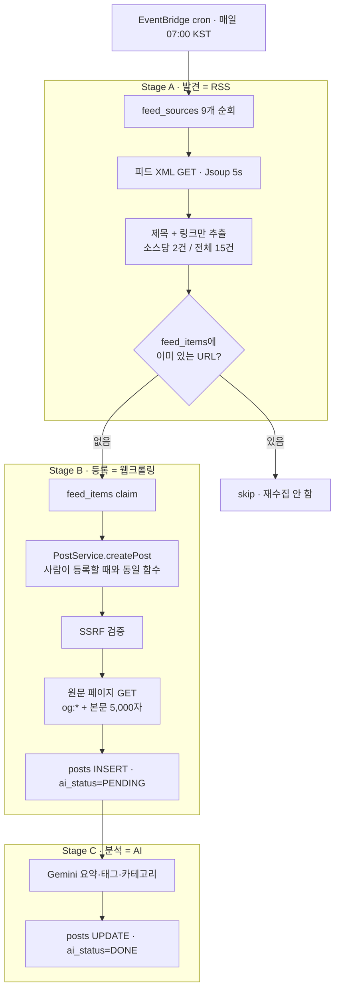

# Link-Sphere BE — RSS 피드 자동 수집 봇 (2026-09-03)

> **문서 성격**: 서사형(설명) — "왜 만들었고 어떻게 동작하는지"를 처음부터 끝까지 기록한다.
> 절차서(런북)가 아니다 — 배포·운영 절차 자체는 [`docs/DEPLOY.md`](./DEPLOY.md) 참고.
>
> **대상 독자**: 이 레포 BE를 처음 보거나, 봇 기능을 오랜만에 다시 만지는 개발자.
>
> **읽고 나면**: 이 문서만 보고 피드 소스를 추가/제거하거나, 수집 주기·건수를 조정하거나,
> 버그를 재현·수정할 수 있다 (§9 참고).
>
> **마지막 검토**: 2026-09-06

## 1. RSS가 뭔가요?

RSS는 새로운 기술이 아니라, 블로그나 뉴스 사이트가 오래전부터 공개해온
**"최신 글 목록" 읽기 전용 API**다. 우리 서비스의 `GET /api/post`를 호출하면
최근 게시글 목록이 JSON으로 오듯, 대부분의 블로그(우아한형제들 기술블로그,
토스 테크 등)는 `/feed`나 `/rss.xml` 같은 주소에 자기 최신 글 목록을
**XML**로 미리 만들어둔다. 형식만 XML일 뿐, 하는 일은 똑같다.

예를 들어 `https://toss.tech/rss.xml`을 열면 이런 게 보인다:

```xml
<item>
  <title>1%가 겪은 버그 고쳐야할까요?</title>
  <link>https://toss.tech/article/qa_hotfix</link>
  <pubDate>...</pubDate>
</item>
<item>
  <title>토스증권 추천과 검색은 어떻게 진화하고 있을까?</title>
  <link>https://toss.tech/article/tech_talk_talk_3</link>
</item>
```

`GET /api/post`가 JSON 배열을 돌려주는 것처럼, 이건 XML로 된 "최근 글 목록"이다.

이 봇이 하는 일은 단순하다:

1. 매일 정해진 시각에 스케줄러가 9개 블로그의 RSS 주소에 요청을 보낸다
2. 응답으로 온 XML을 파싱해 "제목 + 링크"만 뽑는다
3. 아직 등록 안 된 링크라면, **사람이 "링크 등록" 버튼을 눌렀을 때 호출되는 것과
   완전히 동일한 함수**(`PostService.createPost`)를 봇이 대신 호출한다 — 이 함수
   안에서 그 링크 하나를 실제로 크롤링해 본문을 가져온다(아래 순서도 Stage B 참고)

앱 입장에서는 "봇이 대신 등록 버튼을 눌러준 것"과 다르지 않다. AI가 글을
지어내지도, 임의의 사이트를 통째로 긁어오지도 않는다 — RSS로는 발행자가 이미
공개적으로 뿌리고 있는 목록만 읽고, 그 목록에 있는 링크 하나하나는 사람이 등록할
때와 똑같은 경로로 페이지를 가져온다.

RSS(1~2단계)와 크롤링(3단계)을 그림으로 보면 이렇다:



## 2. 전제 지식 — 읽기 전에

이 문서는 Kotlin·Spring Boot·JPA에 대한 기본 지식과, Lambda가 "요청이 올 때만 잠깐
떠서 처리하고 사라지는 실행 환경"이라는 정도의 이해는 있다고 가정한다.

아래는 가정하지 않는다 — 필요하면 먼저 읽는다:

- 이 레포가 120초 Lambda 타임아웃을 피하려고 쓰는 **self-invoke 관례**(자기 자신을
  다시 호출해 작업을 이어가는 패턴) → [`docs/AI-ASYNC-PROCESSING.md`](./AI-ASYNC-PROCESSING.md)
  가 원형이다
- 배포 구조·EventBridge 룰 조작법 → [`docs/DEPLOY.md`](./DEPLOY.md)
- 이 문서에서 처음 보는 용어(원장, claim, 정규화 URL 등) → §13 용어 사전
- 설명 말고 코드부터 보고 싶다면 → §9 코드 지도

## 3. 사용한 도구·기술

**기능 자체를 이루는 것**

- **Kotlin + Spring Boot** — 기존 백엔드 그대로, 이 기능만을 위해 새로 도입한
  프레임워크 없음
- **Jsoup** — RSS/Atom(XML) 파싱과 원문 페이지 크롤링 양쪽에 같은 접속 설정
  (Chrome 120 UA, 5초 timeout, 리다이렉트 홉마다 SSRF 재검증)을 그대로 재사용,
  RSS 전용 라이브러리는 새로 추가하지 않았다(4장 참고)
- **AWS Lambda** — 백엔드 코드가 실제로 실행되는 곳(서버를 직접 띄워두지
  않는 서버리스 환경)
- **AWS EventBridge** — 매일 정해진 시간에 Lambda를 깨우는 스케줄러
- **PostgreSQL (Supabase)** — 데이터 저장. 이번에 `feed_sources`/`feed_items`
  테이블 신설
- **React + TypeScript + Radix UI**(`@radix-ui/react-switch`) — FE "봇 글
  숨기기" 스위치

**만들고 검증하는 과정에서 쓴 도구**

- **`psql`** — 원격 DB에 직접 붙어 마이그레이션 SQL을 실행 (로컬에 없어서
  `brew install libpq`로 새로 설치)
- **AWS CLI**(`aws lambda invoke`, `aws events put-rule` 등) — 배포된 Lambda를
  수동으로 한 번 실행해 검증, EventBridge 스케줄 룰 생성
- **`gh` CLI** — GitHub PR 생성·머지
- **Playwright** — 실제 브라우저를 headless로 띄워 FE 스위치 동작을 자동으로
  확인(초기 노출 → 토글 → 새로고침·재진입 유지 → 모바일 레이아웃). 이 스위치는
  2026-09-06부터 URL 파라미터가 아니라 기기별 localStorage 설정으로 영속화된다
  (FE `CHANGELOG.md`의 `post` "봇 글 숨기기" 항목 참고)
- **GitHub Actions** — merge 시 자동 빌드·배포. 기존에 있던 파이프라인을
  그대로 탔고 새로 만들지 않았다

## 4. 왜 만들었나

Link-Sphere는 사용자가 링크를 직접 등록해야만 피드가 채워진다. 서비스 초기라
콘텐츠가 비어 있으면 신규 방문자에게 보여줄 게 없고, 기존 사용자도 다시 들어올
이유가 없다.

봇 계정 `링크봇`이 큐레이션된 RSS/Atom 피드를 매일 자동 수집해 공개 게시글로
등록하도록 했다. 등록된 글은 사람이 올린 글과 완전히 동일한 경로 — SSRF 검증,
크롤링, AI 요약·태그·카테고리 자동 분류 — 를 그대로 거친다.

**수집 대상을 고르는 방식**을 임의 사이트 스크래핑이 아니라 RSS/Atom으로 한정했다.
RSS는 발행자가 배포를 명시적으로 허용한 채널이라, 같은 목적을 저작권 문제 없이
달성한다(등록된 개별 링크는 사람이 등록할 때와 동일하게 크롤링한다 — 1장 참고).

## 5. 구조 — 3단계로 나눈 이유

피드 9개를 fetch하는 것과 새 글을 하나하나 크롤링하는 것을 한 번의 Lambda 호출
안에서 다 처리하면 120초 타임아웃을 넘긴다(`docs/AI-ASYNC-PROCESSING.md`가 같은
제약으로 self-invoke를 도입한 선례). 그래서 동일한 shape로 쪼갰다(각 단계에서
무엇을 가져오는지는 1장 순서도, 아래는 Lambda 경계·페이로드 관점).

```
EventBridge cron(0 22 * * ? *)   # UTC 22:00 = KST 07:00
        │  {"linksphereJob":"feed-crawl"}
[Stage A] FeedCrawlService.collectAndDispatch()
  · feed_sources(enabled=true) 순회, 소스당 최대 2건 / 전체 최대 15건 fetch
  · FeedUrlNormalizer로 정규화 → feed_items에 이미 있는 URL 제외
  · 남은 항목을 5건씩 chunk → chunk마다 self-invoke
        │  {"linksphereJob":"feed-item","event":{"items":[…5건…]}}
[Stage B] FeedCrawlService.processFeedItemJob(event)
  · 항목마다 독립 트랜잭션 — feed_items claim → PostService.createPost(botId, ...)
        │
[Stage C] "ai-analysis"  ← 기존 경로, 코드 변경 없음
```

### 5.1 chunk를 5건으로 자른 이유

신규 URL을 하나씩 개별 Lambda 호출로 넘기면(예: 15건 → 15개 동시 실행):

- Supabase 트랜잭션 풀러에 15개 클라이언트가 동시 접속한다(컨테이너마다 Hikari
  풀이 별개라 격리되지 않는다).
- 게시글 15개가 거의 동시에 커밋돼 AI 요약 잡도 15번 거의 동시에 발사된다 —
  Gemini 분당 호출 제한(RPM)을 곧바로 초과해 요약이 실패한다.

`chunked(5)` 한 줄로 동시 실행이 3개(15÷5)로 줄고, chunk 내부는 순차 커밋이라
AI 잡도 시간축에 자연스럽게 퍼진다. 부수 효과: chunk가 타임아웃돼 Lambda가 자동
재시도해도, 이미 claim된 항목은 즉시 skip되어 남은 항목만 이어서 처리된다.

5라는 값 자체에 특별한 공식은 없다 — "감당 가능한 동시성" 수준으로 잡은 값이고,
배포 후 `ai_status = FAILED` 비율이 높으면(Gemini RPM 초과 신호) 3으로 낮추도록
`docs/DEPLOY.md` 8장에 적어뒀다.

## 6. 데이터 모델 — `feed_sources` / `feed_items`

이번에 신설한 테이블 2개. 정본 DDL은 여기 옮겨적지 않는다 — 실제 컬럼·제약은
[`src/main/resources/sql/create_feed_sources.sql`](../src/main/resources/sql/create_feed_sources.sql)
을 확인한다. 여기서는 각 컬럼이 **왜 있는지**만 설명한다.

**`feed_sources`** — **"어디서 가져올까"** 목록. 소스 하나가 블로그 하나.

| 컬럼 | 역할 |
| --- | --- |
| `name` | 로그·문서에 찍히는 표시명(예: "우아한형제들 기술블로그") |
| `url` | RSS/Atom 주소. `uk_feed_sources_url`로 중복 등록 방지 |
| `enabled` | `false`면 Stage A 순회에서 제외 — 소스 일시중단에 씀 |
| `last_fetched_at` / `last_error` | 마지막 fetch 시각·실패 사유. 우아한형제들의 403 차단이 여기 기록된다(§10) |

**`feed_items`** — **"이미 가져온 적 있나"를 판정하는 원장(ledger)**. 게시글이
아니다 — 게시글 자체는 `posts` 테이블에 있고, `feed_items`는 봇이 그 URL을 이미
처리했는지만 기억한다.

| 컬럼 | 역할 |
| --- | --- |
| `normalized_url` | 중복 판정 키. `uk_feed_items_normalized_url`로 UNIQUE — Stage B의 claim(§13)이 여기 기댄다 |
| `source_id` | 어느 피드에서 왔는지. 소스가 삭제되면 `NULL`(`ON DELETE SET NULL`) |
| `post_id` | 실제로 만들어진 게시글. **nullable** — claim 시점엔 아직 게시글이 없어 `NULL`로 넣고, `createPost` 성공 후 채운다(attachPost, §11). 게시글이 관리자에 의해 삭제돼도 이 행은 `NULL`로 남아 **재수집을 막는다**(§7) |

`normalized_url`은 **판정 키 전용**이다 — `FeedUrlNormalizer`가 만든 값이고,
실제 `posts.url` 저장과 크롤링 요청에는 항상 원본 URL을 그대로 쓴다
(`FeedUrlNormalizer.kt` 클래스 주석 근거). 그래서 이 정규화는 다소 공격적이어도
안전하다 — 틀려도 "중복 판정을 못 할 뿐"이지 잘못된 URL을 등록하지 않는다.

왜 이 원장이 `posts` 테이블과 분리돼 있는지는 §7에서 다룬다.

## 7. 중복 방지 — `posts.url`을 건드리지 않은 이유

봇이 같은 글을 매일 다시 수집하면 안 되지만, 기존 게시글 URL 컬럼(`posts.url`)에는
unique 제약을 걸지 않았다:

1. **실 DB에 이미 중복이 있었다.** 확인 쿼리(`SELECT url, COUNT(*) ... HAVING COUNT(*) > 1`)
   실행 결과 스택오버플로 링크 1건이 7명에게 등록돼 있는 등 5건이 나왔다 —
   제약을 걸면 마이그레이션 자체가 즉시 실패했을 것이다.
2. **서비스 본질을 깬다.** A와 B가 같은 좋은 글을 각자 등록하는 건 정상 동작이고
   `PostService.createPost`가 지금 이를 허용한다.

대신 봇 전용 원장 테이블 `feed_items`를 새로 만들어 **거기에만** unique를 걸었다
(정규화된 URL 기준, §6). 사람 사용자의 동작은 한 줄도 바뀌지 않는다. `post_id`는
nullable + `ON DELETE SET NULL`로 둬서, 봇 글을 관리자가 지워도 원장은 남아
재수집되지 않는다.

## 8. 운영 파라미터

"몇 시에, 몇 번, 몇 개씩 도는지" 한눈에 보는 표. 코드 값은 파일 위치까지 명시한다.

| 파라미터 | 값 | 실제 위치 |
| --- | --- | --- |
| 실행 주기 | 매일 UTC 22:00 (KST 오전 7시) | **AWS EventBridge 룰 자체** (`link-sphere-feed-crawl`, `cron(0 22 * * ? *)`) — 이 프로젝트는 IaC가 없어서 레포 안 어떤 파일에도 이 cron 표현식을 담은 "설정 파일"은 없다. `docs/DEPLOY.md` 8장의 `aws events put-rule` 커맨드가 유일한 기록이자 값을 바꾸는 방법 |
| 소스당 최대 건수 | 2 | `FeedCrawlService.kt:29` `MAX_ITEMS_PER_SOURCE` |
| 전체 최대 건수 | 15 | `FeedCrawlService.kt:30` `MAX_ITEMS_TOTAL` |
| self-invoke chunk 크기 | 5 | `FeedCrawlService.kt:31` `CHUNK_SIZE` |
| Stage A 마감 가드 | 90,000ms | `FeedCrawlService.kt:32` `DEADLINE_MILLIS` |
| 피드 소스 목록(9개, 1개 비활성) | `feed_sources` 테이블 | DB (SQL 시딩, `sql/create_feed_sources.sql`이 최초 시딩 기록 — 소스 추가/제거는 이 테이블에 직접 SQL로 한다, 재배포 불필요) |

코드 값들은 `private const val` 컴패니언 오브젝트 상수로, 이미 있는
`LambdaHandler.kt`의 `WARMUP_PATHS`/`WARMUP_ITERATIONS`와 같은 스타일이다 — 이
레포는 이런 운영 튜닝값을 `application.yml`로 빼지 않고 코드 상수로 두는 게
기존 관례라 이번에도 그대로 따랐다.

**EventBridge 값을 바꾸려면**: `docs/DEPLOY.md` 8장의 `aws events put-rule`
커맨드를 `--schedule-expression`만 바꿔 재실행하면 된다(같은 이름의 룰에
다시 `put-rule`을 호출하면 덮어써진다 — 별도 삭제 불필요).

## 9. 코드 지도와 자주 하는 수정

순서도(1장)의 단계와 실제 파일의 대응:

| 단계 | 파일 |
| --- | --- |
| Stage A 진입 · Lambda 잡 분기 | `LambdaHandler.kt` — 페이로드의 `linksphereJob` 값(`feed-crawl`/`feed-item`/`ai-analysis`)으로 분기 |
| Stage A 본체 | `domain/feed/FeedCrawlService.kt` |
| RSS/Atom 파싱 | `domain/feed/FeedParser.kt` |
| 중복 판정 키 생성 | `domain/feed/FeedUrlNormalizer.kt` |
| self-invoke 페이로드 조립 | `infra/aws/FeedJobDispatcher.kt` → `infra/aws/LambdaSelfInvoker.kt`(AWS Lambda Invoke API 호출) |
| Stage B 본체(claim → createPost) | `domain/feed/FeedItemProcessor.kt` |
| 원장 테이블 엔티티·쿼리 | `domain/feed/TableFeedSource.kt`/`TableFeedItem.kt`, `FeedSourceRepository.kt`/`FeedItemRepository.kt` |
| 로컬 E2E 실행 도구 | `tools/FeedCrawlRunner.kt` |
| 테스트 | `src/test/kotlin/.../domain/feed/` — `FeedCrawlServiceTest`·`FeedItemProcessorTest`·`FeedParserTest`·`FeedUrlNormalizerTest` |
| 최초 스키마·시딩 | `src/main/resources/sql/create_feed_sources.sql` |

전체 파일 트리는 [`README.md`](../README.md)의 `domain/feed/` 절 참고 — 여기서는
중복하지 않는다.

자주 하는 수정:

| 하고 싶은 것 | 방법 |
| --- | --- |
| 피드 소스 추가·제거·일시중단 | `feed_sources` 테이블에 직접 INSERT / `enabled=false` UPDATE — **재배포 불필요** |
| 실행 시각 변경 | `docs/DEPLOY.md` 8장의 `aws events put-rule` 재실행 |
| 수집 건수·chunk 크기 조정 | `FeedCrawlService`의 companion object 상수(§8 표) 수정 — 재배포 필요 |
| 특정 글 재수집 강제 | `feed_items`에서 해당 `normalized_url` 행을 DELETE — 다음 실행 때 새 후보로 다시 잡힌다 |
| 로컬에서 안전하게 돌려보기 | `./gradlew bootRun --args='--spring.profiles.active=secret,feed-crawl'` — dry-run이 기본(후보만 출력), `--commit`을 붙여야 실제로 게시글이 생성된다(`FeedCrawlRunner.kt`) |
| 테스트 실행 | `./gradlew test --tests '*Feed*'` |
| 프로덕션에서 수동 1회 실행 | §10의 `aws lambda invoke` 커맨드 |

## 10. 검증 (실제 프로덕션)

배포 후 EventBridge 룰을 만들기 전, prod Lambda에 Stage A를 직접 트리거했다:

```bash
aws lambda invoke --function-name link-sphere-api:prod --log-type Tail \
  --payload fileb://feed-event.json out.json --query 'LogResult' --output text | base64 -d
```

```
2026-09-03T08:48:55.129Z WARN  [FeedCrawl] 피드 fetch 실패 - 우아한형제들 기술블로그: HTTP 403
2026-09-03T08:48:58.037Z INFO  [FeedCrawl] 후보가 모두 이미 수집된 URL - 종료
REPORT Duration: 4136.29 ms  Billed Duration: 4137 ms  Memory Size: 2048 MB
```

- 4.1초 만에 완료 (90초 deadline guard, 120초 Lambda 타임아웃에 여유)
- 우아한형제들만 크롤러 UA를 차단(403) — 소스별 `runCatching` 격리 덕에 나머지
  8개 소스는 영향 없음
- 로컬 검증 때 만든 15건이 실제 운영 환경에서도 전부 정상적으로 중복 제외됨
  (`feed_items`/봇 게시글 카운트 그대로 15/15 유지)

## 11. 시행착오 — `attachPost`가 flush 없이 실행되던 문제

### 11.1 증상

로컬 E2E 검증(`FeedCrawlRunner --commit`) 첫 실행에서 후보 14건이 **전부** 실패했다:

```
ERROR: insert or update on table "feed_items" violates foreign key constraint "fk_feed_items_post"
  Detail: Key (post_id)=(6b4dd5f2-...) is not present in table "posts".
```

`feed_items`/`posts` 카운트를 다시 확인해보니 둘 다 0 — claim한 원장 행까지
포함해 트랜잭션 전체가 롤백돼 있었다.

### 11.2 원인

`FeedItemProcessor.processFeedItem`은 한 트랜잭션 안에서 (1) `PostService.createPost`로
새 `TablePost`를 만들고, (2) `FeedItemRepository.attachPost`(`@Modifying` JPQL
`UPDATE`)로 방금 만든 postId를 `feed_items`에 채워 넣는다.

문제는 `@Modifying` 쿼리가 JDBC로 **직접** 나간다는 것이다 — Hibernate의
영속성 컨텍스트(dirty-checking 기반 flush 큐)를 거치지 않는다. `createPost`가
만든 `TablePost`의 실제 `INSERT` 문은 (1)의 `save()` 호출 시점이 아니라 다음
flush 시점까지 지연돼 있었는데, (2)의 `attachPost`가 그 flush보다 먼저 DB에
도달해 존재하지 않는 `post_id`를 참조하는 `UPDATE`를 실행한 것이다.

### 11.3 수정

```kotlin
@Modifying(flushAutomatically = true)
@Query("UPDATE TableFeedItem f SET f.postId = :postId WHERE f.id = :id")
fun attachPost(@Param("id") id: UUID, @Param("postId") postId: UUID)
```

`flushAutomatically = true`가 이 `UPDATE`를 실행하기 직전에 영속성 컨텍스트를
강제로 flush시켜, 대기 중이던 `Post` INSERT가 먼저 DB에 반영되게 한다.

### 11.4 재검증

수정 후 재실행 — 14건 전부 성공. 곧바로 같은 잡을 한 번 더 실행해 멱등성도
확인했다: 기존 URL은 정상적으로 skip되고, 그사이 GeekNews에 새로 올라온 글
1건만 추가로 처리됐다(`totalElements` 14 → 15).

이 버그는 로컬에서만 재현된 게 아니다. 만약 발견 못 하고 그대로 배포했다면,
실제 Lambda 환경에서도 동일한 순서로 같은 예외가 나 **봇 글이 하나도 등록되지
않았을 것**이다 — Lambda self-invoke의 트랜잭션 경계와 `@Modifying` 쿼리의
flush 미보장이 겹치는, 로컬/운영 환경 차이가 아니라 순수하게 코드 로직의 문제였다.

## 12. 남은 것

- 네이버 D2 피드(`enabled=false`로 시딩)의 실제 접근 가능 여부 미확인
- GeekNews 항목 링크가 원문이 아니라 토론 페이지(`news.hada.io/topic?id=...`)인
  점 — 그대로 둘지는 실제 등록 결과를 더 보고 판단
- 우아한형제들 기술블로그 403 — 필요하면 User-Agent 조정 검토 (지금은 실패해도
  다른 소스에 영향 없어 낮은 우선순위)
- 다음 EventBridge 자동 실행: 2026-09-04 07:00 KST — 신규 게시글이 실제로
  올라오는지 재확인 필요

## 13. 용어 사전

- **원장(ledger)** — `feed_items` 테이블을 가리키는 표현. 게시글 자체가 아니라
  "이 URL을 이미 처리했다"는 사실만 기록하는 장부(§6)
- **claim** — `INSERT ... ON CONFLICT DO NOTHING`으로 원장 행을 먼저 선점하는 것.
  반환값이 0이면 이미 다른 실행이 처리했다는 뜻이라 그 자리에서 skip한다(멱등성의
  핵심 장치)
- **정규화 URL(normalized URL)** — `FeedUrlNormalizer`가 만드는, 중복 판정에만
  쓰는 URL 형태(호스트 소문자화, `www.` 제거, 추적 파라미터 제거 등). 실제 저장·
  크롤링에는 쓰지 않는다(§6)
- **self-invoke** — Lambda가 처리 도중 자기 자신을 다시 호출해 나머지 작업을
  넘기는 패턴. 120초 타임아웃을 우회하는 이 레포의 관례(`docs/AI-ASYNC-PROCESSING.md`)
- **`linksphereJob`** — self-invoke 페이로드에 담기는 마커 필드. `LambdaHandler`가
  이 값(`feed-crawl`/`feed-item`/`ai-analysis`)으로 어느 Stage를 실행할지 분기한다
- **Stage A / B / C** — 이 문서에서 편의상 붙인 이름. 코드에는 "Stage"라는 이름의
  클래스나 상수가 없다 — 발견(RSS)/등록(크롤링)/분석(AI)의 3단계를 가리킨다
- **`ai_status`** — `posts` 테이블의 AI 분석 진행 상태(`PENDING`/`DONE`/`FAILED`).
  봇 글도 사람 글과 동일한 값을 쓴다
- **deadline guard** — Stage A가 90초(§8)를 넘기지 않도록 미리 멈추는 안전장치.
  Lambda의 120초 타임아웃보다 여유 있게 짧게 잡아둔 값
- **`prod` alias** — 배포된 Lambda 함수의 프로덕션 버전을 가리키는 별칭. §10의
  수동 검증이 이 alias를 대상으로 실행됐다
- **RPM** — Requests Per Minute. Gemini API의 분당 호출 제한(§5.1)

## 관련 문서

- [`docs/DEPLOY.md`](./DEPLOY.md) 8장 — EventBridge 룰 설정 절차
- [`docs/AI-ASYNC-PROCESSING.md`](./AI-ASYNC-PROCESSING.md) — 이번에 재사용한
  self-invoke 패턴의 원형
- [`CHANGELOG.md`](../CHANGELOG.md) — 버전별 변경 요약
