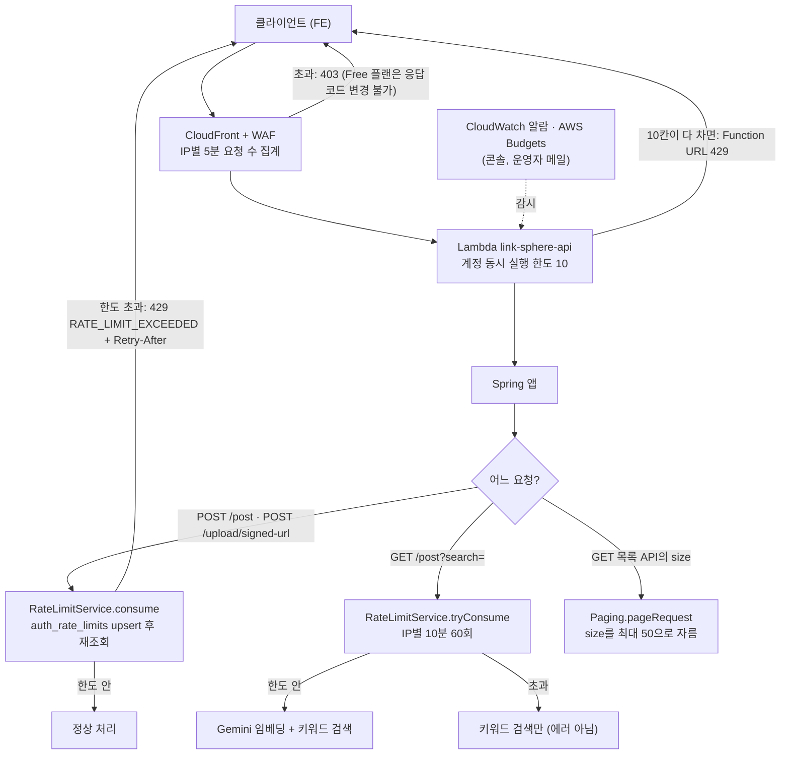

# Link-Sphere BE — 트래픽 관리 (다층 방어)

> **문서 성격**: 서사형 — 트래픽이 몰리거나 남용될 때 무엇이 어디서 막는지의 동작 스펙과 도입 배경
>
> **대상 독자**: 이 레포 BE를 처음 보거나 오랜만에 돌아온 개발자, 그리고 AWS 콘솔에서 WAF·알람을 손봐야 하는 사람
>
> **읽고 나면**: 요청 한도 값을 바꾸거나 새 엔드포인트에 한도를 걸 수 있고, WAF·알람 콘솔 작업을 이 문서만 보고 할 수 있다
>
> **마지막 검토**: 2026-10-03

## 1. 쉬운 설명

놀이공원 입구를 생각하면 된다. **정문 경비(WAF)** 는 한 사람이 5분 안에 너무 자주
드나들면 아예 들여보내지 않는다. 정문을 통과해도 **놀이기구마다 줄 관리(앱 limiter)** 가
있어서, 비싼 놀이기구(글 등록·이미지 업로드)는 한 사람이 시간당 탈 수 있는 횟수가 정해져
있다. 검색처럼 누구나 쓰는 시설은 사람이 몰리면 막는 대신 **간이 버전(키워드 검색)으로
안내**한다. 놀이공원 전체 수용 인원(Lambda 동시 실행 10)은 원래부터 정해져 있고, 그게 다 차면
입장이 잠시 멈춘다. 마지막으로 **CCTV(알람)** 가 이상 징후를 운영자 메일로 알린다.



## 2. 전제 지식

- **가정한다**: Spring Boot 컨트롤러·서비스 구조, HTTP 상태 코드(403·429)의 뜻
- **가정하지 않는다**:
  - CloudFront·WAF·Lambda Function URL의 연결 구조 → [`DEPLOY.md`](DEPLOY.md) §5와
    FE 레포 `docs/DEPLOY.md`의 "CloudFront WAF (수동 관리)" 절
  - 인증 레이트리밋(`auth_rate_limits` 테이블)이 처음 생긴 배경 →
    [`plans/2026-09-28-auth-hardening.md`](plans/2026-09-28-auth-hardening.md)
  - 실제 요청자 IP를 얻는 방법(`CloudFront-Viewer-Address`) → [`DEPLOY.md`](DEPLOY.md) §5-2

## 3. 사용한 도구·기술

- 기능 자체
  - AWS WAF rate-based rule (CloudFront Free 정액 플랜에 포함)
  - Postgres 고정 윈도 카운터 (`auth_rate_limits`, 기존 테이블 재사용)
  - HTTP 429 + `Retry-After` 헤더
  - CloudWatch 알람, AWS Budgets
- 구현·검증 과정
  - AWS CLI 읽기 전용 조회(`get-account-settings`, `wafv2 get-web-acl`, `cloudwatch describe-alarms`)
  - JUnit + Mockito 단위 테스트

## 4. 왜 만들었나

2026-10-02 점검 결과, 기본 방어만 있고 "트래픽 관리"라고 할 장치는 대부분 비어 있었다.

| 층 | 점검 결과 (2026-10-02) | 확인 방법 |
|---|---|---|
| WAF | 관리형 규칙 3개만 있음(IP 평판·Common·KnownBadInputs), **IP별 요청 수 제한 없음** | `aws wafv2 get-web-acl` |
| Lambda | 계정 `ConcurrentExecutions: 10` — 신규 계정용 축소 한도가 우연히 상한 역할 | `aws lambda get-account-settings` |
| 앱 | 인증 4종에만 limiter. 그나마 확인과 기록이 분리돼 병렬 요청이 한꺼번에 통과할 수 있었음 | 코드 |
| 비싼 엔드포인트 | 비로그인 검색이 매번 Gemini 임베딩 호출, 글 등록·업로드 URL 발급 무제한, 목록 `size` 상한 없음 | 코드 |
| 알람 | CloudWatch 알람 0개 | `aws cloudwatch describe-alarms` |

참고로 FE 레포 `docs/plans/2026-09-25-lighthouse-perf.md`는 "로그인 rate limit 없음"이라고 적고
있지만, 그 뒤 인증 하드닝(2026-09-28)으로 로그인 실패 한도가 생겨 지금은 사실이 아니다. 계획
문서는 append-only라 고치지 않고 여기서 정정해 둔다.

[OWASP API Security Top 10 2023의 API4](https://api-security.owasp.org/editions/2023/en/0xa4-unrestricted-resource-consumption)는
이 상태를 _"악용되면 자원 고갈로 인한 서비스 거부가 생기고, 인프라 운영 비용 증가로도
이어질 수 있다"_ (번역)고 설명한다. 서버리스는 쓴 만큼 과금되므로 같은 공격이 장애가 아니라
요금으로 나타날 수도 있다 — Kelly 외([arXiv:2104.08031](https://arxiv.org/abs/2104.08031))는
이를 "Denial of Wallet"이라 부른다.

## 5. 구조

### 5-1. 왜 여러 겹인가

AWS WAF 문서는 rate-based rule의 한계를 직접 밝힌다.

> AWS WAF의 속도 제한은 (...) 정밀한 요청 속도 제한을 위한 것이 아니다. (...) 보통 이 지연은
> 30초 미만이다. (번역)
>
> — AWS WAF Developer Guide, https://docs.aws.amazon.com/waf/latest/developerguide/waf-rule-statement-type-rate-based-caveats.html

그래서 **굵은 차단은 엣지(WAF)**, **세밀한 한도는 앱**에서 건다. WAF는 IP만 보지만, 글 등록처럼
"이 회원이 시간당 몇 번"은 로그인 정보를 아는 앱만 셀 수 있다.

| 대안 | 채택 | 이유 |
|---|---|---|
| WAF만 | ✗ | 회원 단위 한도를 못 건다. 탐지까지 지연이 있다 |
| 앱 limiter만 | ✗ | 요청이 이미 Lambda를 깨운 뒤라 Lambda 10칸과 DB가 그대로 소모된다 |
| CloudFront Pro 플랜($15/월) | ✗ | 429 응답·헤더 기반 규칙이 가능해지지만, 지금 트래픽 규모에 비해 비용이 크다 |
| **WAF + 앱 + 알람 (다층)** | ✓ | 추가 비용 없이 각 층이 다른 공격 형태를 맡는다 |

### 5-2. 앱 limiter를 새로 들이지 않은 이유

Bucket4j 같은 라이브러리나 인메모리 카운터는 쓰지 않았다. Lambda는 실행 환경을 여러 개 띄우고
수 시간마다 교체하므로([Lambda 실행 환경](https://docs.aws.amazon.com/lambda/latest/dg/lambda-runtime-environment.html))
인메모리 카운터는 환경마다 따로 세져 의미가 없다. 공유 저장소가 필요한데, 인증 limiter가 이미
Postgres 카운터(`RateLimitService`)를 쓰고 있어 그대로 확장했다.

### 5-3. 확인과 기록을 한 번에 (consume)

예전 방식(`checkNotExceeded` → `recordHit`)은 "읽고 → 비교하고 → 기록"이 따로라, 같은 순간에
들어온 요청 10개가 모두 "아직 4회"를 읽고 통과할 수 있었다. `consume`은 **먼저 기록(upsert)하고
같은 트랜잭션에서 다시 읽는다**. Postgres는 upsert한 행을 커밋할 때까지 잠그므로 병렬 요청은
앞 요청이 끝날 때까지 줄을 서고, 각자 정확한 누적값을 본다. 한도를 넘어 예외가 나면 그 트랜잭션의
기록은 롤백된다 — 카운터는 한도에 머물러 계속 막는다.

기록하는 메서드(`recordHit`·`consume`·`tryConsume`)는 모두 **별도 트랜잭션(`REQUIRES_NEW`)** 으로
돈다. 호출부가 기록 직후 예외를 던져도(로그인 실패, 가입 중복 등) 카운터는 이미 커밋돼 남는다.
호출부 트랜잭션에 합류하던 시절엔 그 롤백에 기록까지 지워져 로그인 실패 한도가 한 번도 세지지
않았다(10장).

로그인은 예외다. "실패만 센다"는 규칙이라 성공할지 모르는 시점에 미리 기록할 수 없어 옛 방식을
유지한다. 남는 병렬 우회 위험은 WAF IP 제한이 받는다.

### 5-4. 검색은 막지 않고 강등

검색은 비로그인 사용자도 쓰는 핵심 기능이라 429로 막으면 사이트가 고장 난 것처럼 보인다.
Google SRE 책은 과부하 대응으로 기능을 낮춰 응답하는 방법(graceful degradation)을 든다
([Addressing Cascading Failures](https://sre.google/sre-book/addressing-cascading-failures/)).
한도를 넘은 IP의 검색은 Gemini 임베딩만 건너뛰고 키워드 검색 결과를 그대로 돌려준다 — Gemini
장애 때 이미 쓰던 폴백 경로와 같다.

### 5-5. 한도를 컨트롤러에 둔 이유

`PostService.createPost`는 RSS 봇(`FeedItemProcessor`)도 직접 부른다. 서비스에 한도를 걸면 봇이
회원 한도에 걸릴 수 있어, 사용자 요청 경로인 컨트롤러에서만 건다. `consume`은 자기 트랜잭션으로
짧게 끝나므로 크롤링(수십 초) 동안 카운터 행을 잠그지 않는다.

### 5-6. 동시 처리 한계는 Spring 설정이 아니라 Lambda 칸 수가 정한다

일반 서버(EC2, 예전 App Runner)라면 Spring Boot의 `server.tomcat.threads.max`(기본 200)가 서버 한
대의 동시 처리 수를 정한다. 이 레포의 Lambda에는 **Tomcat이 없다** — SnapStart 체크포인트 때문에
소켓을 열 수 없어 `LambdaHandler`가 `DispatcherServlet`을 MockMvc로 직접 호출한다
([`DEPLOY.md`](DEPLOY.md) "MockMvc 방식을 사용하는 이유"). 그리고 Lambda는 실행 환경(이하 "칸")
하나에 요청을 한 번에 1건만 넣는다.

```
일반 서버                                   이 레포의 Lambda
┌────────── 서버 1대 ──────────┐            ┌ 칸1 ┐ ┌ 칸2 ┐ ... ┌ 칸10 ┐
│ Tomcat 스레드 200개          │            │요청1│ │요청1│     │요청1 │
│ → threads.max로 동시 처리 조절│            └─────┘ └─────┘     └──────┘
└──────────────────────────────┘            동시 처리 수 = 칸 수(AWS 계정 한도 10)
```

그래서 Tomcat 스레드·`@Async` 풀(`AsyncConfig`)·Hikari 풀을 늘려도 칸당 1건은 바뀌지 않는다
(Hikari 풀 5도 실제로는 칸마다 1개 남짓만 쓴다).

```
동시 처리 한계 = 칸 수(AWS 계정 설정)  ÷  요청 1건이 칸을 잡는 시간(코드가 결정)
```

- **칸 수**는 코드로 못 바꾼다 — Service Quotas 상향 요청(무료, 승인은 AWS 판단)이 필요하다.
- **칸을 잡는 시간**이 코드의 몫이다. 조회는 0.3초 안팎이라 문제가 없고, 칸을 오래 잡는 건 사실상
  글 등록(동기 크롤링, 수 초~수십 초) 하나다(9장 실측).
- 코드 쪽 대책 후보: ① 글 등록을 "빠른 저장 + 비동기 크롤링"으로 바꾸기(효과 가장 큼),
  ② 비로그인 공개 조회를 CloudFront에서 캐싱해 Lambda까지 안 오게 하기(로그인 응답엔 본인
  좋아요·북마크 여부가 들어가 캐싱하면 안 됨 — 인증 전달 방식 조사가 먼저), ③ 외부 호출
  타임아웃 줄이기. 콜드 스타트(새 칸에 1.5~5초)를 더 줄이는 건 유료 Provisioned Concurrency
  영역이다.

## 6. 데이터 모델

새 테이블은 없다. 기존 `auth_rate_limits`(정본 DDL:
[`src/main/resources/sql/create_auth_rate_limits.sql`](../src/main/resources/sql/create_auth_rate_limits.sql))에
버킷 키 접두사만 늘었다.

| 버킷 키 | 단위 | 쓰는 곳 |
|---|---|---|
| `post-create:member:<회원ID>` | 회원 | 글 등록 |
| `upload:member:<회원ID>` | 회원 | 업로드 URL 발급 |
| `search-embed:ip:<IP>` | IP | 검색 임베딩 |

옛 윈도 행은 정리하지 않는 기존 정책 그대로다. 검색 버킷은 검색한 IP 수 × 10분 윈도 수만큼 행이
늘어난다 — 행이 많아지면 정리 배치를 검토한다(11장).

## 7. 운영 파라미터

### 7-1. 앱 (코드 상수, 바꾸면 재배포 필요)

| 대상 | 한도 | 위치 |
|---|---|---|
| 글 등록 | 회원당 1시간 20회 | `domain/post/PostController.kt:29-30` |
| 검색 임베딩 | IP당 10분 60회 (초과 시 키워드 검색으로 강등) | `domain/post/PostController.kt:34-35` |
| 업로드 URL 발급 | 회원당 1시간 30회 | `domain/upload/UploadController.kt:25-26` |
| 목록 `size` | 최대 50 (글 목록·북마크 폴더 글·내 댓글) | `global/common/Paging.kt:12` |
| 로그인 실패 | 이메일당 15분 5회, IP당 15분 20회 | `domain/auth/AuthService.kt:35-41` |
| 가입 | IP당 1시간 5회 | `domain/auth/AuthService.kt:45-46` |
| 인증메일 재발송 | 이메일당 1시간 3회, IP당 1시간 10회 | `domain/auth/AuthService.kt:49-52` |
| 비밀번호 재설정 요청 | 이메일당 1시간 3회, IP당 1시간 10회 | `domain/auth/PasswordResetService.kt:36-39` |

(경로는 `src/main/kotlin/com/example/linksphere/` 기준)

글 등록·업로드·검색의 값은 2026-10-02에 정한 초안이다. 실제 사용 패턴을 본 적이 없어 넉넉하게
잡았다 — 정상 사용자가 걸린다는 신호(429 로그)가 보이면 올린다.

### 7-2. 엣지·알람 (레포 밖, AWS 콘솔에서 관리)

| 항목 | 값 | 위치 | 필요도 · 비용 |
|---|---|---|---|
| Lambda 계정 동시 실행 | 10 (신규 계정 한도, 사용량에 따라 AWS가 자동 상향) | AWS 계정, 2026-10-02 실측 | — |
| Hikari 풀 | 인스턴스당 5 → 최대 10×5=50 DB 연결 | `src/main/resources/application.yml:17` | — |
| WAF rate-based rule | 8-1 런북 참고 (Count로 관찰 후 Block) | WAF 콘솔 `CreatedByCloudFront-bcd729fb` | **필요** · 추가 비용 없음(Free 플랜 규칙 5개 안) |
| CloudWatch 알람 (`Throttles`) | 8-2 런북 참고 | CloudWatch 콘솔 (ap-northeast-1) | 선택 · 무료(프리티어 알람 10개 안) |
| AWS Budgets | 8-3 런북 참고 | Billing 콘솔 | 선택(우선순위 낮음) · 무료(알림만) |

필요도는 2026-10-03 실측(9장)으로 판단했다. 적용 상태(2026-10-03): WAF IP 제한은 **적용(Count)**,
Throttles 알람·Budgets는 미적용(선택).

## 8. 코드 지도와 자주 하는 수정

| 순서도 단계 | 파일 |
|---|---|
| 한도 계산 (`consume`·`tryConsume`·`checkNotExceeded`) | `global/common/RateLimitService.kt` |
| 카운터 upsert·재조회 | `domain/auth/AuthRateLimitRepository.kt` (`incrementHit`, `findHitCount`) |
| 429 응답 + `Retry-After` | `global/exception/GlobalExceptionHandler.kt` (`handleRateLimitExceededException`) |
| 실제 요청자 IP | `global/common/ClientIpResolver.kt` |
| size 상한 | `global/common/Paging.kt` |

| 하고 싶은 것 | 방법 | 재배포 |
|---|---|---|
| 한도 값 바꾸기 | 7-1 표의 상수 수정 | 필요 |
| 새 엔드포인트에 한도 걸기 | 컨트롤러에 `RateLimitService`를 주입하고 `consume("<기능>:member:$userId", LIMIT, WINDOW)` 호출. 막지 않고 강등하려면 `tryConsume` | 필요 |
| 긴급 차단 | WAF rate rule 한도를 낮추거나 IP 차단 규칙 추가(규칙 수 5개 한도 주의) | 불필요 |

### 8-1. 런북: WAF rate-based rule

**왜 필요한가**: WAF는 이미 하루 800~1,800건을 알려진 악성 IP·공격 패턴으로 차단 중이다(9장).
목록·상세 같은 공개 조회에는 앱 한도가 없어, 처음 보는 IP 하나가 몰아치면 Lambda 10칸이 차서
사이트 전체가 429가 된다. 이걸 앱 앞에서 막는 장치는 이것뿐이다. 추가 비용 없음.

**적용 상태**: 2026-10-03 적용 완료 — `RateLimit-PerIP`(우선순위 3, IP당 5분 1000회, **Count**).
적용 직후 조회 결과 규칙 4개, `CountedRequests` 0건. 원래 설정 백업은 운영자 로컬
`~/waf-backup-2026-10-03.json`(레포 밖)에 있다.

**콘솔에서는 안 된다.** 이 Web ACL은 CloudFront Free 정액 플랜에 묶여 있어 WAF 콘솔에
"Add my own rules and rule groups"가 보이지 않고, CloudFront 콘솔 Security 탭의 WAF 섹션에도
Edit 버튼이 없었다(2026-10-03 확인). AWS 문서([Set up rate limiting](https://docs.aws.amazon.com/AmazonCloudFront/latest/DeveloperGuide/WAF-one-click-rate-limiting.html))는
Security 탭 → Edit → Rate limiting 경로를 안내하지만 이 배포에서는 그 버튼이 없었다. 대신
**`wafv2 update-web-acl` API는 동작한다**(2026-09-06 XSS 오버라이드, 2026-10-03 이 규칙 모두
CLI로 적용). 이 레포의 `link-sphere-user` 자격 증명으로는 하지 않았다 — 운영자 관리자 자격
증명으로 실행했다.

**적용 절차 (관리자 자격 증명, 레포 밖 빈 폴더에서 한 줄씩)** — `update-web-acl`은 규칙 배열 전체를
다시 보내야 하므로 현재 설정을 백업하고 거기에 덧붙인다.

```bash
# 1) 백업 (되돌릴 때 이 파일 사용)
aws wafv2 get-web-acl --scope CLOUDFRONT --region us-east-1 --name CreatedByCloudFront-bcd729fb --id 16fc99ed-1f67-4dec-9951-04806ce95699 > webacl-backup.json

# 2) 적용: 기존 규칙 + RateLimit-PerIP(Count). 중간 파일 없이 백업에서 바로 꺼낸다
aws wafv2 update-web-acl --scope CLOUDFRONT --region us-east-1 --name CreatedByCloudFront-bcd729fb --id 16fc99ed-1f67-4dec-9951-04806ce95699 --lock-token "$(jq -r .LockToken webacl-backup.json)" --default-action "$(jq -c .WebACL.DefaultAction webacl-backup.json)" --visibility-config "$(jq -c .WebACL.VisibilityConfig webacl-backup.json)" --rules "$(jq -c '.WebACL.Rules + [{"Name":"RateLimit-PerIP","Priority":3,"Statement":{"RateBasedStatement":{"Limit":1000,"EvaluationWindowSec":300,"AggregateKeyType":"IP"}},"Action":{"Count":{}},"VisibilityConfig":{"SampledRequestsEnabled":true,"CloudWatchMetricsEnabled":true,"MetricName":"RateLimit-PerIP"}}]' webacl-backup.json)"

# 3) 확인
aws wafv2 get-web-acl --scope CLOUDFRONT --region us-east-1 --name CreatedByCloudFront-bcd729fb --id 16fc99ed-1f67-4dec-9951-04806ce95699 --query "WebACL.Rules[].[Priority,Name,keys(Action || OverrideAction)[0],Statement.RateBasedStatement.Limit]" --output text
```

- 여러 줄짜리 스크립트(heredoc)를 터미널에 붙여넣으면 괄호가 깨져 실패한 적이 있다 — 위처럼 한 줄
  명령만 쓴다. 성공하면 `{"NextLockToken": ...}`가 나온다.
- 결과 파일이 레포 안에 생기지 않게 레포 밖에서 실행한다(2026-10-03 FE 레포 루트에 생겨 수동 정리).
- `WAFOptimisticLockException`이면 그사이 설정이 바뀐 것 — 1)부터 다시.

**1주 뒤 Block 전환 (2026-10-10 무렵)**: CloudWatch(us-east-1) → WAFV2 → `CountedRequests`
(Rule=`RateLimit-PerIP`)를 본다. 정상 사용자가 걸린 흔적이 없으면 위 2)와 같은 방식으로 이 규칙의
`"Action":{"Count":{}}`를 `"Action":{"Block":{}}`로 바꿔 다시 보낸다(최신 백업 기준).

**되돌리기**: 백업 파일의 원래 규칙 배열로 다시 보낸다(lock token은 최신 값으로).

```bash
aws wafv2 update-web-acl --scope CLOUDFRONT --region us-east-1 --name CreatedByCloudFront-bcd729fb --id 16fc99ed-1f67-4dec-9951-04806ce95699 --lock-token "$(aws wafv2 get-web-acl --scope CLOUDFRONT --region us-east-1 --name CreatedByCloudFront-bcd729fb --id 16fc99ed-1f67-4dec-9951-04806ce95699 --query LockToken --output text)" --default-action "$(jq -c .WebACL.DefaultAction webacl-backup.json)" --visibility-config "$(jq -c .WebACL.VisibilityConfig webacl-backup.json)" --rules "$(jq -c .WebACL.Rules webacl-backup.json)"
```

Free 플랜 제약([CloudFront flat-rate 플랜 문서](https://docs.aws.amazon.com/AmazonCloudFront/latest/DeveloperGuide/flat-rate-pricing-plan.html)):
WAF 규칙은 관리형·커스텀 합쳐 5개까지이고(2026-10-03 기준 4개 사용), 차단 응답 코드를 바꿀 수 없어
WAF 차단은 429가 아니라 **403**으로 나간다. FE는 이를 `EDGE_BLOCKED`로 구분한다. 특정 경로만
더 엄격하게 거는 scope-down이 Free 플랜에서 되는지는 확인하지 못했다(미확인).

### 8-2. 런북: CloudWatch 알람

1. SNS 주제 하나(예: `link-sphere-alerts`)를 만들고 운영자 이메일을 구독시킨 뒤 메일에서 승인한다
2. CloudWatch(ap-northeast-1) → Alarms → Create alarm:

| 알람 | 지표 | 조건 | 의미 |
|---|---|---|---|
| `link-sphere-api-throttles` | Lambda `Throttles` (FunctionName=link-sphere-api), Sum | 5분 동안 ≥ 1 | 동시 실행 10칸이 다 찼다 — 한도 상향 요청을 검토할 신호 |

누락된 데이터 처리는 "양호로 처리"로 둔다(요청 없는 시간대에 경보 상태가 되지 않게).

**Lambda `Errors` 알람은 만들지 않는다.** 이 지표는 함수 자체가 실패한 경우만 센다 — Spring은
500도 정상 HTTP 응답으로 돌려주므로 세지지 않는다. 실제로 2026-10-03 실측 중 500이 4건 났는데도
30일 내내 `Errors`는 0이었다. 앱 500을 잡으려면 로그 기반 지표(metric filter)가 따로 필요하다.

비용: CloudWatch 표준 알람은 지표 10개까지 무료이고 넘으면 개당 월 $0.10이다
([CloudWatch 가격](https://aws.amazon.com/cloudwatch/pricing/)). SNS 이메일의 무료 한도는 가격
페이지에서 숫자를 확인하지 못했다(미확인) — 알람 메일은 문제 시에만 오므로 실질 비용은 0에 가깝다.

Lambda 문서에 따르면 throttle된 요청은 `Invocations`에도 `Errors`에도 세지 않는다
([Lambda 지표](https://docs.aws.amazon.com/lambda/latest/dg/monitoring-metrics-types.html)) — 그래서
`Throttles`를 따로 봐야 한다.

### 8-3. 런북: AWS Budgets

비용: 알림만 쓰면 무료다 — _"예산을 모니터링하고 알림을 받는 것은 무료다"_ (번역,
[AWS Budgets 가격](https://aws.amazon.com/aws-cost-management/aws-budgets/pricing/)). 자동 조치(budget
action)와 리포트는 유료라 쓰지 않는다. 우선순위는 낮다 — 9월 요금이 약 $4.6이고 Lambda는 무료
한도 안($0)이며, WAF IP 제한을 넣으면 요금 폭증 시나리오 자체가 거의 막힌다.

Billing → Budgets → Create budget → Cost budget, 월 $10(예시) → 알림 2개: 실제 비용 80%, 예측 비용
100%, 운영자 이메일.

Budgets는 차단 장치가 아니다. AWS 문서는 _"알림을 받기 전에 임계값을 넘는 비용이 발생할 수
있다"_ (번역,
[AWS Budgets](https://docs.aws.amazon.com/cost-management/latest/userguide/budgets-managing-costs.html))고
밝힌다 — 늦게 오는 경보로만 생각한다.

## 9. 검증 결과

- 단위 테스트: `RateLimitServiceTest`(consume·tryConsume 경계값, Retry-After 범위),
  `PostServiceTest`(강등 시 Gemini 미호출, size 100000 → 50), `AuthServiceTest`·`PasswordResetServiceTest`
  (consume 전환) 통과
- 실제 DB 동작(운영, 2026-10-03, 없는 이메일로 curl — 본문 해시 헤더 `x-amz-content-sha256` 필수)
  - `GET /api/post?size=100000` → 전체 231건 중 50건 응답
  - 비밀번호 재설정 요청 4회 → 200 ×3, 429 ×1 + `Retry-After: 915`
  - (BE #62 배포 후) 로그인 실패 7회 → 401 ×5, 429 ×2 / 인증메일 재발송 4회 → 200 ×3, 429 ×1

### 9-1. 트래픽 실측 (2026-09-03 ~ 10-03, CloudWatch 읽기 전용 조회)

| 지표 | 값 |
|---|---|
| Lambda 호출 | 하루 144~4,276회. 바닥선 약 300회는 5분 워밍 핑(하루 288회) |
| 동시 실행 최대 | 대부분 2~6. 2026-09-08 12:50(KST)에 한 번 10, 그때 Throttles 3건(원인 미확인) |
| Lambda `Errors` | 30일 내내 0 (앱 500은 세지 않는다 — 8-2) |
| Duration | 평균 약 0.12초, 최대 45.6초 |
| WAF 차단 | 2026-09-29부터 하루 800~1,800건. 대부분 IP 평판 규칙, Common 규칙 하루 240~510건 |
| 9월 AWS 요금 | 약 $4.6 (도메인 $3, Route 53 $0.5, Secrets Manager $0.4, S3 $0.3 등). Lambda $0 |

### 9-2. 동시 요청 실측 (운영, 2026-10-03 11:20 KST, `GET /api/post?page=0&size=10`)

직접 측정. 방법: `seq N | xargs -P N -I{} curl -s -o /dev/null -w "%{http_code} %{time_total}\n" <URL>`을
N=5·10·15로 8초 간격 실행(총 30건).

| 동시 요청 | 결과 | 응답 시간 |
|---|---|---|
| 5 | 200 ×5 | 0.56초 / 1.7~1.8초 ×3 / 5.4초 ×1 |
| 10 | 200 ×10 | 0.29~0.44초 ×7 / 1.7~2.0초 ×3 |
| 15 | 200 ×10, **429 ×5** | 429는 0.17초에 즉시 거절, 200은 0.27~1.0초 |

- 한도는 정확히 10이다. 넘친 요청은 앱까지 가지 않고 Lambda 입구에서 즉시 429가 된다.
- 새 칸을 띄우면(콜드 스타트) 1.5~5초가 더 걸린다. 이미 떠 있는 칸은 0.3초 안팎.
- DB는 동시 10건에서 병목이 아니었다(떠 있는 칸 7개가 동시에 0.3~0.4초).

## 10. 시행착오

아래 두 가지는 배포 후 겪은 버그가 아니라 설계 중에 발견하고 피한 함정이다.

- 처음엔 `INSERT ... RETURNING hit_count` 한 문장으로 원자화하려 했다. 레포에 선례가 없고 DB 통합
  테스트가 없어 검증이 어려워, 기존 `incrementHit` 뒤에 같은 트랜잭션에서 다시 읽는 방식으로 바꿨다.
  다시 읽을 때 엔티티 조회(`findByBucketKeyAndWindowStart`)를 쓰면, 같은 트랜잭션에서 그 행을 먼저
  읽어 둔 적이 있을 때 영속성 컨텍스트가 옛 값을 돌려준다. 그래서 숫자만 읽는 native 쿼리
  `findHitCount`를 따로 만들었다.
- `getAllPosts`는 `readOnly` 트랜잭션이라 그 안에서 카운터를 쓰면 Postgres가 쓰기를 거부한다.
  검색 카운터를 컨트롤러(트랜잭션 밖)에서 세고 결과만 서비스에 넘기는 구조가 된 이유다.

### 배포 후 발견: 로그인 실패 한도가 한 번도 세지지 않았다 (2026-10-03)

이 문서의 변경(BE #61)을 배포한 뒤 실측하다가 발견했다. 원인은 둘 다 "카운터 기록이 호출부
트랜잭션의 롤백에 휩쓸린다"는 같은 계열이다.

1. **로그인 실패 한도 무력화** — `AuthService.login`은 실패를 기록(`recordHit`)한 직후
   `InvalidCredentialsException`을 던진다. `recordHit`가 `login`의 트랜잭션에 합류해 있어서, 그
   예외로 트랜잭션 전체가 롤백될 때 방금 올린 카운터도 함께 사라졌다. 운영에서 없는 이메일로
   로그인을 7번 실패시켜 모두 401(429 없음)인 것으로 확인했다. 인증 하드닝(2026-09-28) 도입
   때부터 이 상태였던 것으로 보인다 — mock 단위 테스트는 트랜잭션 전파를 재현하지 못해 잡지
   못했다.
2. **없는 이메일로 인증메일 재발송 → 500** — `MemberService`는 클래스 전체가
   `@Transactional(readOnly = true)`라, 회원이 없을 때 `findByEmail`이 던진 예외가 그 경계를
   지나며 호출부 트랜잭션을 rollback-only로 표시했다. `AuthService`가 예외를 잡고 정상 종료해도
   커밋 시점에 `UnexpectedRollbackException`이 나 500이 됐다. "가입 여부와 무관하게 항상 같은
   응답"이라는 의도와 달리, 응답 코드(200 vs 500)로 가입 여부가 드러났다.

해법: 기록 메서드를 `REQUIRES_NEW`로 분리했고(레포 선례 `MemberSessionRepository.revokeFamily`와
같은 이유·해법), 회원 조회는 예외 대신 null을 돌려주는 `MemberService.findByEmailOrNull`로 바꿨다.

## 11. 남은 것

- WAF `RateLimit-PerIP` Count → Block 전환(2026-10-10 무렵, 8-1). Throttles 알람·Budgets는 선택 — 7-2 표
- Lambda 동시 실행 한도 상향 요청 검토 (Service Quotas, 무료) — 5-6, 9-2
- 글 등록을 "빠른 저장 + 비동기 크롤링"으로 — 칸을 오래 잡는 유일한 요청 제거(5-6). 별도 계획
- 비로그인 공개 조회 CloudFront 캐싱 — 인증 전달 방식 조사부터(5-6)
- 북마크 폴더 내 검색(`BookmarkFolderService`)도 Gemini 임베딩을 부르지만 로그인 전용이라 이번엔
  한도를 걸지 않았다
- 댓글·좋아요·북마크 회원별 한도 (WAF IP 제한으로 충분하다고 보고 보류)
- Gemini 서킷 브레이커, SQS/DLQ 전환
- `auth_rate_limits` 옛 윈도 행 정리 배치 (검색 버킷 행이 많아지면)
- WAF·CloudFront·Lambda 설정의 코드화(IaC) — 지금은 콘솔 수동이라 레포와 어긋날 수 있다

## 12. 용어 사전

| 용어 | 뜻 |
|---|---|
| rate-based rule | 집계 키(여기선 IP)별로 일정 시간 동안 요청 수를 세다가 한도를 넘으면 차단하는 WAF 규칙 |
| 고정 윈도 | 시간을 1시간·10분 같은 칸으로 자르고 칸마다 따로 세는 방식. 칸이 바뀌면 0부터 다시 센다 |
| 버킷 키 | 무엇을 단위로 세는지 나타내는 문자열(`<기능>:<단위>:<값>`) |
| consume / tryConsume | 기록과 확인을 한 번에 하는 `RateLimitService` 메서드. 초과 시 전자는 429, 후자는 false |
| 강등 (graceful degradation) | 막는 대신 비싼 부분을 빼고 응답하는 것 |
| `Retry-After` | 몇 초 뒤 다시 시도하라는 HTTP 응답 헤더([RFC 9110 §10.2.3](https://www.rfc-editor.org/rfc/rfc9110#field.retry-after)) |
| 칸 (실행 환경) | Lambda가 요청을 처리하려고 띄우는 독립된 실행 단위. 한 번에 요청 1건만 처리하고, 계정 한도(10)만큼만 동시에 뜬다 |
| 콜드 스타트 | 새 칸을 띄울 때 드는 준비 시간. SnapStart로 줄였지만 실측 1.5~5초 |
| Denial of Wallet | 서비스를 멈추는 대신 사용량 과금을 늘려 비용 피해를 주는 공격 |

## 13. 관련 문서

- [`DEPLOY.md`](DEPLOY.md) — CloudFront·Function URL·IP 헤더 구성
- [`AI-ASYNC-PROCESSING.md`](AI-ASYNC-PROCESSING.md) — 글 등록 후 AI 처리 흐름(글 등록 한도의 배경)
- [`plans/2026-10-02-traffic-management.md`](plans/2026-10-02-traffic-management.md) — 이 작업의 계획
- FE 레포 `docs/DEPLOY.md` "CloudFront WAF (수동 관리)" — WAF 규칙 목록의 FE 쪽 기록
