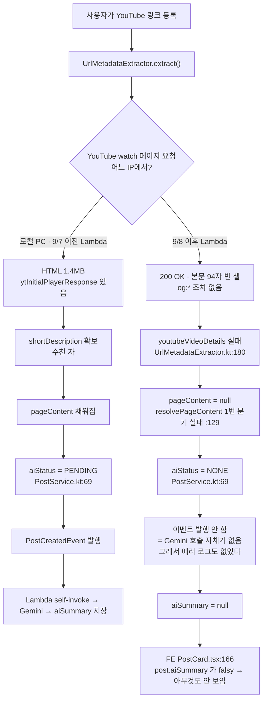
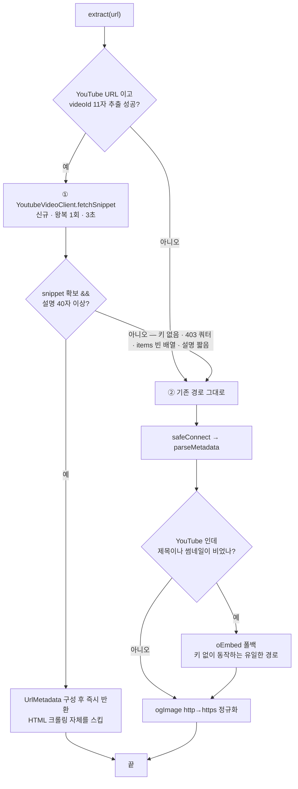
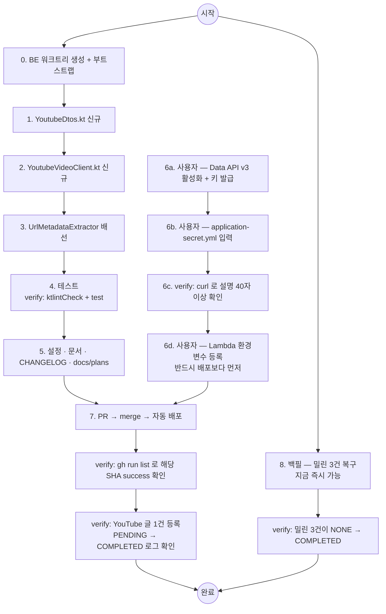

# YouTube AI 요약 복구 — Data API v3 전환 + 백필

## Context

**증상**: 2026-09-08부터 YouTube 링크로 올린 글의 AI 요약이 전혀 생성되지 않는다.

**진단 (확정)**: FE는 무관하다 — `PostCard.tsx:166`이 `post.aiSummary`를 렌더할 뿐이고 BE가 `null`을 준다.
YouTube가 Lambda(AWS ap-northeast-1) IP에 대해 watch 페이지를 **200 OK + body 텍스트 94자짜리 빈 셸**로
내려주기 시작했다.



**근거**:

| 항목 | 실측 |
| --- | --- |
| CloudWatch (Logs Insights, 10일) | `본문 하한 미달 ... bodyTextLength=94` — 09-08 04:18 / 08:09 / 16:59 / 17:29 UTC, 4건 모두 **정확히 94자**. 09-07 이전엔 YouTube 관련 이 로그가 0건 |
| 운영 API 최근 60건 | COMPLETED 48 / NONE 11 / FAILED 1. 비-YouTube는 정상(09-08 15:31 Claude 문서, 12:53 GitHub 모두 요약 있음). NONE인 YouTube 3건이 전부 09-08 이후 |
| 로컬 재현 | 크롤러와 **동일 UA·Referer**로 같은 영상 요청 → 1.4MB 정상 HTML, `ytInitialPlayerResponse` 3회 등장, `shortDescription` 존재 → **IP 기반 차단** |
| oEmbed | 여전히 200이지만 응답에 `description` 필드가 없다(title·author_name·thumbnail_url·html만) → 본문 소스가 못 됨 |
| 제목·썸네일은 왜 멀쩡한가 | 운영 DB의 최근 글 제목과 `ogImage`(`i.ytimg.com/vi/hniTPGEpDl8/hqdefault.jpg`)가 oEmbed 응답과 글자 단위로 일치 → 94자 셸엔 `og:*`조차 없고 oEmbed가 살리고 있다 |

**목표**: YouTube Data API v3 `videos.list(part=snippet)`로 영상 설명을 확보해 AI 파이프라인을 되살리고,
밀린 3건을 백필로 복구한다.

## 승인된 결정

1. **Data API를 1순위로.** YouTube URL이면 Data API를 먼저 부르고, 실패할 때만 기존 경로로 떨어진다.
   환경별로 다른 경로를 타지 않게 해 재현·디버깅을 단순하게 유지한다.
2. **별도 `YOUTUBE_API_KEY`** 발급(사용자). Gemini 쿼터 소진이 크롤링까지 죽이지 않도록 분리한다.
3. **Lambda 환경변수는 사용자가 콘솔에서 직접 등록.** (`update-function-configuration --environment`는
   기존 변수를 전체 치환하므로 CLI는 쓰지 않는다.)
4. **oEmbed 존치.** 키 없이 동작하는 유일한 제목·썸네일 경로다.
5. **기존 스크래핑(`youtubeVideoDetails`) 존치.** Data API 실패 시 폴백이고, 차단이 풀리면 자동 복귀한다.

## 설계

### 폴백 체인 — `UrlMetadataExtractor.extract()` (:53-77)에만 손댄다



②의 기존 경로는 **한 줄도 고치지 않는다.** `parseMetadata` · `resolvePageContent` ·
`youtubeVideoDetails` · `safeConnect`를 그대로 두어 기존 테스트 18개를 회귀 감지기로 남긴다.

### Data API 성공 시 `UrlMetadata` 구성 — 기존 동작과 동일하게

| 필드 | 값 | 근거 |
| --- | --- | --- |
| `title` | `snippet.title` | 지금 oEmbed가 주던 것과 같은 값 |
| `description` | **`null`** | 정상 시절 YouTube 글 6건을 운영 API로 확인했더니 `description`이 전부 `null`이었다. 여기에 설명을 넣으면 카드 UI가 바뀌는 시각적 변경이 된다 |
| `ogImage` | `thumbnails.high.url` (hqdefault) | 지금 oEmbed가 주던 것과 **동일 해상도**. maxres를 쓰면 카드 이미지가 바뀌므로 쓰지 않는다 |
| `tags` | `listOf(host)` | 기존 `parseMetadata`와 동일. 나머지 태그는 Gemini가 붙인다 |
| `pageContent` | `normalizeContent(snippet.description)`이 `MIN_META_DESCRIPTION_LENGTH`(40, :30) 이상일 때만, `MAX_CONTENT_LENGTH`(5000, :18) 절삭 | 스크래핑이 `shortDescription`에 적용하던 규칙과 동일 |

### 실패 케이스 — 전부 `null` 반환 후 ② 경로로 (예외를 위로 던지지 않는다)

| 케이스 | 응답 | 처리 |
| --- | --- | --- |
| 키 미설정 | — | `apiKey.isBlank()` 가드 → warn 후 즉시 null |
| 키 무효 | 400 `API_KEY_INVALID` | catch → warn → null |
| API 미활성 | 403 `SERVICE_DISABLED` | 〃 |
| 쿼터 초과 | 403 `quotaExceeded` | 〃 |
| 비공개·삭제·오타 ID | **200 + `items: []`** (404가 아니다) | `firstOrNull() == null` → null |
| videoId 없는 URL (playlist, @handle) | 호출 안 함 | `extractVideoId` → null |

## 구현 단계

두 갈래가 서로를 막지 않는다 — **백필은 코드·배포와 무관하게 지금 당장 돌릴 수 있다**(로컬 IP는
아직 차단되지 않았다). 밀린 글부터 먼저 복구하고, 코드 작업은 그와 병행한다.



### 0. BE 워크트리

BE 레포에서 작업한다(`/Users/baechan/project/link-sphere/link-sphere_BE_NEW`). 현재 FE 워크트리에서
BE를 고치지 않는다. 진입 직후 부트스트랩(BE `.claude/CLAUDE.md` Critical Rule):

```bash
cp ../../../src/main/resources/application-secret.yml src/main/resources/
cp ../../../src/main/resources/firebase-service-account.json src/main/resources/
```

`git worktree list`로 잔존 워크트리를 먼저 훑고, `git log origin/main..main`으로 미푸시 커밋을 확인한다.

### 1. `infra/youtube/dto/YoutubeDtos.kt` (신규)

`YoutubeVideosResponse(items)` / `YoutubeVideoItem(snippet)` / `YoutubeSnippet(title, description, thumbnails)`
/ `YoutubeThumbnails(high, medium, default)` / `YoutubeThumbnail(url)`.
선례: [`infra/ai/dto/GeminiDtos.kt`](../../project/link-sphere/link-sphere_BE_NEW/src/main/kotlin/com/example/linksphere/infra/ai/dto/GeminiDtos.kt).
미선언 필드는 RestClient 기본 Jackson 설정이 무시한다(`GeminiResponse`가 `usageMetadata`를 선언 안 하고도 도는 것과 같은 이유).

→ verify: 컴파일

### 2. `infra/youtube/YoutubeVideoClient.kt` (신규)

선례로 삼을 파일: [`infra/ai/GeminiService.kt`](../../project/link-sphere/link-sphere_BE_NEW/src/main/kotlin/com/example/linksphere/infra/ai/GeminiService.kt)
— `@Value` 키 주입(:18), `RestClient` + `JdkClientHttpRequestFactory` 타임아웃 구성(:28-31),
`HttpStatusCodeException` 분기(:46-67), 키 공백 시 graceful 무력화(:70-73). **SnapStart에서 검증된
유일한 형태이므로 클라이언트 생성 형태를 바꾸지 않는다.**

- `@Value("\${youtube.api.key:}")` — **기본값 빈 문자열**. `gemini.api.key`(:18, 기본값 없음)와 의도적으로
  다르게 간다. 기본값이 없으면 키를 아직 안 넣은 워크트리·로컬에서 부팅 자체가 실패하고, Lambda
  환경변수를 코드 배포보다 늦게 넣으면 배포가 깨진다. 이 차이를 주석에 남긴다.
- `internal fun extractVideoId(url): String?` — `java.net.URI` 파싱([`FeedUrlNormalizer.kt:16-18`] 형태를
  따른다, 정규식 한 방으로 처리하지 않는다). `watch?v=` / `youtu.be/` / `shorts|embed|live/` /
  `m.`·`music.` 서브도메인 지원, `?si=`·`&list=`·`&t=` 무시, playlist·`@handle`은 null.
  마지막에 `Regex("[A-Za-z0-9_-]{11}")` **완전 일치**를 통과한 값만 반환 — 쿼터 낭비를 막고 사용자
  입력이 API URL에 그대로 보간되는 것을 차단한다.
- `internal fun parseSnippet(response): YoutubeSnippet?` — 테스트를 위해 열어둔다
  (선례: `GeminiService.parseResponse`가 `internal`인 것과 같은 이유).
- `fun fetchSnippet(videoId): YoutubeSnippet?` — connect 3s / read 3s.
  `&fields=items(snippet(title,description,thumbnails))`로 응답을 줄인다(쿼터는 그대로 1 unit).
  재시도·모델 폴백은 넣지 않는다(대체 엔드포인트가 없고 실패해도 ② 경로로 떨어진다).

→ verify: `YoutubeVideoClientTest` 통과

### 3. `UrlMetadataExtractor` 배선

- 생성자에 `private val youtubeVideoClient: YoutubeVideoClient` 추가
- `extract()`(:53-77) 맨 앞에 ① 분기 삽입. ② 이하는 현행 유지
- `internal fun toMetadata(url, snippet): UrlMetadata?` — snippet → `UrlMetadata` 변환을 순수 함수로 분리
  (네트워크 없이 테스트하기 위해). 설명이 하한 미달이면 `null`을 반환해 ②로 흘려보낸다

→ verify: 기존 18개 + 신규 통과

### 4. 테스트

**신규 `src/test/kotlin/.../infra/youtube/YoutubeVideoClientTest.kt`**
(선례: `GeminiResponseParsingTest.kt:13` — 생성자 직접 호출 후 internal 함수만 검증)
- `extractVideoId`: watch / `&list=`·`&t=` 혼재 / `youtu.be` + `?si=` / shorts / embed / live /
  `m.`·`music.` / playlist→null / `@handle`→null / 11자 아님→null
- `parseSnippet`: 정상 / `items: []`→null / 썸네일 티어 폴백(high 없으면 medium→default)
- `apiKey` 공백이면 HTTP 없이 null

**기존 `UrlMetadataExtractorTest.kt` 수정**
- `:14` 생성자에 `mock(YoutubeVideoClient::class.java)` 추가 — **없으면 컴파일 에러**
- `toMetadata` 신규 4개: 정상 변환 / 설명 40자 미만 → null / 5000자 초과 절삭 /
  `description`은 항상 null이고 `ogImage`는 `high` 티어

**추가하지 않음**: `PostServiceTest`(`:283`·`:304`가 aiStatus 게이트 양쪽을 이미 커버),
`extract()` 통합 테스트(실네트워크를 타 이 레포의 "모든 테스트가 네트워크 없이 돈다" 방침을 깬다)

→ verify: `./gradlew ktlintFormat && ./gradlew ktlintCheck test`

### 5. 설정 · 문서

`application.yml`은 **건드리지 않는다** — `gemini.api.key`도 거기 없고 키는 레포에 두지 않는 것이 이 레포 방식이다.

| 대상 | 변경 |
| --- | --- |
| `src/main/resources/application-secret.yml` (gitignore) | `youtube.api.key` 추가 |
| `docs/DEPLOY.md:195` | `GEMINI_API_KEY` 행 아래 `YOUTUBE_API_KEY` 행 추가 |
| `README.md:236-240` | application-secret.yml 샘플에 `youtube:` 블록 |
| `docs/AI-ASYNC-PROCESSING.md` | 신규 `### 5.7 원인 ⑥ — YouTube가 Lambda IP에 껍데기 페이지를 내리기 시작했다 (2026-09-09)`를 기존 5.7 앞에 삽입하고 "남은 것"을 5.8로 리넘버링(외부 참조 없음을 확인함). §5.6에 "그 결론은 `captions.download` 한정이며 `videos.list`는 §5.7에서 채택했다" 한 줄 추가. `:3` 마지막 검토일 갱신 |
| `CHANGELOG.md` | `[Unreleased] > Fixed`에 스코프 `post` 항목 + `<details>` 상세 |
| `docs/plans/2026-09-09-youtube-data-api.md` | 이 계획을 커밋(BE CLAUDE.md §11, append-only) |

`docs/AI-ASYNC-PROCESSING.md` 새 절에 담을 것: 타임라인, 위 Context의 증거 표, 연쇄 경로,
oEmbed가 대안이 아닌 이유(description 필드 부재), Data API 도입과 실패 케이스 표
(특히 "없는 영상은 404가 아니라 200 + `items: []`"), 운영 파라미터(타임아웃 3s의 위치를 `파일:줄`로,
쿼터 10,000/day·1 unit은 레포 밖임을 명시), 백필 절차와 그 함정, 검증 결과 표.

**FE 레포 문서**: `docs/SYSTEM-ARCHITECTURE.md`의 Mermaid(:28 `Gemini[Gemini API]`, :34, :210, :215)에
YouTube Data API 노드 추가. **별도 FE 워크트리·별도 PR로 낸다** — 지금 FE 워크트리는
eslint-query-whitelist 작업 중이라 섞지 않는다.

### 6. 키 발급 · 등록 (사용자)

1. Google Cloud Console에서 YouTube Data API v3 활성화 후 API 키 발급
2. 로컬 `application-secret.yml`에 `youtube.api.key` 입력
3. **Lambda 환경변수 `YOUTUBE_API_KEY`를 콘솔에서 등록 — 코드 배포보다 먼저.**
   `deploy.yml:133`의 `publish-version`이 그 시점 config를 스냅샷하므로, 나중에 넣으면 조용히 무력화된다

→ verify: 로컬에서 실제 키로 확인
```bash
curl -s "https://www.googleapis.com/youtube/v3/videos?part=snippet&id=hniTPGEpDl8&key=$YOUTUBE_API_KEY" \
  | python3 -c "import json,sys; s=json.load(sys.stdin)['items'][0]['snippet']; print(len(s['description']), s['title'])"
```
설명 길이가 40자 이상으로 나오면 통과.

### 7. 배포 · 프로덕션 확인

PR → merge 하면 `deploy.yml`이 code 갱신 → publish-version → 신버전 5회 호출 검증 → `prod` alias 승격까지
자동 수행한다. **alias 수동 이동 금지.**

→ verify: push한 커밋 SHA가 실제로 success인지 확인한 뒤에만 "배포됨"이라고 보고한다
```bash
gh run list --branch main --workflow "<BE 배포 워크플로우명>"
```
그 다음 YouTube 글 1건을 실제로 등록하고 CloudWatch에서
`[AI Async] PostCreatedEvent 발행` → `[AI] 분석 완료` 로그와 `aiStatus`가 `PENDING → COMPLETED`로
가는지 확인한다.

### 8. 백필 — 밀린 3건 복구

**주의: 기존 문서의 `--url-like=youtu` 레시피는 이 건에 쓰면 안 된다.**
`PostAiBackfillRunner.kt:84-93`의 대상 산출은
`(봇 글 중 aiSummary=null) + (PENDING/FAILED & 1시간 경과) + (url LIKE %urlLike%)` 를 합친 뒤
`.distinctBy{id}.take(limit)`이다. 밀린 3건은 **사람이 등록한 `aiStatus=NONE`**이라 1·2번 쿼리에 안 걸리고
`--url-like`로만 잡히는데, `youtu`로 걸면 정상 요약이 있는 54건까지 끌어와 좋은 요약을 덮어쓰고
Gemini 쿼터를 태운다.

**videoId(11자)를 `--url-like`에 넣어 글마다 개별 실행한다.**

```bash
# 1) 대상 확인 (Supabase SQL 에디터)
SELECT id, created_at, url, ai_status FROM posts
WHERE url ILIKE '%youtu%' AND ai_status = 'NONE' ORDER BY created_at DESC;

# 2) 글마다 dry-run → 출력의 contentLength 가 수백 자 이상인지 확인 → commit
./gradlew bootRun --args='--spring.profiles.active=secret,ai-backfill --url-like=hniTPGEpDl8'
./gradlew bootRun --args='--spring.profiles.active=secret,ai-backfill --url-like=hniTPGEpDl8 --commit'
```

- 로컬 IP는 차단되지 않았으므로 **이 백필은 코드 수정·배포와 무관하게 지금 당장 가능하다.** 먼저 돌려
  밀린 글부터 복구한다.
- 반대로 그래서 **백필로는 Data API 경로가 검증되지 않는다** — §6·§7의 검증이 별도로 필요하다.
- 여러 워크트리에서 동시에 `bootRun` 금지(포트 8080·원격 DB 공유).

## 회귀 위험 점검

| 위험 | 소유 파일 | 방어 |
| --- | --- | --- |
| 생성자 파라미터 추가로 컴파일 에러 | `UrlMetadataExtractorTest.kt:14` | 목 추가, `./gradlew test`가 즉시 검출 |
| 키 미설정 시 부팅 실패 | 신규 `YoutubeVideoClient` | `@Value("\${youtube.api.key:}")` + blank 가드 |
| 환경변수를 배포보다 늦게 넣어 조용히 무력화 | `deploy.yml:133` | 환경변수 먼저, 배포 나중 |
| 기존 스크래핑 테스트 5개 | `UrlMetadataExtractorTest.kt:55-116` | `parseMetadata`·`youtubeVideoDetails` 무변경 |
| RSS 봇 경로 | `FeedItemProcessor.kt:41-46` → `PostService.kt:50` 엘비스 | YouTube 피드 항목은 이제 RSS 본문 대신 Data API 설명을 쓴다. 같은 영상 설명이라 실질 동등. 배포 전 `SELECT url FROM feed_sources WHERE enabled`로 YouTube 소스 유무 확인 |
| `updatePost` 제목 덮어쓰기 | `PostService.kt:253` | **변화 없음.** 지금도 oEmbed가 실제 영상 제목을 주고 있어(운영 DB와 oEmbed 응답이 글자 단위로 일치) `WeakTitleDetector.isWeak`가 이미 false다 |

**변경 없음**: DB 스키마, DTO/API 계약, `application.yml`, `PostService.kt`, `PostAiBackfillRunner.kt`, FE 코드.
→ 배포 순서 제약 없고 `docs/VERSION-COMPATIBILITY.md` 갱신 불필요.

## 재발 방지 조치 — 설명에 순서도가 빠지는 문제

이 계획을 처음 냈을 때 텍스트만 있어 이해하기 어렵다는 지적을 받았고, **같은 요청이 이미
2026-09-04에 있었다**(BE 세션: "docs/RSS-FEED-BOT.md … 순서도로 프로세스를 보여주면 더
이해하기 쉬울것"). 대화 기록으로 확인한 사실이다.

**왜 반복됐나**: 그때의 피드백은 FE `.claude/CLAUDE.md` "독립 기능 문서 내부 순서" §1의
*"장 끝에 전체 흐름을 보여주는 Mermaid 순서도를 반드시 넣는다"*로 반영됐다. 그런데 그 규칙의
적용 대상이 **`docs/` 아래 독립 기능 문서로만 한정**돼 있어, 계획 파일·PR 본문·대화 중
진단/설계 설명은 사각지대로 남았다. 규칙 위반이 아니라 **규칙의 범위 누락**이라, 범위를
넓히지 않으면 다음에도 같은 일이 난다.

**조치** (코드 PR과 분리해서 낸다):

1. **메모리에 `feedback`으로 저장** —
   `~/.claude/projects/-Users-baechan-project-link-sphere-link-sphere-FE-NEW/memory/`에
   `explain-with-diagrams.md` 신규 + `MEMORY.md`에 한 줄 등록. CLAUDE.md 규칙이 사각지대를
   남기더라도 세션마다 이 피드백이 먼저 뜨게 하는 이중 안전장치다.
2. **FE `.claude/CLAUDE.md`에 새 절 추가** — 기존 §9(시각적 변경은 반영 전에 먼저 보여준다)와
   같은 층위로, 적용 대상을 명시한다:
   - 대상: 여러 단계를 거치는 흐름(요청→처리→저장), 실패 지점이 여러 곳인 진단, 분기가 있는
     설계 대안, 작업 순서 — **문서만이 아니라 계획 파일·PR 본문·대화 답변 전부**
   - 매체별 형식: 파일(계획·문서·PR 본문)은 **Mermaid**(GitHub·에디터가 도형으로 렌더),
     터미널 대화 답변은 **ASCII 다이어그램**(터미널에서 Mermaid는 코드로만 보여 목적을 못 이룬다)
   - 제외: 단일 파일 한 줄 수정처럼 흐름이랄 게 없는 작업
3. **BE `.claude/CLAUDE.md`에도 같은 절 추가** — 원래 요청이 BE 세션에서 나왔고 이번 작업도
   BE다. 한쪽에만 넣으면 반대편 레포에서 또 새어나간다.

→ verify: 두 레포의 `pnpm check:docs`(FE) 통과, 그리고 이 조치 이후 첫 설계 설명에 실제로
순서도가 들어갔는지 사용자가 그 자리에서 확인 가능.

## 최종 검증

1. `./gradlew ktlintCheck test` — 전부 통과
2. §6의 curl — Data API가 설명을 40자 이상 반환
3. §7 — 배포 run이 success이고, 새로 등록한 YouTube 글이 `COMPLETED` + 요약 존재
4. §8 — 밀린 3건이 `NONE` → `COMPLETED` + 요약 존재 (운영 API로 재확인)
5. PR 본문에 `## 계획 대비 구현` 섹션 — fresh Explore subagent에게 커밋된 계획 파일과 diff를 대조시킨 결과
   (BE `.claude/CLAUDE.md` §11). **이 PR 본문에도 순서도를 넣는다** — 위 재발 방지 조치의 첫 적용 사례다
6. 재발 방지 조치 3건(메모리 · FE CLAUDE.md · BE CLAUDE.md)이 실제로 반영됐는지 파일로 확인
