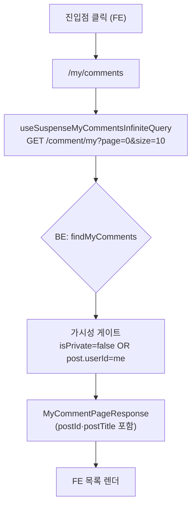

# 내 댓글 히스토리 화면 추가 (BE: `GET /comment/my`)

> 이 계획은 FE·BE 두 레포에 걸친 하나의 기능 작업이다. 전체 계획(진입점 아티팩트,
> FE 3-layer/화면/앵커 구현 포함)은 FE 레포의 `docs/plans/2026-09-14-my-comments.md`에
> 동일하게 커밋돼 있다 — 이 사본은 BE PR의 append-only 기록을 위해 그대로 복제한 것이다.

## Context

사용자가 **자기가 단 댓글을 다시 찾을 방법이 앱에 전혀 없다.** 조사로 확인한 현황:

- 마이페이지는 `MyPageModal.tsx`의 프로필 수정 모달 하나뿐 — 전용 라우트조차 없다
- 댓글 조회는 `GET /post/{postId}/comment`(글 단위)만 존재. **`CommentRepository.kt`에 `userId` 기반 조회 메서드 자체가 없다**
- 댓글 응답 DTO(`CommentResponse`)에 `postId`·원글 제목이 없어 "어느 글에 단 댓글인지"를 표현할 수단이 없다

범위는 사용자와 합의해 **댓글 히스토리만**으로 한정한다. "내가 쓴 글"(이미 피드 필터 `isMyPosts`로 존재)과 "좋아요한 글"(BE API 자체가 없음)은 이번 범위에서 제외한다.

**의도한 결과**: 로그인 사용자가 자기 댓글을 최신순으로 훑고, 클릭하면 원글의 **그 댓글 위치로 바로** 이동한다. BE는 그 목록 조회 API 하나를 새로 제공한다.

## 결정된 사항 (BE 관련)

| 항목 | 결정 | 근거 |
|---|---|---|
| 톰스톤 댓글 | 목록에서 제외 (`isDeleted = false`) | 내용이 `"삭제된 댓글입니다."`로 덮여 있어 보여줄 게 없음 (`CommentService.kt:265-301`) |
| 정렬/페이징 | `createdAt DESC`, offset 방식 page/size | 레포 전체가 offset (`PostPageResponse`) |
| 가시성 게이트 | `isPrivate = false OR post.userId = :userId` | `PostRepositoryImpl.kt:242-251`의 목록 조회 게이트와 동일 기준 |

## 전체 흐름



## BE 구현 — `GET /comment/my`

작업 전 워크트리 부트스트랩(`cp ../../../src/main/resources/application-secret.yml src/main/resources/` 등, `.claude/CLAUDE.md:247-252`).

| 파일 | 변경 |
|---|---|
| `domain/comment/CommentRepository.kt` | `@Query` JPQL + `Pageable` → `Page<TableComment>`. `join fetch c.post p`로 N+1 방지, `WHERE c.userId = :userId AND c.isDeleted = false AND (p.isPrivate = false OR p.userId = :userId)`, `ORDER BY c.createdAt DESC`. **`countQuery` 명시 필수**(JPQL+Pageable 조합은 레포 첫 사례, fetch join과 count가 충돌) |
| `domain/comment/CommentDTO.kt` | `MyCommentResponse`(id, content, createdAt, postId, postTitle) + `MyCommentPageResponse` + `companion object fun from(page, responses)`. **기존 `CommentResponse`는 건드리지 않는다** — 그쪽에 필드를 더하면 `GET /post/{id}/comment` 응답 계약까지 바뀐다 |
| `domain/comment/CommentService.kt` | `getMyComments(userId, page, size)` — `PageRequest.of(page, size)`(레포 전체가 `Sort` 미사용, 정렬은 쿼리 쪽) |
| `domain/comment/CommentController.kt` | `@GetMapping("/comment/my")`. **파일 로컬 스타일을 따른다** — `principal.toRequiredUserId()`(`:11`), `ApiResponse(200, "…")` 리터럴. CLAUDE.md의 `getUserId()`/`HttpStatus.*` 권장과 어긋나지만 이 파일이 이미 그 형태이고 "대상 파일 양식을 그대로 맞춘다"가 우선 |

**가시성 게이트가 이 작업의 핵심 리스크**다. 빠뜨리면 남의 글에 댓글 단 뒤 그 글이 비공개로 전환됐을 때 제목이 유출된다. 선례: `PostRepositoryImpl.kt:242-251`, `BookmarkRepositoryImpl.kt:160-163`.

경로 충돌 없음(`GET /comment/{id}`가 없음), `SecurityConfig.kt:40-61` permitAll에 `/comment/**`가 없어 **인증은 자동으로 필수** — 보안 설정 수정 불필요.

테스트: `CommentServiceTest.kt`에 Mockito 단위 테스트 3종(비공개 글 제외 / 톰스톤 제외 / Page→DTO 변환)을 계획했다. 기존 비공개 가시성 테스트 3-케이스 세트(`:49`, `:63`, `:76`)가 그대로 본뜰 형태.

## 검증

```bash
./gradlew ktlintCheck test
```

기능 검증 순서:
1. FE와 붙여 실제 댓글 작성 → 목록에 뜨는지
2. **비공개 글 케이스 수동 확인** — 다른 계정 글에 댓글 → 그 글을 비공개 전환 → 내 목록에서 사라지는지(가시성 게이트 동작)
3. 답글 있는 댓글 삭제(톰스톤) → 목록에서 빠지는지
4. 무한 스크롤 — 11개 이상 댓글로 2페이지 로드 확인

문서·기록:
- `CHANGELOG.md` `[Unreleased]`(스코프 `comment`)
- `docs/VERSION-COMPATIBILITY.md`는 API 계약 추가이므로 릴리즈 시 갱신 대상인지 확인
- 이 계획 파일을 `docs/plans/2026-09-14-my-comments.md`로 구현 PR에 함께 커밋
- PR 본문에 `## 계획 대비 구현` 섹션

## 커밋·워크트리 주의

- `EnterWorktree`로 격리, 진입 직후 부트스트랩
- `git add` 금지 — `git commit -- <경로...>`로 대상 직접 지정
- BE→FE 순서로 배포해야 FE가 404를 안 본다 — **BE 배포 확인 후 FE 머지**
