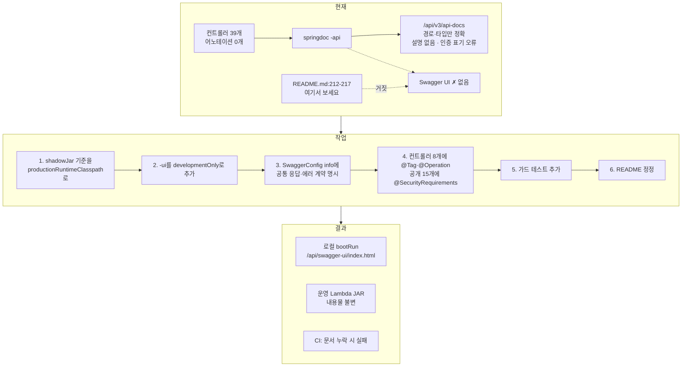

# Swagger API 문서화 + 문서 노후화 방지 가드

## Context

"백엔드에 Swagger 있나? 최신화는 되고 있나?"라는 질문에서 출발했다. 조사 결과 문서가
낡은 정도가 아니라 **존재하지 않는 것을 안내하고 있고, 존재하는 스펙은 일부 틀렸다.**

확인된 사실:

| # | 문제 | 근거 |
| --- | --- | --- |
| 1 | Swagger UI가 없는데 README는 있다고 안내 (2026-03-06부터 6개월) | `README.md:23`, `README.md:212-217` |
| 2 | 안내된 URL이 `context-path: /api` 미반영으로 이중으로 틀림 | `application.yml:5` |
| 3 | 39개 엔드포인트 전체에 `@Tag`/`@Operation` 0개 → 설명 없는 스펙 | 컨트롤러 8개 전수 |
| 4 | 공개 엔드포인트까지 "JWT 필요"로 표기 (스펙이 거짓) | `SwaggerConfig.kt:23` 전역 `addSecurityItem` |
| 5 | 문서 누락을 막는 장치 없음 → 앞으로도 계속 낡음 | CI 게이트에 관련 검사 없음 |

`-ui` → `-api` 교체는 실수가 아니라 2026-03-06 Lambda 마이그레이션에서 콜드스타트·JAR
크기를 이유로 내린 **의도적 결정**이다(`build.gradle.kts:58`의 `exclude("META-INF/resources/webjars/**")`
주석이 근거). 이 결정은 유지한다.

**목표**: 운영 Lambda 산출물을 그대로 둔 채 로컬에서 쓸모 있는 API 문서를 갖추고,
다시 낡지 않도록 CI로 강제한다.

## 확정된 결정

| 결정 | 선택 |
| --- | --- |
| UI 열람 방식 | 로컬 전용 (`developmentOnly`) — 운영 JAR 무변경 |
| 어노테이션 깊이 | 컨트롤러 + 에러 계약 |
| 에러 문서 형태 | `@Operation(description)` 설명 문장 (구조화 표 아님) |
| 재발 방지 | 리플렉션 기반 가드 테스트로 CI 강제 |
| `/v3/api-docs` 운영 공개 | 현행 유지 (범위 밖, PR에 명시) |
| README API 테이블 | 손대지 않음 (최소 범위 원칙) |

## 전체 흐름



## 작업 내용

### 1. `build.gradle.kts` — 패키징 기준 전환 (선행 필수)

Shadow 8.1.1은 기본적으로 `runtimeClasspath`를 패키징하는데, Spring Boot 플러그인이
`runtimeClasspath.extendsFrom(developmentOnly)`를 걸어둔다. **이걸 먼저 고치지 않고
`developmentOnly`를 추가하면 Swagger UI가 Lambda JAR에 그대로 실린다.** 기존
`exclude("META-INF/resources/webjars/**")`는 정적 에셋만 막고 `org/springdoc/webmvc/ui/*`
클래스와 자동설정은 못 막는다.

`ShadowJar` 블록 안, `manifest { }` 다음 · `mergeServiceFiles()` 앞:

```kotlin
    // 패키징 대상은 runtimeClasspath(기본값)가 아니라 productionRuntimeClasspath 다.
    // Spring Boot 플러그인이 runtimeClasspath.extendsFrom(developmentOnly) 를 걸어두기 때문에
    // 기본값을 쓰면 developmentOnly 의존성(Swagger UI)이 Lambda fat JAR 에 그대로 딸려 들어간다.
    configurations = listOf<org.gradle.api.file.FileCollection>(
        project.configurations.getByName("productionRuntimeClasspath"),
    )
```

`productionRuntimeClasspath`는 `developmentOnly`가 붙기 전 부모 목록의 스냅샷이라 현재
의존성 집합과 동일하다 → 이 커밋만으로는 산출물이 안 바뀐다(검증으로 증명).
기존 `exclude` 줄은 유지한다(이중 방어, 최소 범위).

### 2. `build.gradle.kts` — Swagger UI 로컬 전용 의존성

```kotlin
    // Swagger UI 는 로컬 bootRun 전용이다. developmentOnly 는 shadowJar 가 쓰는
    // productionRuntimeClasspath 에 들어가지 않으므로 Lambda 아티팩트는 그대로다.
    // 로컬: http://localhost:8080/api/swagger-ui/index.html
    developmentOnly("org.springdoc:springdoc-openapi-starter-webmvc-ui:2.7.0")
```

`swagger-annotations-jakarta`는 이미 `-api`를 통해 컴파일 클래스패스에 있으므로
어노테이션용 신규 의존성은 없다.

### 3. `SwaggerConfig.kt` — 공통 계약 한 곳에

`addSecurityItem` 전역 `bearerAuth`는 **그대로 둔다**(메서드별 opt-out이 올바른 방식).
`Info().description(...)`만 채워 아래를 한 번에 선언한다:

- 성공은 `ApiResponse<T>`(status·message·data·timestamp), 실패는 `ErrorResponse`(status·code·message·timestamp)
- 401은 `NOT_LOGGED_IN` / `TOKEN_EXPIRED` / `INVALID_TOKEN`, 미처리 예외는 500 `INTERNAL_SERVER_ERROR`
- **대부분 API는 `ResponseEntity`를 쓰지 않아 HTTP 상태가 항상 200**이고 본문 `status`만 201일 수 있다
  (실제 201은 `POST /auth/signup` 하나뿐)

### 4. 컨트롤러 8개 — 39개 엔드포인트 어노테이션

`@Tag`(클래스) + `@Operation(summary, description)`(메서드) + 공개 엔드포인트 15개에
`@SecurityRequirements`(인자 없는 형태 = 전역 보안 해제).

`@SecurityRequirements` 대상은 `SecurityConfig.kt:39-62`의 permitAll 목록이 정본이다.
`HttpMethod.GET` 전용 항목(`GET /post`, `GET /post/{id}`, `GET /post/{postId}/comment`)은
같은 경로의 쓰기 메서드에 붙이지 않도록 주의한다.

| 컨트롤러 | `@Tag(name)` | 엔드포인트 |
| --- | --- | --- |
| `AuthController` | 인증 | 8 (공개 6) |
| `PostController` | 게시글 | 6 (공개 2) |
| `CommentController` | 댓글 | 5 (공개 1) |
| `InteractionController` | 좋아요·북마크 | 9 |
| `BookmarkFolderController` | 북마크 폴더 | 6 |
| `CategoryController` | 카테고리 | 2 (공개 2) |
| `UploadController` | 업로드 | 1 |
| `FcmTokenController` | FCM 토큰 | 2 |

### 5. `SwaggerDocsCoverageTest.kt` (신규) — 재발 방지 가드

`src/test/kotlin/com/example/linksphere/global/config/SwaggerDocsCoverageTest.kt`

- 발견 방법: `ClassPathScanningCandidateComponentProvider`(spring-context, 신규 의존성 없음).
  **Spring 컨텍스트를 띄우지 않는다** → DB·Firebase 자격증명 불필요, 수십 ms.
- 판정: `AnnotatedElementUtils`로 `@RequestMapping` 메타 어노테이션 보유 메서드를 뽑아
  `@Operation` 존재 + `summary` 비어있지 않음을 검사, 클래스에 `@Tag` 존재를 검사.
- 실패 메시지에 `Class.method()`를 나열해 무엇을 추가해야 하는지 바로 보이게 한다.
- 스캐너가 아무것도 못 찾아 조용히 통과하는 것을 막는 하한선(`minimumControllerCount = 8`)을 둔다.
- **`@SecurityRequirements`까지는 검사하지 않는다** — `SecurityConfig`의 permitAll 목록을
  테스트에 복제해야 해서 두 번째 정본이 생기고 드리프트한다. 잡히는 실패는 자물쇠 아이콘
  하나 수준이라 비용이 이득보다 크다.

### 6. `README.md` 정정

- `README.md:23` 기술스택 행 → `SpringDoc OpenAPI 2.7.0 (Swagger UI는 로컬 전용)`
- `README.md:212-217` Swagger 절 → 올바른 URL(`http://localhost:8080/api/swagger-ui/index.html`),
  UI가 `developmentOnly`라 Lambda 산출물에는 없고 `/api/v3/api-docs`는 계속 제공된다는 설명
- **기존 API 테이블(`README.md:131-220`)은 건드리지 않는다**

## 어노테이션 컨벤션

1. **`@ApiResponses`를 쓰지 않는다.** `GlobalExceptionHandler`의 16개 핸들러에
   `@ResponseStatus`가 없어 springdoc이 전부 `200`으로 등록하는데, 메서드에 `@ApiResponses`를
   붙이면 병합 분기에서 `200`의 content 생성을 건너뛰어 **성공 스키마가 `ErrorResponse`로
   대체된다**. 이 함정 때문에 `ApiResponse` 이름 충돌도 발생하지 않아 import 별칭이 불필요하다.
2. **엔드포인트별 실패는 `description` 한 줄로**: `"실패: 404 FOLDER_NOT_FOUND · 403 FORBIDDEN"`.
3. **200/201**: 공통 규칙은 `info.description`에 한 번. 본문 `status`가 201인 5개
   (createPost·createComment·createReply·createFolder·createSignedUploadUrl)에만 개별 명시.
   `signup`은 실제 201이므로 그렇게 적는다.
4. **`Map<String, Boolean>` 3개**: 스키마로는 `additionalProperties`로만 나와 키 이름이 사라지므로
   설명에 키를 적는다 — `"data 는 {\"isLiked\": true|false}"`.
5. **어노테이션 순서**: Swagger 어노테이션이 위, Spring 매핑 어노테이션이 `fun` 바로 위(기존 리듬 유지).
6. **언어는 한국어**, 기존 `ApiResponse` 메시지·테스트명과 일치.
7. **범위 밖**: `@Parameter`(경로·쿼리 파라미터), DTO 필드 `@Schema`.

예시 (`BookmarkFolderController.getBookmarkedPosts`):

```kotlin
    @Operation(
        summary = "폴더별 북마크 게시글 조회",
        description = "folderKey 는 all(전체) · uncategorized(미분류) · 폴더 UUID 중 하나다. " +
            "실패: 400 INVALID_INPUT(잘못된 key) · 403 FORBIDDEN(남의 폴더) · 404 FOLDER_NOT_FOUND",
    )
    @GetMapping("/{folderKey}/posts")
```

## 커밋 분할

작업 전: `git log origin/main..main`으로 미푸시 커밋 확인 → `git worktree list`로 오래된
워크트리 정리 → `EnterWorktree`(호출 직전 `cd <BE 레포> && pwd`로 레포 확인) → 부트스트랩:

```bash
cp ../../../src/main/resources/application-secret.yml src/main/resources/
cp ../../../src/main/resources/firebase-service-account.json src/main/resources/
```

커밋은 항상 `git commit -- <경로>`(신규 파일만 `git add`). `.gitmessage` 형식(한글 subject +
`── 변경 이유 (WHY) ──` / `── 변경 내용 (WHAT) ──` / `── 영향 범위 ──`) 준수.
**docs/test/build 타입이라 `CHANGELOG.md`는 갱신하지 않는다.**

| # | 대상 | subject |
| --- | --- | --- |
| 1 | `docs/plans/2026-09-14-swagger-api-docs.md` | `docs(process): Swagger 문서화 작업 계획 커밋` |
| 2 | `build.gradle.kts` | `build(config): shadowJar 패키징 기준을 productionRuntimeClasspath 로 전환` |
| 3 | `build.gradle.kts` | `build(config): Swagger UI 를 로컬 전용(developmentOnly) 의존성으로 추가` |
| 4 | `SwaggerConfig.kt` | `docs(config): OpenAPI info 에 공통 응답·에러 계약과 200/201 규칙 명시` |
| 5 | 컨트롤러 8개 | `docs(common): 컨트롤러 8개 39개 엔드포인트에 Swagger @Tag·@Operation 추가` |
| 6 | `SwaggerDocsCoverageTest.kt` | `test(common): 엔드포인트 문서 누락을 막는 가드 테스트 추가` |
| 7 | `README.md` | `docs(common): README Swagger 안내를 로컬 전용 UI 기준으로 정정` |

## 검증

**0. 기준선** (소스 변경 전. `bootRun`은 포트 8080·원격 DB 공유라 한 워크트리에서만)

```bash
./gradlew shadowJar --no-daemon
unzip -v build/libs/*-all.jar | awk 'NF==8 && $1 ~ /^[0-9]+$/ {print $7, $8}' | sort > $SCRATCH/jar-before.txt
./gradlew bootRun --no-daemon &
curl -s localhost:8080/api/v3/api-docs | jq -S . > $SCRATCH/openapi-before.json
jq '[.paths[] | to_entries[]] | length' $SCRATCH/openapi-before.json   # 39
```

**1. 운영 산출물 불변 증명** (커밋 2·3 각각 직후, `clean` 없이)

```bash
./gradlew shadowJar --no-daemon        # → "Task :shadowJar UP-TO-DATE" 여야 한다
unzip -l build/libs/*-all.jar | grep -E "springdoc/webmvc/ui|webjars/swagger-ui"   # 출력 없어야 함
diff $SCRATCH/jar-before.txt <(unzip -v build/libs/*-all.jar | awk 'NF==8 && $1 ~ /^[0-9]+$/ {print $7, $8}' | sort)
```

**2. 스펙 정확성** (어노테이션 후)

```bash
# summary 누락 0건
jq -r '.paths|to_entries[]|.key as $p|.value|to_entries[]|select(.value.summary==null or .value.summary=="")|"MISSING \($p) \(.key)"' $SCRATCH/openapi-after.json

# 인증 표기 수정 확인 — 이번 작업의 핵심
jq '.paths."/auth/login".post.security'  $SCRATCH/openapi-after.json   # []   공개
jq '.paths."/auth/account".get.security' $SCRATCH/openapi-after.json   # null 전역 상속

# 성공 스키마 회귀 확인 (@ApiResponses 함정 재발 감지)
diff <(jq -S '[.paths[]|to_entries[]|.value.responses."200".content]' $SCRATCH/openapi-before.json) \
     <(jq -S '[.paths[]|to_entries[]|.value.responses."200".content]' $SCRATCH/openapi-after.json)
```

**3. UI 육안 확인** — `http://localhost:8080/api/swagger-ui/index.html`에서 태그 8개,
`POST /auth/login`·`GET /post`에 자물쇠 없음, `GET /auth/account`·북마크 폴더 전체에 자물쇠 있음.

**4. CI 게이트** — `./gradlew ktlintFormat` 후 `./gradlew ktlintCheck test --no-daemon`.
`@Operation` 하나를 일부러 지워 가드 테스트가 해당 `Class.method()`를 지목하며 실패하는지
확인 후 복구.

**5. PR** — fresh Explore 서브에이전트에게 커밋된 계획 파일과 전체 diff를 주고 대조시켜
PR 본문에 `## 계획 대비 구현` 섹션 작성. 아래를 범위 밖으로 명시:

- `/v3/api-docs`는 운영에서 계속 공개 (`SecurityConfig` 미변경)
- `@Parameter`·DTO `@Schema` 미적용
- 도달 불가능한 `?: throw IllegalArgumentException("User not authenticated")` 분기는 관찰만 하고 미수정
