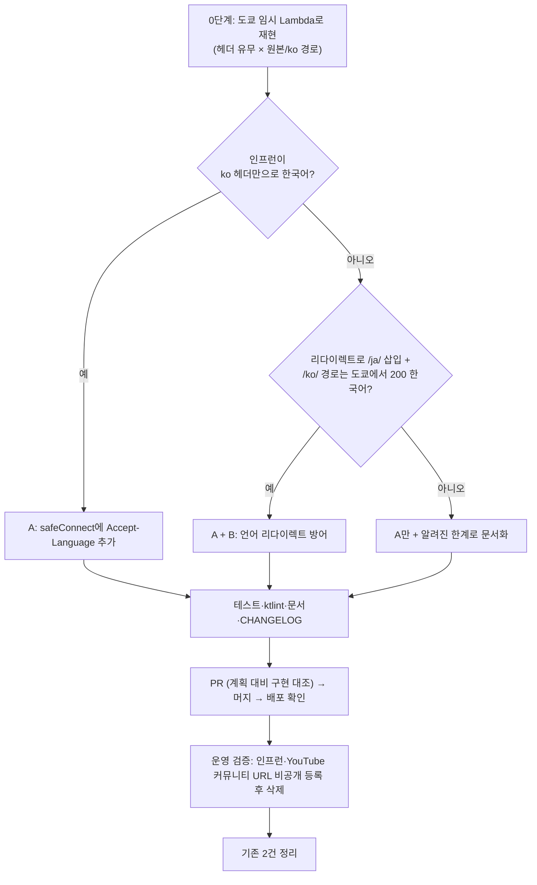

# 크롤러가 한국어판 페이지를 받도록 고정 (인프런 일본어 수집 문제)

## Context

인프런 강의 URL을 등록하면 제목·설명·AI 요약이 일본어로 저장된다(운영 글 `6dc0471e-…`, 2026-09-27).
**수정 대상은 BE 레포(`link-sphere_BE_NEW`)다. FE는 URL만 넘기고 크롤링은 하지 않는다.**

### 확인한 원인 (2026-09-27 조사)

- **저장된 제목이 인프런 `/ja/` 페이지와 같다.** 운영 API로 조회한 제목이 로컬 curl로 받은 `/ja/course/…`의 og:title과
  글자 하나까지 같다. 강사명도 `유동균`이 아니라 일본어판 표기 `hackurity01`이다.
- **BE Lambda는 도쿄에서 돈다.** 리전이 `ap-northeast-1`이다
  (`aws lambda get-function-configuration --function-name link-sphere-api`로 확인).
- **크롤러가 언어를 밝히지 않는다.** `UrlMetadataExtractor.safeConnect`(`UrlMetadataExtractor.kt:254-287`)는
  `Accept-Language`를 보내지 않는다. BE 전체를 grep해도 0건이다.
- **인프런은 헤더가 아니라 IP로 언어를 정하는 것으로 보인다.**
  - 인프런은 Next.js i18n을 `localeDetection:false`로 쓴다(HTML에 심긴 설정을 직접 확인).
  - 한국 IP에서 `Accept-Language: ja`를 보내도 한국어가 왔다.
  - 그래서 CloudFront 접속 국가로 판단한다고 **추정**한다. 도쿄 IP에서 직접 재현하지는 못했다.
- **`/ko/` 접두사 URL은 한국 IP에서 동작한다.** 리다이렉트 없이 200 한국어를 준다. 도쿄에서 되는지는 미확인이다.
- **YouTube는 헤더를 따른다.**
  - 한국 IP에서 ja 헤더를 보내면 `…さんからの投稿`, ko 헤더를 보내면 `…님의 게시물`이 온다.
  - 운영 글 `ea4afc65-…`(2026-02-24)의 제목이 이 일본어 문구로 저장돼 있다.
- **AI 요약도 일본어가 된다.** `GeminiService.kt:93` 프롬프트가 "원문 언어를 그대로 쓸 것"이라 일본어 원문을 받으면 요약도 일본어다.

### 사용자와 합의한 방향 (AskUserQuestion, 2026-09-27)

- 대응 범위: **도쿄 재현 → A(헤더)는 반드시, B(언어 리다이렉트 방어)는 조건부**. 둘 다 안 통하면 C(한국 IP로 옮기기)로 가지 않고 한계로 문서화한다.
- 재현 방법: **임시 Lambda**. 권한이 부족하면 CloudShell 스크립트로 전환한다.
- 기존 데이터: **배포 후 2건 정리**.

### 사용자가 체감하는 변화 (공유 완료)

`Accept-Language: ko-KR`로 고정하면 영어가 기본이지만 한국어판도 있는 사이트는 한국어판이 저장된다.
한국에서 브라우저로 여는 것과 같은 결과다. URL에 언어가 명시된 링크(`/en-us/…`)는 영향이 없다.

## 전체 흐름

## 0단계 — 도쿄 IP 재현 (코드 수정 전)

1. 임시 함수 `link-sphere-locale-probe-tmp`를 `ap-northeast-1`에 만든다.
   - Python 3.12, 표준 `urllib`만 쓰고, 리다이렉트를 직접 따라가며 홉마다 기록한다.
   - 역할은 `link-sphere-api-role-qd2sz01l`을 재사용한다. `link-sphere-api`는 건드리지 않는다.
2. 요청 설정은 크롤러와 같게 둔다: 같은 User-Agent·Referer, 쿠키 없음, 최대 5홉.
3. 아래 조합을 각각 2회 호출한다. 홉마다 상태코드와 `Location`, 최종 `<html lang>`, og:title을 기록한다.

   | 대상 URL | 헤더 없음 | `Accept-Language: ko-KR,…` |
   | --- | --- | --- |
   | 제출된 원본 URL(`…/dashboard?cid=324686`) | ✓ | ✓ |
   | `https://www.inflearn.com/ko/course/…?cid=324686` | ✓ | ✓ |
   | `https://www.youtube.com/post/UgkxTy0Bwh3y-_MtFzum5iOM99tE_aRz1iKP` | ✓ | ✓ |

4. 끝나면 함수와 로그 그룹 `/aws/lambda/link-sphere-locale-probe-tmp`를 **바로 삭제**한다.
   - `CreateFunction`이나 `PassRole`이 거부되면 같은 조합의 curl 스크립트를 드린다. AWS CloudShell(도쿄 리전)에서 실행해 달라고 요청한다.
5. 결과를 위 흐름도의 분기에 대입해 B를 넣을지 정한다. 이 결과는 PR 본문과 문서 §5.9(아래)에 남긴다.

## 1단계 — 구현 (BE 워크트리)

작업 준비는 BE Critical Rules를 따른다.

- `git log origin/main..main`으로 푸시되지 않은 커밋이 있는지 확인한다.
- `EnterWorktree`로 워크트리를 만든다.
- `application-secret.yml`과 `firebase-service-account.json`을 복사한다.

### A. 요청 언어 고정 — `src/main/kotlin/com/example/linksphere/domain/post/UrlMetadataExtractor.kt`

- `USER_AGENT` 옆에 `ACCEPT_LANGUAGE = "ko-KR,ko;q=0.9,en-US;q=0.8,en;q=0.7"` 상수를 추가한다.
  - 이미 흉내 내고 있는 "Mac Chrome" 사용자가 한국어 환경일 때 보내는 기본값이다.
  - 영어 fallback을 둬서 한국어판이 없는 사이트는 지금처럼 영어를 받게 한다.
- `safeConnect`의 `Jsoup.connect(...)` 체인에 `.header("Accept-Language", ACCEPT_LANGUAGE)`를 한 줄 추가한다.
- 주석으로 이유를 남긴다: "Lambda가 도쿄 IP라, 헤더가 없으면 사이트가 IP로 일본어판을 고른다." 관련 문서 절(§5.9)도 가리킨다.
- oEmbed(`fetchYoutubeMetadata`)와 YouTube Data API는 건드리지 않는다. 둘 다 영상의 원제목을 돌려줄 뿐 UI 문구를 현지화하지 않는다.

### B. 언어 리다이렉트 방어 (0단계 결과가 "예"일 때만)

- **판정 함수**: 네트워크 없이 테스트할 수 있게 `internal fun koreanLocaleAlternative(current: URI, next: URI): URI?`로 분리한다.
  - 선례는 같은 파일의 `internal fun toMetadata`와 `parseMetadata`다.
  - 발동 조건:
    - 같은 호스트이다.
    - `next.path == "/" + seg + current.path` 형태로, 언어 구간 하나만 끼운다.
    - `seg`가 `^[a-z]{2}(-[a-z]{2,4})?$`에 맞는다(대소문자 무시).
    - `seg`가 `ko`로 시작하지 않는다.
  - 반환값은 path가 `"/ko" + current.path`인 URI다. query는 `next`의 것을 쓰고, 없으면 `current`의 것을 쓴다.
- **`safeConnect` 루프**: 3xx 분기에서 위 함수가 URI를 돌려주면, 호출당 한 번만 그 ko URL로 대신 이동한다.
  - 원래 `next`는 기억해 둔다.
  - ko URL도 같은 루프를 타므로 홉마다 `SafeUrlValidator` 검증과 `MAX_REDIRECTS` 카운트가 그대로 적용된다.
  - ko 시도가 4xx·5xx면 기억해 둔 `next`로 돌아가 지금처럼 동작한다.
  - ko 시도가 다시 `/ja/`로 리다이렉트되면 방어는 이미 한 번 썼으므로 그대로 따라간다. 결과는 지금과 같다.

### 테스트

- **B 판정 함수**: `src/test/kotlin/com/example/linksphere/domain/post/UrlMetadataExtractorTest.kt`에 순수 함수 케이스를 추가한다.
  - `/course/x → /ja/course/x`는 `/ko/course/x`를 돌려준다.
  - query가 보존된다.
  - 다음 경우는 null이다: 다른 호스트, `/ko/` 삽입, 언어 코드가 아닌 구간(`/login/…`), 단순한 경로 변경.
  - `en-us`도 발동한다.
- **`safeConnect` 동작**: 새 파일 `SafeConnectTest.kt`를 만든다.
  - JDK 내장 `com.sun.net.httpserver.HttpServer`를 쓰므로 의존성을 추가하지 않는다.
  - `SafeUrlValidator`는 기존 테스트처럼 Mockito 목으로 채운다. 그래야 localhost가 허용된다.
  - A 검증: 서버가 받은 `Accept-Language`가 `ko-KR`로 시작하는지 확인한다.
  - B 검증(B를 넣을 때만): 두 가지를 확인한다.
    - `/ja/`로 307을 보내고 `/ko/`가 200이면 `/ko/` 응답을 채택한다.
    - `/ko/`가 404면 원래 `/ja/`로 돌아간다.

### 문서·릴리즈노트 (같은 PR)

- **`docs/AI-ASYNC-PROCESSING.md`에 §5.9를 추가한다.**
  - 제목: "원인 ⑦ — 도쿄 IP 때문에 일본어판을 받았다 (2026-09-27)".
  - 형식은 §5.7(IP 기반 YouTube 셸 페이지)과 같게 한다: 증상, 로컬 재현, 도쿄 재현 결과표, 조치, 남은 한계.
  - 목차 §5.8 "남은 것"도 필요하면 갱신한다.
- **`docs/RSS-FEED-BOT.md` 운영 파라미터 표(:249-251 부근)에 "크롤링 요청 언어" 행을 추가한다.** RSS fetch도 `safeConnect`를 공유하기 때문이다.
- **`CHANGELOG.md`의 `[Unreleased]` → `### Fixed`에 항목을 추가한다.**
  - 한 줄 요약: `` `post` 도쿄 리전 IP 때문에 링크 제목·설명이 일본어로 수집되던 문제 수정 ``
  - `
` 블록에 배경과 구현을 적는다.
- **계획 스냅샷 `docs/plans/2026-09-27-crawl-korean-locale.md`를 같은 PR에 커밋한다** (BE CLAUDE.md §8).
- FE 쪽 문서는 고치지 않는다. `docs/SYSTEM-ARCHITECTURE.md:235`는 컴포넌트 이름만 적혀 있어 달라지는 것이 없다.

## 영향 범위 점검 (BE CLAUDE.md §5)

**CRUD**

- **등록**(`PostService.createPost`)
  - 헤더로 언어를 고르는 사이트는 이제 한국어판이 저장된다.
  - B가 발동하면 요청이 1회 늘어난다. 동기 경로라 최악의 경우 타임아웃 5초만큼 등록이 느려진다.
  - 스키마와 API 계약은 바뀌지 않는다.
- **수정**(URL 변경·제목 비움 재수집, `PostService.kt:180-207`): 같은 추출기를 쓰므로 영향이 같다.
- **조회·삭제**: 영향 없다.

**기존 기능 회귀 후보**

- **RSS 봇**: `FeedParser`가 `safeConnect`를 재사용한다(`FeedParser.kt:30`).
  - 피드 요청에도 ko 헤더가 붙는다. 언어를 협상하는 피드라면 한국어가 오는데, 원하는 결과다.
  - `FeedParserTest`는 추출기를 목으로 쓰므로 영향이 없다.
- **백필 러너**: `OgImageBackfillRunner`와 `PostAiBackfillRunner`는 같은 추출기를 쓰므로 한국어를 받게 되고, 문제는 없다.
- **SSRF 방어**: B의 ko URL도 홉마다 `SafeUrlValidator.validate`를 통과해야 한다. 이 루프 안에서 구현되는지 리뷰에서 확인한다.
- **`MAX_REDIRECTS`**: ko 시도도 홉으로 센다.
- **기존 테스트**: `UrlMetadataExtractorTest`는 순수 함수만 다루므로 영향이 없다.

## 2단계 — PR·배포·운영 검증

1. 검증을 순서대로 돌린다: `./gradlew ktlintCheck`, `./gradlew test`, `./gradlew build`.
2. fresh Explore subagent에게 계획 스냅샷과 diff를 대조시킨다. 결과는 PR 본문 `## 계획 대비 구현`에 남긴다.
3. PR을 squash 머지한다. BE `deploy.yml`의 run이 success인지, `prod` alias가 승격됐는지 `gh run list`로 확인한 뒤에만 배포됐다고 보고한다.
4. 운영 검증: 운영 FE에서 두 URL을 **비공개**로 등록해 제목·설명이 한국어인지 확인하고, 바로 삭제한다.
   - 인프런 원본 URL
   - YouTube 커뮤니티 URL
   - B까지 넣었는데 인프런이 여전히 일본어면, 0단계 결과와 어긋난 것이다. 이 사실을 보고하고 멈춘다.

## 3단계 — 기존 데이터 2건 정리 (배포 확인 후)

- **인프런 `6dc0471e-…`** (작성자 남극곰): 제목·설명·AI 요약이 전부 일본어다.
  - 수정 화면에서 URL을 정규 URL(`…/course/웹-성능-최적화-리액트-1?cid=324686`)로 바꾸면 URL 변경 경로를 탄다(`PostService.kt:193-199`). 이 경로는 설명·태그·썸네일을 전면 재수집하고 AI 요약을 초기화한 뒤 재분석한다.
  - 사용자 계정의 글이 아니면 삭제 후 재등록한다.
- **YouTube 커뮤니티 `ea4afc65-…`** (작성자 뉴유저3): 제목만 일본어 문구다.
  - 수정 화면에서 제목을 비우면 제목만 재수집된다(`PostService.kt:180-191`).
  - 해당 계정에 접근할 수 없으면 제목 1건만 SQL로 고칠지 그 시점에 확인받는다.
- **범위 밖(발견만 보고)**: YouTube Shorts 2건(`2eaa8e1e-…`, `19615c96-…`)의 설명이 YouTube 기본 안내문 일본어판이다.
  - 언어 문제 이전에 §5.7의 "셸 페이지" 문제라서 이번 수정으로는 한국어 안내문으로 바뀔 뿐이다.
  - 따로 다룰지 보고한다.

## 핵심 파일

| 파일 | 변경 |
| --- | --- |
| `link-sphere_BE_NEW/src/main/kotlin/com/example/linksphere/domain/post/UrlMetadataExtractor.kt` | A: 상수와 헤더 1줄 추가 / B: 판정 함수와 루프 분기(조건부) |
| `link-sphere_BE_NEW/src/test/kotlin/com/example/linksphere/domain/post/UrlMetadataExtractorTest.kt` | B 판정 함수 케이스 (조건부) |
| `link-sphere_BE_NEW/src/test/kotlin/com/example/linksphere/domain/post/SafeConnectTest.kt` (신규) | 헤더 전송 검증, B 폴백 검증 |
| `link-sphere_BE_NEW/docs/AI-ASYNC-PROCESSING.md` | §5.9 추가 |
| `link-sphere_BE_NEW/docs/RSS-FEED-BOT.md` | 운영 파라미터 행 추가 |
| `link-sphere_BE_NEW/CHANGELOG.md` | `[Unreleased]` Fixed |
| `link-sphere_BE_NEW/docs/plans/2026-09-27-crawl-korean-locale.md` (신규) | 이 계획의 스냅샷 |

## 검증 요약

- 도쿄 재현표(0단계): B를 넣을지 판단하는 근거다.
- 단위 테스트: `./gradlew test`로 판정 함수와 로컬 HttpServer 헤더·폴백을 확인한다.
- 배포: `gh run list`로 해당 SHA의 run이 success인지 확인한다.
- 운영: 비공개 등록으로 인프런과 YouTube 커뮤니티가 한국어로 오는지 확인하고, 테스트 글은 삭제한다.
- 기존 데이터: 운영 API로 2건을 재조회해 일본어(가나)가 없는지 확인한다. 공개글 전체도 다시 스캔한다(이번 조사에서 쓴 스크립트와 같은 방식).
