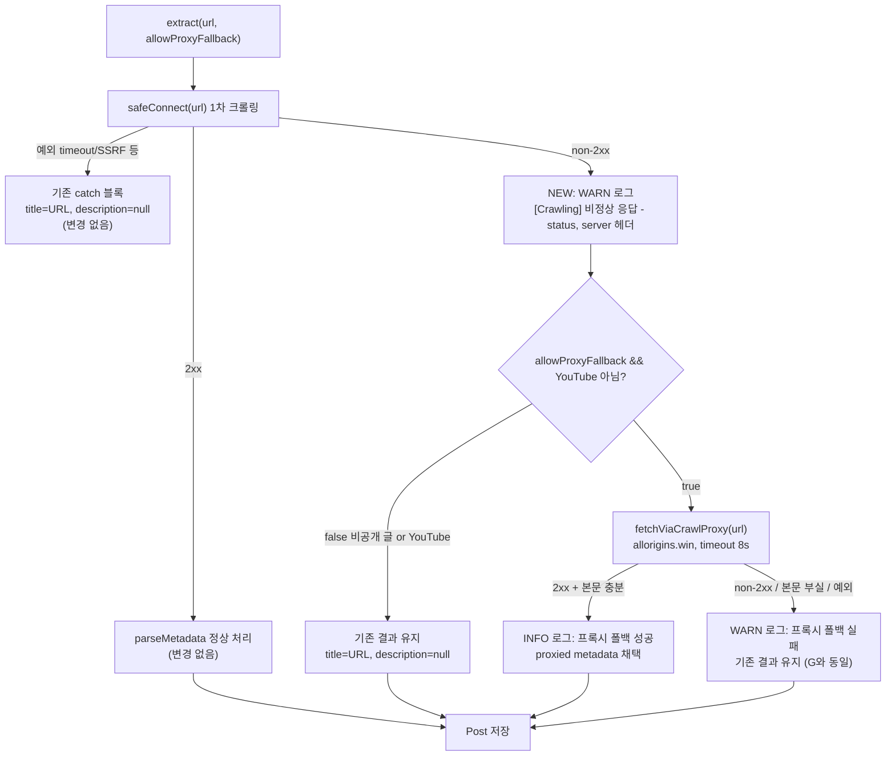

# 크롤링 실패 시 무료 공개 프록시(allorigins) 폴백 추가

## Context

`https://dbw3brui6htwk.cloudfront.net/post/f68eb8f4-1610-4639-82c8-425f14f84fbb` (URL: `https://techblog.woowahan.com/7425/`) 글이 제목·설명 없이 등록됐다. 원인을 추적한 결과:

- BE의 `UrlMetadataExtractor`가 Lambda(도쿄 리전)에서 이 URL을 크롤링했을 때 non-2xx 응답을 받았다(사이트가 `server: cloudflare` 헤더를 반환 — Cloudflare의 클라우드/데이터센터 ASN 차단으로 추정).
- non-2xx 응답 경로는 **현재 로그를 한 줄도 남기지 않아** 사후 진단이 저장된 Post row를 역추적해야만 가능했다.
- 이 세션에서 실측 확인: 같은 URL을 (1) 이 세션의 비-클라우드 IP(Korea Telecom)로 직접 요청, (2) 무료 공개 프록시 `https://api.allorigins.win/raw?url=`를 경유해 요청 — 둘 다 og:title/og:description을 정상적으로 받았다. 즉 사이트 자체 문제가 아니라 Lambda의 클라우드 IP만 차단당한 것이며, 무료 프록시로 우회 가능함이 실측으로 확인됐다.
- 이 실패 유형(클라우드 IP 차단)은 이미 `docs/AI-ASYNC-PROCESSING.md` §5.5에 다른 도메인(news.hada.io, stackoverflow.com, smartstore.naver.com)으로 문서화돼 있고, techblog.woowahan.com도 RSS 피드 봇 경로에서는 2026-09-06에 이미 차단이 확인돼 있었다(`docs/RSS-FEED-BOT.md:384-386`) — 그 지식이 RSS 피드 비활성화에만 쓰이고 사용자 등록(`POST /post`) 경로에는 적용되지 않아 이번에 재발했다.
- 사용자와 논의를 거쳐 방향을 확정: **크롤링이 non-2xx로 완전히 차단된 경우에만, 무료 공개 프록시(allorigins.win)로 한 번 더 시도**한다. 단, 비공개(`isPrivate=true`) 글의 URL은 제3자 서비스로 보내지 않는다(공개 글의 URL은 이미 이 앱에서 공개돼 있어 새로 새는 정보가 없지만, 비공개 글의 URL은 토큰 붙은 개인 링크일 수 있어 새로운 노출이 생기기 때문).
- 2xx인데 본문이 부실한 경우(JS 렌더링 사이트 등)는 이번 범위에서 제외한다 — 프록시를 태워도 원래 없는 본문이 생기지 않는데 매번 헛수고 왕복 + URL 전송만 생기기 때문.
- FE에서 "이 글은 정보를 못 가져왔어요" 같은 사용자 안내 문구를 추가하는 작업은 **이번 계획에서 제외**하고 별도 후속 작업으로 넘긴다(BE만 지금 처리, FE는 다음).

## 확정된 설계 결정

| 항목 | 결정 |
|---|---|
| 발동 조건 | HTTP status가 non-2xx일 때만 (2xx+본문부실은 제외) |
| 프록시 | `https://api.allorigins.win/raw?url=` 하나만 (corsproxy.io는 실측에서 빈 응답 — 채택 안 함, 문서에만 기록) |
| YouTube | 제외 (이미 Data API·oEmbed 자체 폴백 있음) |
| primary 예외(catch 블록) | 폴백 대상 아님 (SSRF 가드 우회 방지, 예외 기반 차단 증거 없음) |
| 비공개 글 | 제외 — `extract()`에 `allowProxyFallback: Boolean` 필수 파라미터 추가 |
| 타임아웃 | 8초 (1차 크롤링 5초보다 길게 — 중계 구간 추가) |
| 재시도 | 없음, 1회만 |
| 킬스위치 | 프록시 주소를 `@Value("\${crawl.proxy.url-prefix:...}")`로 주입 — 문제 생기면 환경변수로 즉시 끔 |
| 로깅 | non-2xx 발생 시(현재 누락된 로그), 폴백 성공/실패/예외 각각 별도 로그 |

## 흐름도

## 핵심 파일

- **`src/main/kotlin/com/example/linksphere/domain/post/UrlMetadataExtractor.kt`** — 메인 수정 대상.
  - 상수 블록(15-54줄 부근)에 `DEFAULT_CRAWL_PROXY_URL_PREFIX`, `CRAWL_PROXY_TIMEOUT_MS = 8000` 추가.
  - 생성자에 `@Value("\${crawl.proxy.url-prefix:$DEFAULT_CRAWL_PROXY_URL_PREFIX}") private val crawlProxyUrlPrefix: String` 추가.
  - `extract()` 시그니처를 `fun extract(url: String, allowProxyFallback: Boolean): UrlMetadata`로 변경(기본값 없이 필수 인자로 — 호출부 누락을 컴파일 에러로 드러냄).
  - `extract()` 안에서 `response.statusCode()`를 변수로 받아 non-2xx일 때 새 로그 + 폴백 분기 추가.
  - 새 private 메서드 `fetchViaCrawlProxy(url: String): UrlMetadata?` — `fetchYoutubeMetadata`와 같은 위치·스타일로 추가. allorigins로 Jsoup 요청 → `parseProxyResponse`로 파싱.
  - 새 internal 메서드 `parseProxyResponse(body: String, statusCode: Int, url: String): UrlMetadata?` — 네트워크 없이 단위테스트 가능한 순수 함수(`parseMetadata`와 같은 이유로 분리). **`Jsoup.parse(body, url)`에서 baseUri를 반드시 원본 url로 줘야** og:image 상대경로가 프록시 도메인(`api.allorigins.win`)이 아니라 원본 호스트 기준으로 절대화된다. 채택 게이트는 `pageContent != null`(챌린지 페이지·차단 안내문 오인 방지, §5.5에서 이미 막은 회귀와 동일 원리).

- **호출부 6곳 — `allowProxyFallback` 인자 추가 필요:**
  - `PostService.kt:40`(`createPost`) → `!request.isPrivate`
  - `PostService.kt:181`(`updatePost`) → `!post.isPrivate`
  - `CommentPostProcessService.kt:93`(댓글 링크 미리보기) → 연결된 post의 `isPrivate` 기준
  - `tools/PostAiBackfillRunner.kt:112`, `tools/PostLocaleBackfillRunner.kt:73`, `tools/OgImageBackfillRunner.kt:64` → 각각 `!post.isPrivate`

  **주의:** `domain/feed/FeedParser.kt:30`은 `extract()`가 아니라 `safeConnect()`를 직접 호출한다 — 이번 폴백 로직은 `extract()` 안에만 넣어서 RSS 피드 XML 파싱 경로는 그대로 둔다(건드리면 안 됨).

- **테스트:**
  - `UrlMetadataExtractorTest.kt` (신규 또는 기존 파일에 추가) — `parseProxyResponse` 순수 함수 테스트: 정상 HTML 채택, og:image가 원본 호스트로 절대화되는지, 챌린지 페이지(200+짧은 본문) 거부, 500 거부, 빈 body 거부.
  - `SafeConnectTest.kt` 스타일(로컬 `HttpServer`)로 통합 테스트: `/target`이 403을 주고 `/proxy`가 정상 HTML을 주는 상황에서 `extract(url, true)`가 프록시를 태워 description을 채우는지, `extract(url, false)`는 프록시를 안 타는지, 프록시 자체가 실패해도 기존 동작으로 안전하게 내려가는지.
  - 시그니처 변경으로 깨지는 기존 테스트 스텁 수정: `PostServiceTest`, `PostAiBackfillRunnerTest`, `CommentPostProcessServiceTest`.

- **`docs/AI-ASYNC-PROCESSING.md`** — 새 절 추가(기존 §5.10 "남은 것" 앞, 새 §5.10으로 삽입하고 기존 §5.10은 §5.11로 밀기). 기존 §5.9와 같은 형식(문제 → 진단 경위 → 증거표 → 수정 내용 → 운영 파라미터 → 비공개 글 제외 이유 → 남은 한계). 증거표에는 도쿄 Lambda 403(cloudflare), KT IP 200, allorigins 200, corsproxy.io 빈 응답(채택 안 함), r.jina.ai 403(참고, 클라우드 호스팅 서비스도 막힘)을 포함.
  - §5.5(502-506줄)와 `docs/RSS-FEED-BOT.md:384` 부근에 새 절로의 교차참조 한 줄씩 추가.
  - `docs/DEPLOY.md` 환경변수 표에 `CRAWL_PROXY_URL_PREFIX` 추가.

- **CHANGELOG.md** — `[Unreleased]`에 fix 항목 추가(레포 컨벤션).

## 남은 한계 (문서에 명시)

- 다른 알려진 차단 도메인(news.hada.io, stackoverflow.com, smartstore.naver.com)에도 allorigins가 통하는지는 **검증되지 않음** — 이번 세션 네트워크 제약으로 techblog.woowahan.com 1건만 실측했다.
- allorigins는 SLA 없는 무료 서비스 — 언제든 중단/차단될 수 있어 킬스위치를 반드시 함께 배포한다.
- RSS 피드 경로는 이번 수정과 무관 — 우아한형제들 피드 소스는 계속 비활성 상태로 둔다.

## 검증 방법

1. `./gradlew test` — 새 단위/통합 테스트 통과 확인.
2. 배포 후, 이미 등록된 `f68eb8f4-1610-4639-82c8-425f14f84fbb` 글의 제목을 FE에서 비워 저장(→ `updatePost` 재크롤링 트리거) 또는 techblog.woowahan.com의 다른 글 URL로 새로 등록.
3. CloudWatch Logs Insights에서 `[Crawling] 비정상 응답 ... status=403, server=cloudflare` 다음에 `[Crawling] 프록시 폴백 성공`이 이어서 찍히는지 확인.
4. 운영 API로 해당 글의 `description`이 채워졌는지 확인.
