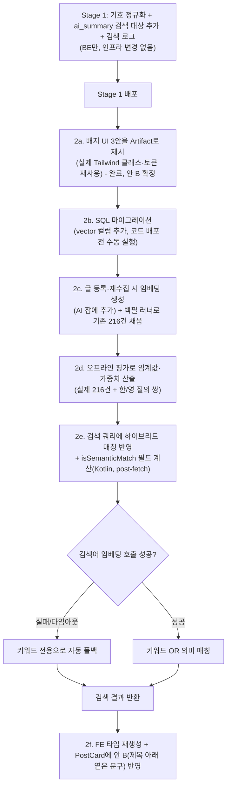

# 검색 품질 개선 (링크스피어)

> 이 파일은 append-only 스냅샷이다(CLAUDE.md §11). 커밋된 뒤에는 수정하지 않는다 - 계획과
> 실제 구현이 갈라진 부분은 각 PR 본문의 "계획 대비 구현" 섹션에 남긴다.
>
> 이 계획은 Stage 1(이 PR)과 Stage 2(후속 PR, pgvector 하이브리드 검색 + 매칭 배지)를
> 함께 다룬다. 2a(배지 UI 3안 비교)는 Plan 승인 직후 Artifact로 먼저 진행해 "안 B"로
> 확정했다: https://claude.ai/artifact/Jb3DS6YWM5ZsFbtg9kN37j

## Context

지금 검색(`GET /post`, `GET /bookmark/folders/{id}/posts`)은 `PostSearchQuery.kt`의
`lower(replace(field,' ',''))` + `LIKE '%token%'` 방식이다. 실측(공개 글 216건, 배포
API에서 직접 확인)으로 세 가지 구멍을 확인했다.

1. **한·영 표기 불일치**: `claude` 14건 vs `클로드` 13건(합집합 24건) — 한쪽으로만 검색하면
   절반을 놓친다.
2. **AI 요약 미검색**: 216건 중 173건에 `ai_summary`가 있는데 검색 대상이 아니다. 넣으면
   `테스트` 4→14건, `상태관리` 0→2건.
3. **기호 미정규화**: `nng`로 `NN/g - 닐슨 노먼 그룹은...` 글을 못 찾는다(BE
   `PostSearchQuery.kt:93`이 공백만 지우고 기호는 남김).

CloudWatch 실측(`/aws/lambda/link-sphere-api`, 최근 30일): AI 작업 60건, 요약 성공
47건, 1차 모델(`gemini-2.5-flash`) 폴백 34건(그중 진짜 한도초과 429는 8건, 나머지 25건은
503 일시 과부하) — 평소 트래픽에서는 무료 티어 한도가 큰 문제가 아니었다(BE 문서의 사고
사례는 백필 27건을 한꺼번에 몰아 돌렸을 때였다). 이 근거로 Gemini는 **무료 티어를 유지**
하기로 확정했다.

북마크함 검색에 의미 검색을 적용할지 논의한 결과, "정렬을 바꿔도 결과 집합 자체는 항상
동일(검색어와 일치하는 글만)하고 정렬만 달라진다"는 점, 그리고 구글 포토가 실제로 검색
결과에 "텍스트 일치" 라벨을 붙여 매칭 방식을 구분해서 보여주는 선례(참고:
[Android Authority](https://www.androidauthority.com/google-photos-search-text-match-3563838/))
를 근거로, **피드·북마크 검색 모두 동일하게 하이브리드(키워드+의미) 검색을 적용하고,
키워드로는 안 걸렸지만 의미로 걸린 결과에는 배지를 붙여 이유를 보여주기로** 했다. 배지
스타일은 Artifact로 3안(A: 태그 줄, B: 제목 아래 옅은 문구, C: 카드 상단 띠)을 실제
`PostCard.tsx` 레이아웃·`globals.css` 토큰으로 만들어 비교했고, 구글 포토 선례·NN/g
설명-근접 배치 원칙·목록 스케일에서의 시각적 부담을 근거로 **안 B**로 확정했다.

## 전체 흐름



## Stage 1 — 키워드 검색 정확도 (BE만, 인프라 변경 없음)

**대상 파일**: `domain/post/PostSearchQuery.kt`, `domain/post/PostService.kt`,
`domain/interaction/BookmarkFolderService.kt`

1. `PostSearchQuery.kt`에 **명시적 기호 목록**으로 `regexp_replace` 스트립을 추가한다.
   `[^[:alnum:]]` 같은 부정 클래스는 쓰지 않는다 — Supabase DB의 `LC_CTYPE`에 따라 한글이
   영숫자로 안 잡혀 통째로 지워질 위험이 있다(미확인, 확인 전까지는 명시적 목록으로
   방어).
   - `searchPredicate()`와 `relevanceScore()` **둘 다** 스트립된 버전을 OR로 추가한다 —
     하나만 고치면 스트립으로만 걸린 결과가 점수 0점이라 맨 뒤로 밀린다. 제목
     완전일치/prefix 보너스도 스트립된 제목 기준을 추가한다.
   - 태그는 `array_to_string(tags, ',')` 결과에서 **쉼표는 남기고** 그 외 기호만 지운다 —
     쉼표까지 지우면 태그끼리 이어붙어 오매칭된다.
   - `ai_summary`를 `description`과 같은 가중치(1)로 검색 대상에 추가한다(정규화+스트립
     양쪽 다).
2. **검색 로그**: `PostService.getAllPosts`와 `BookmarkFolderService.getBookmarkedPosts`에
   검색어(개인정보 없음)·토큰 수·결과 건수·자판보정 여부를 로그 한 줄로 남긴다. 목적: 0건
   검색어 파악, Stage 2 임계값 튜닝 근거 확보.

## Stage 2 — 하이브리드(키워드+의미) 검색 + 매칭 이유 배지 (후속 PR)

### 2a. 배지 UI를 Artifact로 먼저 확인 — 완료

3안(A: 태그 줄에 배지, B: 제목 아래 옅은 문구, C: 카드 상단 띠)을 `Badge` atom과
`globals.css` 토큰만으로 만들어 실제 `PostCard.tsx` 레이아웃 안에서 비교했다
(https://claude.ai/artifact/Jb3DS6YWM5ZsFbtg9kN37j). **안 B로 확정** — 근거: 구글
포토의 "텍스트 일치" 라벨과 같은 톤(제목 바로 아래, 옅은 색), NN/g의 "근거는 주장
바로 옆에" 원칙, 검색 결과 목록에 여러 건이 나와도 안 C(상단 띠)보다 화면이 조용함.
세 안 모두 구현 난이도는 비슷해 코드 품질이 결정을 좌우하지는 않았다.

### 2b. Supabase에 pgvector 켜기

**새 파일** `sql/add_post_embedding.sql`(BE 배포 **전** 수동 실행):

```sql
CREATE EXTENSION IF NOT EXISTS vector WITH SCHEMA extensions;
ALTER TABLE posts ADD COLUMN IF NOT EXISTS embedding vector(768);
```

- 768차원: `gemini-embedding-2` 권장값(768/1536/3072) 중 가장 작은 값. 인덱스는 지금
  안 만든다 — 공개 글 216건 규모에서 exact scan 비용이 무시할 수준이고, 나중에 필요해지면
  추가한다.
- **[미확인]** PgBouncer 풀러 연결에서 `extensions` 스키마가 `search_path`에 포함돼
  `vector`/`<=>` 연산자를 별도 스키마 지정 없이 쓸 수 있는지 — 마이그레이션 실행 직후
  `SHOW search_path;`로 확인한다.

### 2c. 임베딩 생성 (등록·재수집·백필)

**대상 파일**: `build.gradle.kts`(`hibernate-vector` 추가), `TablePost.kt`,
`infra/ai/GeminiService.kt`, `domain/post/PostAiService.kt`, `domain/post/PostService.kt`,
새 파일 `domain/post/PostEmbeddingText.kt`, `tools/PostEmbeddingBackfillRunner.kt`.

- `TablePost`에 `embedding: FloatArray?` 컬럼을 `insertable=false, updatable=false`로
  매핑한다 — 쓰기는 항상 `PostRepository.updateEmbedding()`(신규 네이티브 `@Modifying`
  쿼리, `CAST(:embedding AS vector)`)로만 한다. 이유: `PostAiService`/`PostService`가
  엔티티 전체를 `save()`하는데, 매핑을 쓰기 가능으로 두면 AI 잡이 새 임베딩을 쓰는 사이
  다른 저장 경로가 옛 값(또는 null)으로 덮어쓸 수 있다.
- `GeminiService`에 `embedDocument()`/`embedQuery()`를 추가한다. **모델 폴백을 쓰지
  않는다** — 서로 다른 임베딩 모델 벡터는 비교 불가. `gemini-embedding-2`는 `task_type`
  파라미터가 없고 프롬프트에 지시를 넣는 방식이다(공식 문서:
  [ai.google.dev/gemini-api/docs/embeddings](https://ai.google.dev/gemini-api/docs/embeddings)) —
  문서 검색용 `"title: {title} | text: {content}"`, 질의용
  `"task: search result | query: {q}"`.
- `PostAiService.processAiJob()`의 요약 저장 직후에 임베딩 호출을 추가한다. 실패해도
  `FAILED`로 만들지 않고 요약은 그대로 저장한다(요약과 임베딩은 독립 실패 단위).
- URL이 바뀌는 수정(기존 `aiSummary = null`과 같은 자리)에서 임베딩도 함께 `null`로
  리셋한다.
- **백필**: `PostAiBackfillRunner.kt`와 같은 형태(`@Profile`, dry-run 기본, `--commit`,
  `--limit`)로 `PostEmbeddingBackfillRunner`를 만들어 기존 216건에 임베딩을 채운다.

### 2d. 오프라인 평가로 임계값 산출

배포 전 스크래치 스크립트(커밋 안 함)로 공개 API(`GET /post?page=N&size=50`)에서 216건을
받아 미리 정의한 한/영 질의 쌍(react/리액트, claude/클로드, 테스트, 상태관리, nng 등)과
노이즈 질의(spdlqj, asdf 등)로 코사인 거리 분포를 확인하고, 거짓 양성이 안 생기는 선에서
`MAX_COSINE_DISTANCE`/`SEMANTIC_WEIGHT` 값을 정한다. 이 절차와 최종 값은 Stage 2 구현
PR 본문에 실측 근거로 남긴다.

### 2e. 검색 쿼리 반영 + 매칭 이유 계산

**대상 파일**: `PostSearchQuery.kt`, `PostRepositoryImpl.kt`, `BookmarkRepositoryImpl.kt`,
`PostService.kt`, `PostResponseAssembler.kt`, `PostDTO.kt`.

- `PostSearchQuery`에 `queryEmbedding: FloatArray?`를 받는 `semanticPredicate()`를
  추가하고, `searchPredicate()`를 `키워드 OR (embedding IS NOT NULL AND cosine_distance <
  임계값)`로 확장한다. `relevanceScore()`에도 `(1 - distance) * SEMANTIC_WEIGHT`를
  더한다(임베딩 NULL이면 0으로 처리). `cosine_distance`는 `hibernate-vector`가 등록하는
  함수를 `cb.function(...)`으로 호출한다(대안 검토 결과: 이 방식만 count/data 쿼리가
  하나의 predicate 정의를 공유해 총 건수가 항상 실제 결과 수와 일치한다).
- **매칭 이유는 SQL 프로젝션을 바꾸지 않고 Kotlin에서 가볍게 재계산한다** — 페이지당
  10건 정도라 비용이 무시할 수준이다. `PostSearchQuery`에 순수 함수
  `matchesKeywordLiterally(post, tokens): Boolean`을 추가해(Stage 1과 같은 스트립 규칙
  재사용), `PostResponseAssembler.buildResponsesFromPosts()`/`buildPostResponse()`에
  `searchTokens: List<String> = emptyList()` 파라미터를 추가한다.
  `isSemanticMatch = tokens.isNotEmpty() && !matchesKeywordLiterally(post, tokens)`로
  계산해 `PostResponse`에 `isSemanticMatch: Boolean` 필드를 추가한다. 검색이 없거나
  키워드로 걸린 결과는 항상 `false`.
  - SQL의 `LIKE`/`regexp_replace` 로직과 Kotlin의 문자열 처리 로직, 두 구현이 갈라질
    위험이 있다 — 스트립할 기호 목록 자체는 상수 하나로 공유하고, 유닛 테스트로 두
    구현이 같은 판정을 내리는지 검증한다.
- 자판 오타 보정은 **키워드만으로 0건일 때만** 트리거한다(하이브리드 결과 기준으로
  판단하면 의미 검색이 약하게라도 뭔가 찾아내 보정이 안 켜질 수 있다).
- `PostService.getAllPosts`는 검색어 임베딩 호출이 실패/타임아웃이면 키워드 전용으로
  자동 폴백한다 — 검색이 Gemini 장애로 실패하는 일은 없어야 한다.

### 2f. FE 배지 반영 (안 B)

- BE `PostResponse`에 필드가 추가되면 FE는 OpenAPI 재생성으로 `Post` 타입에
  `isSemanticMatch`가 자동으로 붙는다. BE 필드 추가는 이전 버전 FE와도 호환(추가 필드
  무시)이라 배포 순서 걱정은 없다.
- `PostCard.tsx`의 `CardContent` 맨 앞(`post.description` 블록보다 먼저)에
  `post.isSemanticMatch`일 때만 안 B 스타일(아이콘 + 옅은 텍스트 한 줄, "검색어와 의미가
  비슷한 글이에요")을 렌더링한다. 새 컴포넌트를 만들지 않고 기존 아이콘+텍스트 행 패턴을
  재사용한다.

## 영향 범위 점검

| 항목 | 확인 내용 |
| --- | --- |
| 등록(create) | 임베딩은 항상 AI 잡에서 사후 채움. `aiStatus=NONE`(크롤링 실패)인 글은 백필 대상에서도 빠짐 — 드문 케이스로 두고 규모만 확인 |
| 수정(update) | URL 변경 시 임베딩 리셋(기존 `aiSummary=null`과 동일 패턴). 제목만 비운 수정은 임베딩을 갱신 안 함 — 키워드 OR 매칭이 새 제목은 즉시 커버 |
| 조회(read) | 매 posts SELECT가 벡터 컬럼(약 8KB/행)을 더 읽음 — 페이지당(10건) 약 80KB 증가, 이 규모에서는 무시 가능 |
| 삭제(delete) | 임베딩은 posts 행에 종속 — 별도 정리 불필요 |
| 동시성 | `insertable/updatable=false` + 네이티브 UPDATE 전용으로 AI 잡과 일반 `save()`의 덮어쓰기 경쟁 차단 |
| 기존 회귀 | count/data 쿼리가 같은 predicate 빌더를 공유하므로 total과 실제 반환 건수가 항상 일치. 자판 보정은 키워드 기준 유지로 회귀 없음 |
| 배포 순서 | (1) Stage 1 배포 → (2) SQL 마이그레이션 수동 실행 → (3) 2b~2c 코드 배포(컬럼 없이 배포하면 모든 posts SELECT 실패) → (4) 백필 실행 → (5) 오프라인 평가로 임계값 확정 → (6) 2e 배포 → (7) FE 타입 재생성 + 2f 배포 |

## 검증 방법

- **Stage 1**: `search=nng` → `NN/g` 글 반환 확인. `상태관리`/`접근성`처럼 요약에만 있는
  검색어가 0건이 아님을 확인. 유닛 테스트: 스트립 정규식이 한글을 보존하는지, 태그 쉼표가
  살아있는지.
- **Stage 2**: 임베딩 스파이크(로컬에서 Criteria 쿼리 하나로 `cosine_distance` 호출이
  `cast(? as vector)`를 실제로 만드는지 SQL 로그로 확인) 선행. 이후 `상태관리` 검색이
  "Zustand 입문기"류 글을 찾는지, Gemini 장애 시뮬레이션(키 제거)에서 검색이 키워드
  결과로 정상 응답하는지, `spdlqj` 자판 보정이 여전히 동작하는지 확인.
- **배지**: `PostCard.tsx`에 안 B가 그대로 반영됐는지, `isSemanticMatch`가 키워드로도
  걸린 글에는 절대 `true`가 안 되는지 유닛 테스트로 확인.

## 미확인 사항

- Supabase pgvector용 `search_path`(`extensions` 스키마 포함 여부).
- `gemini-embedding-2`의 실제 응답 JSON 형태, 요청당 요금이 무료 한도 안에 드는지(1일
  검색량 데이터가 아직 없음 — Stage 1 로그로 먼저 쌓는다).
- `hibernate-vector`가 Criteria API의 `FloatArray` 파라미터/리터럴을 `vector` 타입으로
  올바르게 캐스팅하는지 — 2c 착수 전 스파이크로 확인.
