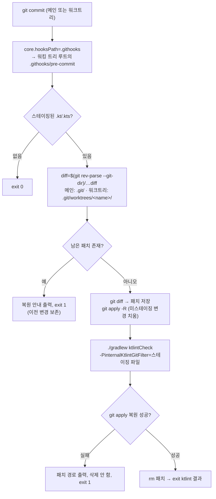

# BE: 워크트리에서 깨지는 ktlint pre-commit 훅을 레포 추적 훅(`.githooks/`)으로 교체

> 대상 레포: `/Users/baechan/project/link-sphere/link-sphere_BE_NEW`
> 구현 후 이 파일을 BE `docs/plans/2026-09-27-worktree-safe-precommit-hook.md`로 같은 PR에 커밋한다.

## Context

BE의 `.git/hooks/pre-commit`(ktlint-gradle이 만든 훅)은 스테이징하지 않은 변경을 잠시 치워두는
패치 경로를 `.git/unstaged-ktlint-git-hook.diff`로 하드코딩했다(훅 14줄). 워크트리에서는 `.git`이
디렉터리가 아니라 `gitdir: ...`을 담은 파일이라, 커밋할 때마다 `Not a directory` 에러가 나고 격리
단계가 조용히 건너뛰어진다. 훅이 `set +e`로 시작해서 커밋은 막히지 않는다. 목표는 **모든 워크트리와
새 클론에서 격리가 실제로 동작하는 훅**을 버전 관리 대상으로 만드는 것이다.

## 조사 결과 (확인한 사실)

- **설치 경로**: 레포 설정이나 빌드가 설치하는 게 아니라, 한 번 수동으로 설치했다.
  - `./gradlew addKtlintCheckGitPreCommitHook`로 설치했다. 레포에서 이 명령이 적힌 곳은
    ktlint를 도입한 커밋 919cb2e의 본문 한 곳뿐이다: _"로컬 pre-commit 훅은 각 개발자가
    ./gradlew addKtlintCheckGitPreCommitHook 실행 필요"_
  - README, docs, CI, `build.gradle.kts` 어디에도 설치 단계나 자동 연결이 없다.
  - `core.hooksPath`는 설정돼 있지 않다.
- **CI는 훅을 쓰지 않는다**: `ci.yml:54`와 `deploy.yml:64`가 `./gradlew ktlintCheck test ...`를
  직접 실행한다. "CI에서도 지속되게"라는 요구는 이미 이 게이트가 충족한다. 이 훅은 순수하게 로컬
  편의 장치다.
- **upstream은 고치지 않았다**: 최신 릴리스가 지금 쓰는 14.2.0(2026-03-12)이다. 로컬 jar에서
  꺼낸 템플릿에도 `diff=.git/unstaged-ktlint-git-hook.diff`가 그대로 있다. 워크트리 수정 PR
  [#605](https://github.com/JLLeitschuh/ktlint-gradle/pull/605)는 2022-09부터 열린 채 머지되지
  않았다. 이 수치와 날짜는 조사 에이전트가 GitHub에서 확인한 것이다.
- **플러그인 설정으로는 고칠 수 없다**: `KtlintExtension`에 훅 관련 설정이 없다. 설치 태스크의
  속성은 `internal`이고, JGit `repo.directory/hooks`에 쓰기 때문에 `core.hooksPath`도 무시한다.
  그래서 `build.gradle.kts` 쪽 해결은 불가능하다.
- **상대 경로 `core.hooksPath`는 워크트리마다 자기 루트 기준으로 풀린다**.
  [git core.hooksPath](https://raw.githubusercontent.com/git/git/master/Documentation/config/core.adoc)는
  _"상대 경로는 훅이 실행되는 디렉터리 기준으로 해석된다"_ 고 말한다(번역).
  [githooks](https://git-scm.com/docs/githooks)는 비-bare 저장소에서 그 디렉터리가
  _"워킹 트리의 루트"_ 라고 말한다(번역). 즉 각 워크트리는 자기가 체크아웃한 `.githooks/`를 쓴다.
- **선례**: FE 레포가 같은 메커니즘을 쓴다. husky(`package.json:40` `"prepare": "husky"`)로
  `core.hooksPath=.../FE_NEW/.husky/_`를 설정한다. 다만 FE는 절대 경로로 설정돼 있다.

### 정정: 원래 요청문의 위험 시나리오

요청문에는 _"다른 워크트리에 관련 없는 미완성 변경이 … ktlint 대상에 섞여 들어갈 수 있다"_ 고
적혀 있었다. 사실은 다르다.

- 워크트리마다 워킹 디렉터리가 따로 있어서 다른 워크트리의 변경은 애초에 보이지 않는다.
- 같은 워크트리 안에서도 훅은 `-PinternalKtlintGitFilter="$CHANGED_FILES"`로 **스테이징된
  `.kt`/`.kts`만** 검사한다(훅 4·20줄).
- 격리가 무력화돼서 실제로 틀려지는 경우는 하나뿐이다. **스테이징한 파일에 스테이징 안 한 수정이
  더 있을 때**, ktlint가 스테이징본이 아니라 워킹 트리본을 검사한다.
- 이 레포 컨벤션(`git add` 금지, `git commit -- <경로>`)에서는 파일 전체가 커밋되므로 이 경우가
  드물다.

그래서 지금의 실제 피해는 에러 출력 2줄과, 부분 스테이징(`git add -p`, IDE 청크 커밋)을 할 때의
검사 부정확성이다. 요청대로 격리를 살리되, 이 판단은 사용자가 볼 수 있게 남긴다.

## 접근

`.githooks/pre-commit`을 레포에 추적시키고, 클론마다 `git config core.hooksPath .githooks`를
한 번 실행한다. 스크립트는 **14.2.0 템플릿을 그대로 옮기고** 아래 세 곳만 바꾼다.

1. **(요청)** 패치 경로를 `diff="$(git rev-parse --git-dir)/unstaged-ktlint-git-hook.diff"`로
   바꾸고 변수를 따옴표로 감싼다.
   - 메인 체크아웃에서는 `.git/...`로 풀려 기존과 같다.
   - 워크트리에서는 `.git/worktrees/<name>/...`로 풀린다. 경로가 워크트리별로 달라서 워크트리끼리
     경쟁할 일이 없다.
   - 같은 워크트리 안의 동시 커밋은 git의 `index.lock`이 막는다.
2. **(추가)** 이전 실행이 남긴 패치 파일이 있으면 덮어쓰지 않고, 복원 방법을 안내한 뒤 `exit 1`한다.
3. **(추가)** 복원(`git apply --ignore-whitespace`)이 실패하면 패치를 지우지 않고, 경로를 출력한 뒤
   `exit 1`한다.

2·3을 추가하는 이유: 격리가 실제로 동작하게 되면 워크트리의 미커밋 변경이 처음으로
"잠시 되돌렸다가 다시 적용"하는 과정을 거치게 된다.

- 원본 템플릿은 복원 결과와 상관없이 `rm $diff`를 실행한다. 복원이 실패하면 변경이 사라진다.
- Claude Bash 타임아웃이나 Ctrl-C로 훅이 중간에 죽으면 패치가 남는다. 그 상태에서 다음 커밋이
  패치를 덮어써도 변경이 사라진다.

요청문이 말한 "새 위험을 만들지 말 것"에 해당하는 부분이다. 같은 문제를 자체 훅으로 푼 사례로
[Anki-Android #21994](https://github.com/ankidroid/Anki-Android/pull/21994)가 있다. 이 사례는
조사 에이전트가 찾았고, 나는 직접 읽지 않았다.

스크립트 머리 주석에 세 가지를 남긴다.

- 출처(ktlint-gradle 14.2.0 `GitHook.kt`)
- 원본 대비 이탈 3건
- 플러그인을 올릴 때 upstream 템플릿과 비교하라는 안내

## 흐름

## 사용자가 체감하는 트레이드오프 (승인 필요)

- **클론마다 1회 수동 설정**이 필요하다(`git config core.hooksPath .githooks`). 지금도 수동
  설치(`addKtlintCheckGitPreCommitHook`)였는데 README에 없었으니, README에 적는 것만으로 나아진다.
  Gradle 태스크로 자동 설치하는 방식은 빌드가 git 설정을 조용히 바꾸게 되므로 채택하지 않는다.
- **기존 워크트리 9개는 main을 합치기 전까지 로컬 pre-commit 훅이 아예 돌지 않는다.** 머지 후
  공유 `.git/config`에 hooksPath를 설정하는 순간부터다. 상대 경로라 각 워크트리에 `.githooks/`가
  있어야 하기 때문이다. 이 기간에 ktlint 위반은 커밋 시점이 아니라 PR CI(`ci.yml`)에서 잡힌다.
  FE처럼 절대 경로로 메인 체크아웃을 가리키면 이 공백은 없다. 대신 새 클론과 설정 방식이 달라지고,
  훅 변경을 브랜치에서 시험할 수 없다. 그래서 상대 경로를 권한다.
- 워크트리에서 커밋하는 동안(수 초~수십 초) **스테이징 안 한 변경이 워킹 트리에서 잠시
  사라졌다가 돌아온다**. 이는 격리의 본래 동작이고, 메인 체크아웃에서는 원래 그렇게 동작했다.
- 기존 `.git/hooks/pre-commit`은 hooksPath가 설정되면 무시된다. 지우지 않고 둔다(`rm`은
  settings에서 차단돼 있기도 하다).

## 영향 범위 점검

- **CRUD / 데이터**: 해당 없음(애플리케이션 코드, DB, API 변경 없음).
- **회귀 후보**
  - 메인 체크아웃 커밋: `rev-parse --git-dir`이 `.git`을 돌려주므로 기존과 같다. 추가 가드 2개만
    새로 생긴다.
  - CI: `ci.yml`과 `deploy.yml`은 바뀌지 않는다. `deploy.yml` 경로 필터(`src/**`,
    `build.gradle.kts` 등)에 `.githooks/`, 문서, CHANGELOG가 걸리지 않으므로 **머지해도 Lambda
    배포가 트리거되지 않는다**.
  - `ci.yml`의 "docs/plans 불변성" 스텝: 계획 파일을 새로 추가하는 것이므로 통과한다.
  - 플러그인 내부 속성 `internalKtlintGitFilter`에 의존한다. 플러그인을 올릴 때 이 속성이 바뀌면
    훅이 전체 파일을 검사하게 된다. 조용히 틀리는 게 아니라 시끄럽게 틀린다. 스크립트 주석에
    적어 둔다.
  - `addKtlintCheckGitPreCommitHook`은 계속 존재하지만, 실행해도 무시되는 `.git/hooks`에만 쓴다.
    README에 쓰지 말라고 적는다.

## 변경 파일 (BE 레포)

| 파일 | 변경 |
| --- | --- |
| `.githooks/pre-commit` (신규, mode 100755) | 위 템플릿 + 이탈 3건 + 머리 주석 |
| `README.md` `## 시작하기` | `### 4. pre-commit 훅 연결 (클론마다 1회)`를 끝에 추가: 명령 1줄 + 한두 문장 + 플러그인 태스크를 쓰지 말라는 안내. 기존 1~3 번호는 건드리지 않는다 |
| `docs/CI-CHECK-GATE.md` | `### 7.5` 시행착오 절(워크트리에서 격리가 조용히 실패한 경위, upstream #605 미머지, `.githooks`로 옮긴 이유), `마지막 검토` 날짜 갱신 |
| `CHANGELOG.md` `[Unreleased]` → `### Fixed` | `infra` 항목 + `
` 블록. 선례: ArchUnit 도입(5d7b71e), ci 게이트(ef3fe01)도 `infra`로 기록했다 |
| `docs/plans/2026-09-27-worktree-safe-precommit-hook.md` (신규) | 이 계획의 스냅샷 |

커밋 메시지: `fix(infra): 워크트리에서 ktlint pre-commit 훅 격리가 깨지던 문제 수정`
(`.gitmessage`의 WHY/WHAT/영향 범위 형식을 따른다).

## 실행 순서

1. `cd BE && pwd`로 위치를 확인한다(CI-CHECK-GATE §7.3의 레포 혼동 사례 때문). 이어서
   `git log origin/main..main`과 `git worktree list`를 확인하고, `EnterWorktree`
   (`precommit-hook-worktree`)로 들어간다. 부트스트랩으로 `application-secret.yml`과
   `firebase-service-account.json`을 복사한다.
2. `.githooks/pre-commit`을 작성하고 `chmod +x` 한다(아직 untracked 상태).
3. 아래 "검증" T0~T3을 진행한다.
4. README, CI-CHECK-GATE, CHANGELOG를 수정하고 계획 파일을 복사한다.
5. `./gradlew ktlintCheck test --no-daemon`을 실행한다.
6. 신규 파일만 `git add`하고(CI-CHECK-GATE §7.2 선례) 나머지는 `git commit -- <경로>`로 커밋한다.
   `git ls-files -s .githooks/pre-commit`이 `100755`인지 확인한다.
7. fresh Explore 서브에이전트에게 계획과 diff를 대조시키고, PR 본문에 `## 계획 대비 구현`을
   남긴 뒤 PR을 연다.
8. **머지 후, 사용자 확인을 받고** 메인 체크아웃에서 `git pull`과 `git config core.hooksPath .githooks`를
   실행한다. `git config --get core.hooksPath`로 확인한다.

## 검증

테스트 커밋이 PR 브랜치에 남지 않도록 `git switch --detach` 상태에서 진행한다. 끝나면 `git switch -`로
돌아가고, 테스트로 수정한 파일은 `git restore`로 되돌린다. 준비물은 두 가지다.

- A: 관련 없는 `.kt` 파일. 끝에 공백을 넣은 ktlint 위반을 만들고 스테이징하지 않는다.
- B: 커밋할 `.kt` 파일. 정상적인 수정만 한다.

- **T0 수정 전 재현**: 기본 훅(공유 `.git/hooks/pre-commit`)으로 `git commit -m t0 -- B`를 실행한다.
  → `Not a directory` 2줄이 출력되는지 확인한다.
- **T1 요청문 시나리오**: `git -c core.hooksPath=.githooks commit -m t1 -- B`를 실행한다. 확인할 것:
  - 에러가 없고, 훅 출력의 검사 목록에 B만 있다.
  - 커밋 후 `git diff`에 A의 위반 줄이 그대로 남아 있다(복원 동작).
  - `$(git rev-parse --git-dir)/unstaged-ktlint-git-hook.diff`가 남아 있지 않다.
- **T2 격리가 검사 결과를 실제로 바꾸는지 대조**: B를 `git add`한 뒤(테스트용, 격리된 워크트리의
  자기 인덱스) **같은 파일 B**에 스테이징하지 않은 위반을 추가한다.
  - 기본 훅: 워킹 트리본을 검사해서 **실패**해야 한다(현재 버그가 실제로 영향을 준다는 증거).
  - `.githooks` 훅: 스테이징본을 검사해서 **통과**해야 하고, 커밋 후 B의 위반 줄이 워킹 트리에
    남아 있어야 한다.
- **T3 남은 패치 가드**: gitdir 아래에 가짜 패치를 만든 뒤 커밋한다.
  - 안내 메시지와 함께 커밋이 중단되고, 가짜 패치가 그대로 남아 있어야 한다.
  - 정리는 `mv`로 scratchpad에 옮긴다.
- 복원 실패 가드(이탈 3)는 재현이 경쟁 상태에 의존해서, 코드 리뷰로만 확인한다고 PR에 명시한다.
- 최종 확인은 `./gradlew ktlintCheck test --no-daemon` 통과, 그리고 `git status`에 의도한 파일만
  남았는지다.
