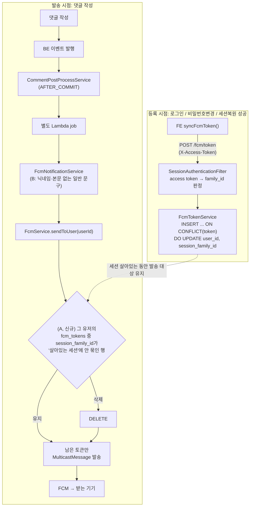

# FCM 푸시 알림 보안 강화 — 세션 바인딩 + 알림 내용 최소화

> Summary: (A) 로그인 세션이 죽으면(자연만료·로그아웃·비밀번호변경·탈취세션 강제폐기) 그
> 기기로의 FCM 푸시도 함께 끊기도록 `fcm_tokens`를 세션 회전 계열(`family_id`)에 묶고,
> (B) 세션이 살아있는 동안에도 잠금화면 등에 댓글 내용이 그대로 노출되지 않도록 알림
> 문구에서 닉네임·본문을 제거해 일반 문구로 바꾼다.

## Context

**문제**: FCM 토큰(`fcm_tokens` 테이블)은 로그인 세션과 완전히 분리된 수명주기를 가진다.
로그인 성공 시 1회 등록되고, 삭제되는 경우는 명시적 로그아웃(`DELETE /fcm/token`)과 FCM이
자체적으로 죽었다고 판정하는 경우(`UNREGISTERED`/`INVALID_ARGUMENT`)뿐이다. 세션이 시간이
지나 자연 만료돼도 이 행은 그대로 남아 계속 푸시를 받는다 — 실제로 사용자가 오래전
로그인한 계정에서 이 상황을 겪었다(알림 클릭 → 이미 로그아웃 상태).

사용자가 제기한 보안 우려: 오래 방치된 계정도 댓글이 달릴 때마다 "닉네임 + 내용 50자"가
담긴 푸시가 그 기기(잠금화면 포함)에 계속 뜬다. 세션이 죽었으면 그 기기로의 알림도 끊겨야
한다.

**지금 이게 가능해진 이유**: 2026-09-28 머지된 인증 개편(PR #41~#47,
`docs/plans/2026-09-28-auth-hardening.md`)이 JWT를 버리고 `member_sessions` 테이블 기반
세션 관리로 바꿨다. 이제 로그인 하나 = `family_id`를 가진 회전 계열 하나이고, 로그아웃·
재사용탐지·비밀번호변경 시 그 계열 전체가 `revoked_at`으로 즉시 폐기된다
(`MemberSessionService.kt`). 이 "기기별 로그인 인스턴스" 식별자를 FCM 토큰에도 묶으면
세션 생명주기와 자동으로 동기화된다.

**목표 A**: 그 기기의 로그인 세션이 살아있는 동안에만(`revoked_at IS NULL AND
refresh_expires_at > now`) 그 기기로 푸시.

**업계 관례 조사 결과 — A는 표준이 아니라 이 레포 맞춤 보강임을 밝힌다**: FCM/APNs 토큰
관리의 표준 트리거는 "로그아웃/계정전환/전송실패"이지 "세션 TTL 만료"가 아니다.

> _"use our SDKs' `clearIdentify` method to disassociate the device token from the user
> in the current session"_ (번역: "SDK의 `clearIdentify` 메서드로 현재 세션의 사용자로부터
> 기기 토큰 연결을 끊으세요") — [Customer.io 공식 문서](https://docs.customer.io/messaging/channels/push/device-tokens/),
> 로그아웃 시 할 일에 대해

이 관례(로그아웃 시 연결 해제, 전송 실패 시 자동 정리)는 이 레포가 이미 하고 있다. 반면
"세션이 자연 만료되면 로그아웃 없이도 그 토큰 발송을 끊는다"는 흐름은 조사한 자료
어디에서도 확인되지 않았다 — A안은 이 레포가 마침 갖춘 세션 인프라(`family_id`)를
활용한 **자체 보강**이지, "다들 이렇게 한다"는 근거는 아니다.

**목표 B — 사용자가 암묵적으로 우려한 두 번째 문제**: "오래 방치했는데 계속 옴"과 별개로,
지금 알림 본문(`"{닉네임}: {내용 50자}"`)은 세션이 **살아있는** 동안에도 잠금화면 등에
댓글 내용을 그대로 노출한다. 업계 표준 대응은 세션 생사와 무관하게 항상 적용되는
"알림 내용 최소화"다.

> _"more apps should handle push notifications similarly to the way Signal does, where
> a ping is sent to wake up the app to check for messages, and the content of that
> message is never sent across servers"_ (번역: "Signal처럼 앱을 깨우는 핑만 보내고
> 메시지 내용 자체는 서버를 거쳐 전송하지 않는 방식을 더 많은 앱이 써야 한다") —
> [EFF, "How Push Notifications Can Betray Your Privacy"(2026-04)](https://www.eff.org/deeplinks/2026/04/how-push-notifications-can-betray-your-privacy-and-what-do-about-it)

> _"an SMS app might display a notification that shows 'You have 3 new text messages,'
> but hides the message contents and senders"_ (번역: "SMS 앱이라면 '새 문자 3개'처럼
> 표시하고 메시지 내용·발신자는 숨길 수 있다") — [Android Developers 공식 문서](https://developer.android.com/develop/ui/views/notifications/build-notification)

A와 B는 서로 다른 문제를 푼다 — A는 "세션이 죽은 뒤"에만 발송을 막고, B는 세션이
살아있어도 항상 내용 노출을 막는다. 사용자 확인 후(2026-09-29) 둘 다 이번 계획에
포함한다.

## 판단이 필요했던 항목

| 항목 | 결정 | 근거·기각한 대안 |
|---|---|---|
| 바인딩 단위 | `family_id`(회전 계열) 단위 | userId 단위(대안 D)는 기기 구분이 안 됨 — 공용PC 세션이 만료돼도 폰 세션이 살아있으면 공용PC로 계속 발송되고, 탈취 세션을 강제 폐기해도 피해자가 재로그인하면 공격자 브라우저 토큰으로 다시 발송됨. family는 로그인=새 계열, refresh 회전=계열 유지, 로그아웃/재사용탐지=계열 전체 폐기라 "이 브라우저의 이 로그인"을 정확히 추적함 |
| 죽은 토큰 정리 방식 | 발송 시점(`FcmService.sendToUser`)에 필터링 + DELETE, 별도 배치 없음 | 이 BE는 `@Scheduled`가 제거되고 EventBridge→Lambda 방식으로 바뀜(BE CLAUDE.md, `LambdaHandler.kt`) — 새 정리 배치를 놓으려면 EventBridge 룰을 추가해야 해서 과함. 댓글 발생 시점마다 자연 청소되면 충분. **필터만 하고 삭제 안 하면 안 됨** — 그 토큰은 발송 대상에서 빠지므로 FCM의 UNREGISTERED 응답을 영원히 못 받아 사후 삭제 경로 자체가 작동 안 함(Plan 에이전트 검증) |
| DELETE 타이밍 레이스 우려 | 안전함, 별도 처리 불필요 | rotate의 구행 revoke+신행 insert가 한 트랜잭션으로 커밋됨(`MemberSessionService.kt:92-109`). PostgreSQL READ COMMITTED는 문장마다 스냅샷을 새로 잡으므로 다른 트랜잭션에는 커밋 전(구행 활성) 또는 커밋 후(신행 활성)만 보이고, 둘 다 죽은 중간 상태는 절대 안 보임(Plan 에이전트 검증) |
| FE 토큰 재등록 시점 | 로그인 성공(기존) + 비밀번호 변경 성공(신규) + 앱 부팅 세션 복원 성공(신규) 3곳 | 비밀번호 변경은 BE가 `revokeAllForMember` 후 새 세션 발급(`AuthService.kt:195-196`)해서 family가 바뀜 — 재등록 안 하면 방금 비밀번호를 바꾼 정상 사용자의 현재 기기 토큰이 옛(이미 폐기된) family에 묶인 채 다음 발송 때 삭제돼버림. 세션 복원(`useAuth.ts:70-78`)도 마찬가지로 레거시(family 없음) 토큰이 복구가 안 됨. 이 두 경로를 빼면 이번 수정 자체가 "정상 사용자의 알림이 조용히 끊기는" 새 회귀를 만든다 |
| FE 중복 등록 방지 캐시(`sessionStorage`) | 제거 | 지금 사용자가 겪은 상황의 재현 경로 그 자체 — 세션 만료 후 같은 탭에서 재로그인하면 FCM 토큰 문자열이 이전과 같아서 `fcm.ts`의 sessionStorage 체크가 서버 재등록 자체를 건너뜀. 등록은 로그인 성공 시에만 호출되므로 중복 방지의 실익이 거의 없음 |
| 등록 API 구현 방식 | 네이티브 `INSERT ... ON CONFLICT(token) DO UPDATE`로 전환 | 기존 `findByToken` 후 분기 저장 로직과, 이번에 발송 쪽에 새로 생기는 DELETE 문이 겹치면 Hibernate가 StaleObjectStateException(500)을 낼 수 있음(Plan 에이전트 지적). 다른 유저에게 토큰 재할당하는 기존 분기(`FcmTokenService.kt:15-26`)도 이 한 문장으로 대체되어 더 단순해짐 |
| 세션-토큰 참조 방식 | JPA 연관관계 매핑 없이 리포지토리 레벨 서브쿼리(JPQL/네이티브)로만 참조 | 기존 `fcm_tokens.user_id`도 FK가 아님(레거시 관례). `AccountDeletionService`가 이미 `FcmTokenRepository`를 직접 주입받아 쓰는 선례가 있음(반대 방향 infra↔domain 참조). ArchUnit은 `domain` 패키지만 검사해 이 참조 자체는 규칙 위반이 아님(Plan 에이전트 확인) |
| "알림이 끊겼다" 안내 UX | 범위 밖 | 사용자가 요청한 건 보안 우려 해소이지 새 안내 기능이 아님. 세션이 죽으면 어차피 로그인 화면으로 수렴하므로 별도 알림 없이도 재로그인 시 정상 복구됨 |
| 알림 내용 노출(B안) 대응 방식 | 알림 본문에서 닉네임·댓글 내용 제거, 일반 문구로 교체(제목은 "새로운 댓글"/"새로운 답글"로 유지해 구분만 남김) | EFF·Android 공식 문서가 공통으로 권고하는 "내용 최소화, 세부 내용은 앱을 열어야만" 패턴(위 Context 인용 참고). data 페이로드(`type`/`postId`/`commentId`)는 그대로 유지해 딥링크는 안 깨짐 |
| B안 적용 범위 | 알림 문구만 교체(BE 한 파일 중심), FE 변경 없음 | FE는 `payload.notification.title`/`body`를 그대로 표시만 할 뿐(useFcmForegroundMessage.ts, firebase-messaging-sw.js) 내용을 가공하지 않으므로 BE가 보내는 문구만 바뀌면 자동으로 반영됨 |

## 세부 계획

### 백엔드 (`link-sphere_BE_NEW`)

| 위치 | 변경 내용 |
|---|---|
| `src/main/resources/sql/add_fcm_session_family.sql` (신규) | `add_member_auth_columns.sql` 스타일 그대로: `ALTER TABLE fcm_tokens ADD COLUMN IF NOT EXISTS session_family_id UUID NULL;` + 인덱스. **BE 코드 배포 전 수동 실행 필수** |
| `infra/fcm/TableFcmToken.kt` | `sessionFamilyId: UUID?` 컬럼 추가(nullable — 레거시 행 대응) |
| `infra/fcm/FcmTokenRepository.kt` | 네이티브 upsert 쿼리(`@Modifying @Query(nativeQuery = true)`, `INSERT ... ON CONFLICT (token) DO UPDATE SET user_id=:userId, session_family_id=:familyId, platform=:platform, updated_at=now()`) 추가. 발송용 삭제 쿼리(`deleteStaleTokensForUser` — 해당 유저 토큰 중 `session_family_id IS NULL OR` 그 family가 `member_sessions`에서 `revoked_at IS NULL AND refresh_expires_at > now`로 살아있지 않은 것) 추가 |
| `infra/fcm/FcmTokenService.kt` | `registerToken(userId, token, platform, sessionFamilyId: UUID?)`로 확장, 기존 findByToken 분기 로직을 upsert 쿼리 호출로 교체 |
| `infra/fcm/FcmTokenController.kt` | `registerToken`에서 `authentication.getSessionFamilyId()`(신규)로 familyId를 꺼내 서비스에 전달. 요청 DTO는 변경 없음(클라이언트가 familyId를 보내지 않음 — 서버가 인증된 토큰으로 판정) |
| `domain/auth/MemberSessionService.kt` | `AccessTokenCheck.Valid`에 `familyId: UUID` 필드 추가 |
| `domain/auth/SessionAuthenticationFilter.kt` | `Valid`에서 꺼낸 familyId를 `UsernamePasswordAuthenticationToken`의 `details`에 담음(principal은 그대로 memberId 문자열 유지 — `getUserId()` 파싱 안 깨지게) |
| `global/common/SecurityUtils.kt` | `Authentication?.getSessionFamilyId(): UUID?` 확장 함수 추가 |
| `infra/fcm/FcmService.kt` | `sendToUser`의 조회를 try 블록 안으로 옮기고, 조회 직전에 `deleteStaleTokensForUser` 호출 → 남은 토큰만 발송 |
| `infra/fcm/FcmNotificationService.kt` (B안) | `sendCommentNotification`/`sendReplyNotification`에서 `commenterNickname`/`commentContent`/`replierNickname`/`replyContent` 파라미터 제거. `body`를 일반 문구로 교체(예: 댓글 "회원님의 게시글에 새 댓글이 달렸어요.", 답글 "회원님의 댓글에 새 답글이 달렸어요."). `title`(`"새로운 댓글"`/`"새로운 답글"`)과 `data` 페이로드는 그대로 유지 |
| `domain/comment/CommentPostProcessService.kt` (B안) | `sendNotification`에서 이제 안 쓰는 `commenter`/`nickname`/`contentPreview` 계산 제거 — `memberRepository`가 이 용도로만 쓰였으므로(파일 전체에서 다른 사용처 없음, 직접 확인) 생성자 파라미터까지 함께 제거 |
| `test/.../CommentPostProcessServiceTest.kt` (B안) | `memberRepository.findById(commenterId)` stub과 `@Mock memberRepository` 필드 제거(제거 안 하면 MockitoExtension 기본 strict stubbing이 `UnnecessaryStubbingException`으로 테스트를 실패시킴), `sendCommentNotification(...)` 호출 검증을 축소된 파라미터 시그니처로 갱신 |

### 프론트엔드 (`link-sphere_FE_NEW`)

| 위치 | 변경 내용 |
|---|---|
| `src/shared/lib/firebase/fcm.ts` | `registerTokenToServer`의 `sessionStorage` 중복 체크 제거 |
| `src/entities/auth/api/auth.queries.ts` | `useChangePasswordMutation.onSuccess`(`setAuth(data.accessToken)` 다음 줄)에 `void requestAndRegisterFcmToken();` 추가 |
| `src/entities/auth/hooks/useAuth.ts` | `restoreAuth`의 성공 분기(`setAuth(authData.accessToken)` 다음)에 `void requestAndRegisterFcmToken();` 추가 |
| `docs/FCM-PUSH-NOTIFICATION.md` | §11.1(현재 "동기 트랜잭션" 서술 — 실제로는 AFTER_COMMIT+Lambda 비동기로 이미 바뀜)과 §11.2("DELETE 무인증" 서술 — 실제로는 인증 필요)를 최신 상태로 정정. 세션 바인딩(A) 동작을 §5·§6에 반영. §5 시퀀스 다이어그램의 `body: "{닉네임}: {내용 50자}"` Note를 B안의 새 일반 문구로 갱신. §7의 "알림 본문 길이 제한 50자" 행은 B안으로 `contentPreview` 계산 자체가 사라지므로 제거. §11.3("50자 truncation에 '...' 없음")도 B안으로 해소되므로 제거 — 참고로 이 문서 §7은 원래 truncation 위치를 `CommentService.kt`로 서술했으나 실제 코드는 `CommentPostProcessService.kt`(`contentPreview = comment.content.take(50)`)였다는 기존 문서 드리프트도 이번에 같이 바로잡는다 |

## 영향 범위

**CRUD 관점**
- 등록(create): upsert로 바뀌어 오히려 실패 지점이 줄어듦(기존 findByToken+분기 저장의 경합 문제 해소)
- 삭제(신규): `sendToUser` 호출마다 그 유저의 죽은 family 토큰을 지움 — 레이스는 트랜잭션 커밋 원자성으로 없음(위 판단 표 참고)
- 조회: `getTokensByUserId` 쿼리 자체는 변경 없음
- 동시 요청: 등록(upsert)과 발송(DELETE)이 겹쳐도 각각 단일 SQL 문이라 안전

**기존 회귀 위험**
- `AccessTokenCheck.Valid` 시그니처 변경 → `MemberSessionServiceTest.kt`, `SessionAuthenticationFilterTest.kt` 수정 필요
- FCM 전용 BE 테스트는 현재 없음 → `FcmTokenServiceTest` 신규 작성 필요(upsert, family 갱신 검증)
- (B안) `CommentPostProcessServiceTest.kt`의 기존 테스트가 옛 5-파라미터 `sendCommentNotification(...)` 호출을 그대로 stub하고 있어, 파라미터 제거 없이 두면 컴파일 자체가 깨짐. Phase 8에서 추가된 "탈퇴 유예 중 알림 문구에 '누군가'를 쓴다" 테스트는 B안으로 그 전제(닉네임이 알림에 실림) 자체가 없어져 전체 삭제
- FE `vi.mock('@/shared/lib/firebase/fcm')`로 목킹하는 테스트에 새 export 추가 시 목 팩토리 갱신 필요
- `useAppInitialization.test.tsx`에 새 mock 추가 필요
- **배포 순서 위반 시**: SQL 없이 BE가 먼저 나가면 매핑된 컬럼이 없어 등록·발송 SQL이 전부 런타임 오류(ddl-auto: none이라 기동 자체는 됨). 반드시 **SQL → FE → BE** 순서. FE가 먼저 나가도 구 BE에서는 무해(구 BE는 새 필드를 모름)

## 검증 방법

1. BE: `MemberSessionServiceTest`, `SessionAuthenticationFilterTest` 갱신 후 통과. 신규 `FcmTokenServiceTest` 작성·통과
2. 로컬 시나리오 — 정상 흐름: 로그인 → 댓글 알림 수신 확인(기존과 동일해야 함)
3. 로컬 시나리오 — 세션 만료: `member_sessions.refresh_expires_at`을 과거로 수동 UPDATE해 자연만료 시뮬레이션 → 다른 계정으로 댓글 작성 → 푸시 미수신 확인, BE 로그에서 stale 토큰 삭제 확인
4. 로컬 시나리오 — 비밀번호 변경: 변경 성공 후 같은 브라우저에서 알림이 계속 수신되는지 확인(재등록 누락 시 다음 발송부터 끊기므로 이 케이스로 회귀 검증됨)
5. 로컬 시나리오 — B안: 댓글 작성 → 받는 기기의 토스트/시스템 알림에 닉네임·댓글 내용이 전혀 없고 일반 문구("새 댓글이 달렸어요" 류)만 보이는지 육안 확인. 클릭 시 postId 딥링크는 그대로 동작하는지 확인
6. FE: `pnpm type-check && pnpm test && pnpm lint`
7. BE: `./gradlew test`

## 남은 것

- (B안) "누가 무슨 댓글을 달았는지 미리보기로 바로 알 수 있던" 기존 UX가 사라진다 — 알림을 봐도 "새 댓글이 달렸다"는 사실만 알 수 있고 내용은 앱을 열어야 확인 가능. 이 트레이드오프는 2026-09-29 사용자에게 A/B 조합 선택지를 제시하고 "A+B 둘 다"로 명시적 확인을 받았다
- 세션 절대 수명(7일) 동안 재로그인하지 않으면 그 사이 알림은 못 받는다 — 이건 이번 변경의 의도된 효과(세션이 죽으면 알림도 죽어야 한다)이지 버그가 아니다
- 배포 직후 기존 `fcm_tokens` 레거시 행(`session_family_id IS NULL`)은 즉시 "비활성"으로 간주돼 다음 댓글 발송 시도 때 삭제된다 — 그 전에 로그인하지 않은 사용자는 알림이 갑자기 끊긴 것처럼 보일 수 있으나, 재로그인하면 새 family로 재바인딩되어 정상 복구된다
- `useLogoutMutation`이 `clearAuth()`를 먼저 실행한 뒤 `unregisterFcmToken()`을 호출해 accessToken이 없어 서버 삭제가 항상 스킵되는 기존 동작은 이번 변경 덕에 영향이 줄어든다(로그아웃하면 그 family가 즉시 폐기되므로 다음 발송 시도 때 알아서 삭제됨) — 하지만 호출 순서 자체를 고치는 근본 수정은 이번 스코프 밖
