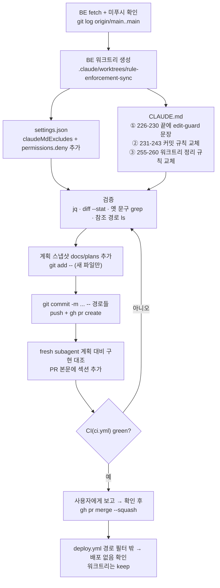

# BE 레포에 워크트리·커밋 규칙 동기화 (FE #254·#260 후속)

> FE 계획 `docs/plans/2026-09-29-rule-enforcement-hardening.md`의 "FE·BE" 항목(139·141·154행) 중 BE 몫을 BE PR 하나로 반영한다.

## Context

- FE는 #254(규칙 문구 교정·`claudeMdExcludes`)와 #260(PreToolUse 가드·`permissions.deny`)으로 워크트리·커밋 규칙을 고쳤다. FE 계획 174행은 "BE 커밋 규칙 문구도 FE와 같아지고 … BE PR은 BE 워크트리에서 별도로"라고 적어 두었지만 아직 반영되지 않았다.
- BE 현재 상태(2026-09-30 확인, BE `main` = `477dd68`, 미푸시 커밋 없음):
  - `.claude/settings.json`: `hooks.PostToolUse`(CHANGELOG 확인 훅) 하나뿐 — `claudeMdExcludes`·`permissions` 없음
  - `.claude/CLAUDE.md:231-243`: "Never `git add`/`git rm`으로 미리 스테이징" + 2026-09-27 새 파일 예외(`git add <새-파일-경로>`) — FE 정책(메인 금지, 워크트리 3가지 허용, 광범위 스테이징 전면 금지)과 다름
  - `.claude/CLAUDE.md:255-260`: "작업 끝난 워크트리를 `keep`으로 방치 금지 → `remove`로 정리" — 2026-09-14 사용자 결정("당분간은 냅두자")과 반대
- 가드 훅은 BE도 대상으로 설계돼 있다: `FE/.claude/lib/shell-parse.mjs:20` `REPO_PATTERN = /\/link-sphere_(FE|BE)_NEW(\/|$)/`, `edit-guard.mjs:1` "link-sphere FE·BE의 메인 체크아웃".
- **단, 2026-09-30 현재 `~/.claude/settings.json`에 `hooks.PreToolUse`가 없다**(`jq '.hooks.PreToolUse'` → `null`). FE 계획 155행 ③(사용자가 등록 블록을 직접 붙여넣기)이 아직 안 된 상태다 — 이번 PR 범위 밖이지만 문서의 "강제한다"는 등록 후에야 사실이 된다.

## 판단이 필요했던 항목

| 항목 | 결정 | 근거·기각한 대안 |
| --- | --- | --- |
| BE 워크트리 생성 방식 | 이 FE 세션에서 `git -C <BE> worktree add`로 BE `.claude/worktrees/` 아래 수동 생성, 절대경로로 편집 (2026-09-30 사용자 선택) | `EnterWorktree`는 현재 레포 워크트리만 만들고, `path` 진입도 "현재 레포 또는 실행 디렉터리 안에 중첩된 레포"만 허용 — BE는 FE의 형제 디렉터리라 불가. 수동 워크트리도 index·워킹트리가 분리돼 규칙의 목적(세션 간 오염 방지)을 채우고, edit-guard는 `.claude/worktrees/` 경로를 허용한다. 대안: BE 세션을 새로 열어 이 계획을 넘김(`shell-parse.mjs:630-633` 가드 안내 문구의 방식, BE CLAUDE.md가 온전히 로드됨) |
| 요청 4 (워크트리 정리 규칙) | FE `CLAUDE.md:480-484` 문구로 교체 (2026-09-30 사용자 선택) | 2026-09-14 사용자 결정·FE 현행과 일치. 대안: 이번 PR에서 제외 |
| 커밋 규칙 문구 | FE `CLAUDE.md:455-467`을 기준으로 하되 경로만 BE 기준으로 조정: 훅 경로는 "FE 레포 `.claude/hooks/…`", 근거 계획은 "FE `docs/plans/2026-09-29-…`", 예시 파일명 `a.ts`→`a.kt` | BE엔 훅·계획 파일이 없으므로 레포를 명시해야 경로가 맞다 |
| PR #29 근거 | 워크트리 index 독립 문장 뒤 괄호 한 줄: "(2026-09-27 PR #29에서 `git rev-parse --git-dir`로 직접 확인)" | 사용자 지시. 나머지 경위 서술은 삭제 |
| 계획 대비 구현 검증자 | fresh **general-purpose** 서브에이전트 | BE `CLAUDE.md:140`은 Explore를 지정하지만 FE #254가 "Explore는 CLAUDE.md를 로드하지 않는다"는 이유로 general-purpose로 바꿨다. BE 문구 교정은 범위 밖(남은 것) |
| settings.json 키 순서 | `hooks` → `permissions` → `claudeMdExcludes` (FE 파일과 같은 순서) | 의미 차이 없음, 두 레포 파일을 나란히 비교하기 쉬움 |

## 세부 계획

작업 위치: `BE=/Users/baechan/project/link-sphere/link-sphere_BE_NEW`, `WT=$BE/.claude/worktrees/rule-enforcement-sync`.

1. `git -C $BE fetch origin` → `git -C $BE log origin/main..main` 빈 출력 확인 → `git -C $BE worktree list`로 같은 이름 없음 확인
2. `git -C $BE worktree add -b worktree-rule-enforcement-sync .claude/worktrees/rule-enforcement-sync origin/main`
3. BE 부트스트랩(BE `CLAUDE.md:244-249`): `$BE/src/main/resources/`의 `application-secret.yml`·`firebase-service-account.json`을 `$WT/src/main/resources/`로 복사
4. 아래 표대로 편집(모든 경로는 `$WT` 기준 절대경로) → 검증 → 커밋 → PR

| 위치 | 변경 내용 |
| --- | --- |
| `.claude/settings.json` | 기존 `hooks.PostToolUse` 그대로. 최상위에 `"permissions": { "deny": ["Bash(git reset --hard)", "Bash(git reset --hard *)", "Bash(git checkout -- .)", "Bash(git restore .)"] }`, `"claudeMdExcludes": ["/Users/baechan/project/CLAUDE.md"]` 추가 |
| `.claude/CLAUDE.md:229-230` 끝 | `…(\`2648c7f\`) 메시지 참고` 뒤에 ". 메인 체크아웃 파일 편집은 FE 레포 `.claude/hooks/edit-guard.mjs`(사용자 설정에 등록하는 PreToolUse 훅)가 막는다 — gitignore된 로컬 파일만 예외" |
| `.claude/CLAUDE.md:231-243` | 제목을 "Never 메인 체크아웃에서 `git add`/`git rm`으로 스테이징"으로. 본문: 메인 index 공유 이유 → `git commit -m "<메시지>" -- <경로...>`(옵션은 `--` 앞, `git commit -- a.kt -m x` 실패 예) → 워크트리 index 독립(git-worktree 문서 링크 + PR #29 괄호 한 줄) → 허용 3가지(① 새 파일 `git add -- <파일>`, git-commit 문서 링크 ② 충돌 해결 중 add ③ `git rm <경로>`, rm 전역 차단·우회 금지·절대경로 제시) → `-A`·`.`·`-u`·`--all`·`commit -a` 어디서나 금지(2026-09-29 사용자 결정, FE 계획 파일 링크) → "이 규칙과 stash·`reset --hard`·`rm` 처리는 FE 레포 `.claude/hooks/bash-guard.mjs`(사용자 설정에 등록하는 PreToolUse 훅)가 실행 직전에 강제한다 — 막히면 메시지가 안내하는 명령으로 바꾸고, 우회하지 않는다" |
| `.claude/CLAUDE.md:255-260` | FE `CLAUDE.md:480-484`와 같은 문구: "Never 사용자 요청 없이 워크트리를 지우지 않는다 → … 명시적으로 요청할 때만 … (2026-09-14 사용자 결정 "당분간은 냅두자") … `keep`으로 나온다 … 목록엔 없는 경우만 `git worktree prune`" |
| `docs/plans/2026-09-30-rule-enforcement-sync.md` (신규) | 이 계획 파일의 스냅샷(BE `CLAUDE.md:136`) |
| PR 본문 | 요약 · 변경 · 검증 결과 · `## 계획 대비 구현`(위 계획 파일 링크) · 가드 미등록 사실 안내 |

커밋: `git -C $WT add -- docs/plans/2026-09-30-rule-enforcement-sync.md` → `git -C $WT commit -m "chore(claude): …" -- .claude/settings.json .claude/CLAUDE.md docs/plans/2026-09-30-rule-enforcement-sync.md`. 메시지는 BE `.gitmessage` 형식(한글, 왜/무엇/영향 범위) + Co-Authored-By 줄. 병합은 사용자 확인 후 `gh pr merge <번호> --squash`.

## 영향 범위

- **CRUD**: 데이터·API·스키마 변경 없음(설정·문서만).
- **CI/배포**: PR에서 `ci.yml`(docs/plans 불변성 + ktlint·test)이 돈다 — 신규 plans 파일은 `A`라 불변성 검사 통과. `deploy.yml`은 `src/**`·gradle 파일에만 걸려 병합해도 배포가 안 돈다. pre-commit(ktlint)은 스테이징된 `.kt/.kts`가 없으면 즉시 통과.
- **BE 세션 동작 변화**: ① 상위 `/Users/baechan/project/CLAUDE.md`(배럴 import·camelCase 등)가 더 이상 로드되지 않음 ② BE 세션에서 Claude는 `git reset --hard`·`git checkout -- .`·`git restore .`를 실행할 수 없음(사용자가 직접 입력) ③ 문서상 새 파일 예외 문구가 FE 정책으로 바뀜.
- **이미 열린 BE 세션·워크트리**: CLAUDE.md는 세션 시작 스냅샷이고, 기존 워크트리 12개는 `origin/main`을 반영해야 새 문구를 본다. `settings.json`도 워크트리별 체크아웃이다.
- **기존 참조**: BE `docs/plans/2026-09-14-my-comments.md:41`의 `.claude/CLAUDE.md:247-252`는 append-only라 손대지 않는다(이미 어긋나 있음). BE `CLAUDE.md:172`의 `:633` 자기 참조는 이미 실제 위치(672행대)와 어긋나 있고 이번 편집으로 더 밀린다 — 범위 밖, 언급만.
- **CHANGELOG**: chore(개발 도구 규칙) → 갱신 대상 아님.

## 검증 방법

1. `jq . $WT/.claude/settings.json` 성공, `jq '.hooks.PostToolUse' ` 결과가 `origin/main` 버전과 동일(`diff <(git -C $WT show origin/main:.claude/settings.json | jq .hooks) <(jq .hooks $WT/.claude/settings.json)` 빈 출력).
2. `git -C $WT diff origin/main --stat` → 위 3파일만.
3. 옛 문구 소멸: `grep -n "git add <새-파일-경로>\|keep\`으로 방치\|ci-guardrails" $WT/.claude/CLAUDE.md` 0건.
4. 새 문구가 가리키는 FE 경로 존재: `ls` FE `.claude/hooks/bash-guard.mjs`·`edit-guard.mjs`, FE `docs/plans/2026-09-29-rule-enforcement-hardening.md`.
5. BE에는 문서 검사 스크립트가 없다(`scripts/` 없음, CI에도 없음) — 3·4번 수동 확인으로 대신한다.
6. PR CI(`gh pr checks`) green 확인.
7. fresh general-purpose 서브에이전트가 계획 파일과 diff를 대조 → PR 본문 `## 계획 대비 구현`.
8. 병합 후(사용자 확인 뒤): `gh run list --branch main` 으로 병합 SHA에 `deploy.yml` run이 없는 것 확인. 새 BE 세션의 `/context`에 `/Users/baechan/project/CLAUDE.md`가 없어야 함 — 같은 키를 가진 FE 세션(지금 이 세션)에는 이미 상위 CLAUDE.md가 로드되지 않았다.

## 남은 것

- **가드 훅 등록(사용자 작업)**: `~/.claude/settings.json`에 PreToolUse가 없다. FE `.claude/hooks/run-node.sh` 머리말의 등록 블록을 붙여넣어야 FE·BE 문서의 "강제한다"가 사실이 된다(FE 계획 155행 ③~⑤).
- BE `CLAUDE.md:140` §11 검증자 "Explore 타입" → FE처럼 general-purpose로 고칠지(이번 범위 밖).
- BE `CLAUDE.md:172`의 낡은 `:633` 자기 참조(이번 범위 밖).
- 워크트리는 사용자 요청 전까지 지우지 않는다.
