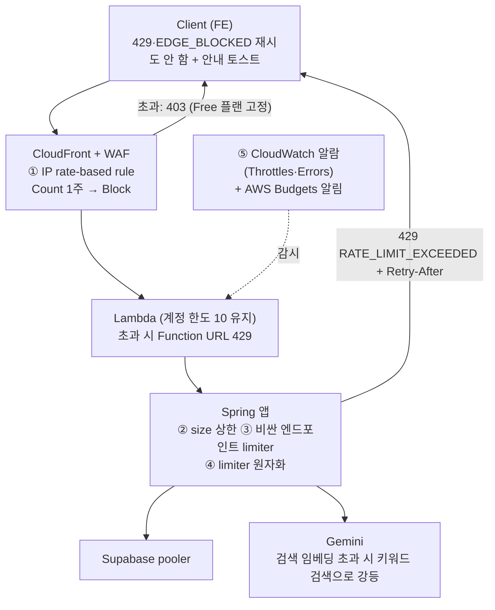

# 백엔드 트래픽 관리 다층 방어 도입

## Context

사용자 질문: "백엔드 트래픽 관리가 잘 되고 있나? 따로 설정한 게 없어 걱정된다."
조사 결과 기본 방어(WAF 관리형 규칙·인증 limiter)만 있고, IP별 요청량 제한·비싼 엔드포인트 제한·
비용/장애 알람·FE 429 처리가 비어 있다. 업계 관행(엣지 → 실행 → 앱 → 응답 → 비용의 다층 방어)에
맞춰 빈칸을 채운다. 사용자 결정(2026-10-02): **범위 = 전체(엣지·알람 + BE + FE)**,
**Lambda 계정 동시성 한도 10은 유지 + 알람 감시**.

## 0. 현재 상황 (실측·코드 확인)

| 층 | 현재 | 근거 |
|---|---|---|
| WAF | 관리형 규칙 3개(IpReputation, Common, KnownBadInputs), **rate-based 없음** | `aws wafv2 get-web-acl` 실측 2026-10-02 |
| Lambda | 계정 `ConcurrentExecutions: 10`(신규 계정 축소 한도) → 사실상 상한. reserved concurrency는 설정 불가(남는 동시성 ≥100 필요) | `aws lambda get-account-settings` 실측 |
| DB | Supabase pooler(6543), Hikari `maximum-pool-size: 5` → 최악 10×5=50 연결 | BE `application.yml:14-22` |
| 앱 limiter | 인증 4종만(`RateLimitService`, Postgres 고정 윈도). check와 record가 분리돼 병렬 burst 통과 | BE `global/common/RateLimitService.kt:23-41` |
| 무제한 | `GET /post?search=`(익명, 매번 Gemini 임베딩), `POST /post`(크롤+AI), `/upload/signed-url`, `GET /post` `size` 상한 없음 | `PostService.kt:136`, `PostController.kt:46`, `UploadService.kt:17-28` |
| 알람 | CloudWatch 알람 0개(실측), Budgets 조회 권한 없음·문서 기록 없음 | `describe-alarms` 실측 |
| FE | 쿼리 `retry: 1`이 429도 재시도, 429·`Retry-After` 처리 없음 | FE `queryClient.ts:68-76`, `client.ts` |

## 1. 전체 계획

업계 근거(전부 BE 새 문서에 출처 링크와 함께 기록):
- AWS WAF rate-based rule: 평가 창 기본 5분, 한도 최저 10. AWS는 _"정밀한 속도 제한용이 아니다"_ (번역)라고 밝힌다 — [AWS WAF caveats](https://docs.aws.amazon.com/waf/latest/developerguide/waf-rule-statement-type-rate-based-caveats.html). 그래서 굵은 차단은 엣지, 세밀한 한도는 앱에서 건다.
- CloudFront Free 플랜에는 WAF 규칙 5개와 IP 기반 rate limiting이 포함되고, 커스텀 응답 코드는 Pro부터다 — [flat-rate 플랜 문서](https://docs.aws.amazon.com/AmazonCloudFront/latest/DeveloperGuide/flat-rate-pricing-plan.html).
- 비싼 작업과 민감한 작업에 빈도 제한을 둔다 — [OWASP API4:2023](https://api-security.owasp.org/editions/2023/en/0xa4-unrestricted-resource-consumption).
- 응답은 429에 `Retry-After`를 붙인다 — [RFC 6585 §4](https://www.rfc-editor.org/rfc/rfc6585#section-4), [RFC 9110 §10.2.3](https://www.rfc-editor.org/rfc/rfc9110#field.retry-after).
- 클라이언트는 같은 요청을 무작정 재시도하지 않는다 — [AWS Architecture Blog, backoff+jitter](https://aws.amazon.com/blogs/architecture/exponential-backoff-and-jitter/).
- 과부하가 오면 기능을 내려 응답한다(graceful degradation) — [Google SRE, Addressing Cascading Failures](https://sre.google/sre-book/addressing-cascading-failures/).

## 2. 세부 계획

### 2-A. 엣지·알람 (콘솔 작업 — 사용자가 직접 실행, 런북은 문서로 제공)

내 IAM 사용자(`link-sphere-user`)에는 WAF·Budgets·Lambda 설정 쓰기 권한이 없다(실측: Budgets·GetFunctionConcurrency 둘 다 AccessDenied). 그래서 콘솔 작업은 사용자가 실행한다.

1. **WAF rate-based rule** `RateLimit-PerIP`를 Web ACL `CreatedByCloudFront-bcd729fb`에 추가한다.
   - 조건: priority 3, IP 집계, 5분 창, 한도 초안 1000.
   - **Count 모드로 1주** 운영한다. CloudWatch에서 WAF `CountedRequests`와 sampled requests로 실제 상위 IP 분포를 본다.
   - 그 뒤 정상 사용 피크의 약 3~5배로 한도를 확정하고 Block으로 전환한다.
   - 규칙 수는 4/5가 된다.
   - Free 플랜에서 scope-down(`/api/auth/*` 전용 규칙)이 되는지는 미확인이라 콘솔에서 확인만 한다. 안 되면 인증 보호는 앱 limiter가 이미 맡고 있다.
2. **CloudWatch 알람**(ap-northeast-1, SNS 이메일 1개 주제):
   - Lambda `Throttles` Sum ≥ 1 / 5분. 한도 10 감시가 목적이며, 사용자 결정에 따른 핵심 알람이다.
   - Lambda `Errors` Sum ≥ 5 / 5분.
   - WAF `BlockedRequests` 급증 알람은 선택 항목이며 us-east-1에 둔다.
3. **AWS Budgets**: 월 비용 예산(예: $10)의 80% 실제 비용과 100% 예측 비용에서 이메일 알림을 보낸다.
   - [AWS Budgets 문서](https://docs.aws.amazon.com/cost-management/latest/userguide/budgets-managing-costs.html)는 _"알림을 받기 전에 임계값을 넘는 비용이 발생할 수 있다"_ (번역)고 밝힌다. 차단 장치가 아니라 늦게 오는 알림이라는 점을 문서에 명시한다.

### 2-B. BE (link-sphere_BE_NEW, PR 1개)

선례: 기존 `RateLimitService` + `ClientIpResolver` + 인증 서비스의 `checkNotExceeded`/`recordHit` 호출 형태(`AuthService.kt:56-59`)를 그대로 따른다. 새 라이브러리(bucket4j 등)는 들이지 않는다. Lambda 인스턴스마다 메모리가 따로라 인메모리 limiter는 무의미하고, Postgres 공유 카운터가 이미 있기 때문이다.

1. **limiter 원자화**: `AuthRateLimitRepository.incrementHit`에 `RETURNING hit_count`를 쓰는 변형 `incrementAndGet`을 추가한다.
   - `RateLimitService.consume(bucketKey, limit, window)`가 "기록 후 비교"를 한 번에 처리하고, 초과하면 throw한다.
   - 시도 횟수를 세는 흐름에 적용한다: 가입, 인증메일 재발송, 비밀번호 재설정, 그리고 아래 신규 제한.
   - 실패만 세는 로그인은 기존 check→실패 시 record 구조를 유지한다. 성공 요청까지 세면 의미가 바뀌기 때문이다. 남는 burst 위험은 WAF가 받는다.
2. **`GET /post` size 상한**: `size`를 `coerceIn(1, MAX_PAGE_SIZE=50)`으로 묶는다.
   - FE 실제 요청값을 grep으로 확인한 뒤 그보다 크게 잡는다.
   - 같은 패턴의 다른 페이지 API도 grep으로 확인해 함께 묶는다.
3. **검색 임베딩 강등**: 익명 포함 IP 버킷에서 검색 임베딩이 한도(초안 60회/10분)를 넘으면 429를 던지지 않는다. 대신 `queryEmbedding = null`로 키워드 검색만 수행한다.
   - 기존 Gemini 실패 폴백 경로(`PostService.kt:134-137`)를 재사용한다. 사용자는 결과를 계속 받는다(graceful degradation).
4. **`POST /post` 회원별 한도**(초안 20회/시간)와 **`/upload/signed-url` 회원별 한도**(초안 30회/시간)를 둔다. 초과하면 429 `RATE_LIMIT_EXCEEDED`를 반환한다.
5. **429에 `Retry-After` 헤더**를 붙인다(`GlobalExceptionHandler.kt:148-153`).
   - `RateLimitExceededException`에 남은 윈도 초를 담아 초 단위 정수로 내보낸다.
6. 테스트: `RateLimitServiceTest`에 consume 경계값 테스트를 추가한다. 각 서비스 테스트에는 한도 초과 시 429(검색은 강등)를 확인하는 테스트를 추가한다. 기존 인증 limiter 테스트가 회귀하지 않는지 확인한다.
7. `@Operation` 설명에 "429 RATE_LIMIT_EXCEEDED"를 추가해 OpenAPI 계약을 갱신한다. FE codegen 드리프트 이슈에 대응하기 위해서다.

한도 값(20/30/60/50)은 **초안**이다. 구현 PR에서 상수 한 곳에 모으고 사용자 확인을 받는다. 값 변경은 상수 수정 1줄이라 되돌리기 비용이 낮다.

### 2-C. FE (link-sphere_FE_NEW, PR 1개, BE 배포 후)

1. `SERVER_ERROR_CODE`에 `RATE_LIMIT_EXCEEDED`를 추가한다(`src/shared/config/error-code.ts`).
2. `queryClient.ts`의 `retry`를 함수로 바꾼다. status 429와 `EDGE_BLOCKED`(WAF 403)는 재시도하지 않고, 나머지는 기존처럼 1회 재시도한다.
3. `error-toast.ts`의 `resolveErrorToast()`에서 429일 때 `TEXTS.messages.error.rateLimited`("요청이 많아요. 잠시 후 다시 시도해 주세요")를 띄운다. 키를 새로 추가하며, 문구는 texts-conventions skill의 해요체를 따른다.
4. 테스트: `queryClient`·`error-toast` 단위 테스트에 429 케이스를 추가한다.

### 배포 순서와 그 사이 상태

BE를 먼저 배포한다. 그 사이 FE는 429를 일반 서버 에러로 1회 재시도하고 `serverError` 토스트를 띄운다. 기능은 깨지지 않고 문구만 덜 친절하다. 그다음 FE를 배포한다. WAF는 Count 모드라 언제 넣어도 영향이 없다.

## 영향 범위 (CLAUDE.md §5)

- **CRUD**: `auth_rate_limits`에 새 bucketKey 접두사(`post-create:`, `upload:`, `search-embed:`)로 행이 늘어난다. 스키마 변경과 마이그레이션은 없다. 옛 윈도 행을 정리하지 않는 기존 정책이 그대로 적용되고, 검색 버킷은 IP 수만큼 행이 늘어난다(문서에 기록).
- **회귀 후보**:
  - 인증 4종 limiter 동작. 로그인 외 3종이 `consume`으로 바뀌므로 기존 `AuthServiceTest`·`PasswordResetServiceTest`가 계약을 지켜준다.
  - `GET /post` 무한스크롤 페이지 크기. FE `post.api.ts`의 size 값을 확인한다.
  - FE 공용 `queryClient`·`error-toast`(전 쿼리·뮤테이션 공용). 구현 전에 `pnpm graph:focus "src/shared/lib/react-query/config/queryClient.ts" --text`로 사용처를 뽑는다.
  - 봇 피드 크롤(`FeedCrawlService`)이 `POST /post` 한도에 걸리지 않는지 확인한다. 봇은 서비스 직접 호출 경로이므로 limiter를 컨트롤러가 아니라 사용자 요청 경로에만 건다.

## 실행 전략

워크트리 2개를 쓴다(BE·FE 각각). 순서는 BE PR → 병합·배포 확인 → FE PR이다. 콘솔 작업 2-A는 코드와 독립적이라 바로 시작해도 된다(WAF Count 1주 관찰).

## 검증 방법

- BE: `./gradlew test`. 배포 후 `curl`로 `GET /api/post?size=100000`을 보내 응답 건수가 50 이하인지 확인한다. 테스트 계정으로 `POST /post`를 한도+1회 보내 429와 `Retry-After`를 확인한다(또는 한도 상수를 낮춘 로컬에서 확인).
- FE: `pnpm type-check && pnpm test && pnpm lint`. MSW로 429를 모킹해 토스트 1개가 뜨고 재시도가 없는지 확인한다(network 탭 요청 1회).
- 엣지: WAF 규칙이 Count로 추가된 것을 `aws wafv2 get-web-acl`로 확인한다(읽기 권한 있음). 알람이 생성된 것을 `aws cloudwatch describe-alarms`로 확인한다.
- 배포: `gh run list --workflow ...`로 BE·FE 각 SHA가 success인지 확인한 뒤 보고한다.

## 문서

- BE `docs/TRAFFIC-MANAGEMENT.md`(독립 기능 문서, 신규)를 만든다. 들어갈 내용:
  - 층별 방어 구조와 Mermaid 흐름도
  - 운영 파라미터 표(`파일:줄`)
  - 위 업계 근거(번역 인용 + 링크)
  - 콘솔 런북(2-A)
  - Free 플랜 제약(403 고정, 규칙 5개)
- FE `docs/DEPLOY.md` WAF 절에 rate-based rule 행을 추가한다. FE `docs/plans/2026-09-25-lighthouse-perf.md:124`의 낡은 서술("로그인 rate limit 없음")은 append-only라 고치지 않고 새 문서에서 정정 사실을 밝힌다.
- 대안 비교(WAF만 / 앱만 / Pro 플랜 업그레이드 / 다층)를 BE 문서 "구조" 절에 남긴다. 되돌리기 어려운 결정이 아니므로 DECISIONS.md에는 넣지 않는다.
- CHANGELOG `[Unreleased]`에 BE·FE 각각 항목을 추가한다.

## 남은 것 (이번 범위 밖)

- 댓글·좋아요·북마크 회원별 한도. 비용이 낮아 엣지 IP 제한으로 충분하다고 보고 보류한다.
- Gemini 서킷 브레이커와 SQS/DLQ 전환
- Lambda 한도 증설. Throttles 알람이 실제로 울릴 때 재검토한다.
- WAF·CloudFront·Lambda 설정의 IaC화(지금은 콘솔 수동, 드리프트 위험)
- BE 문서 불일치 정정(메모리 1024/2048, origin timeout 30/60초)
